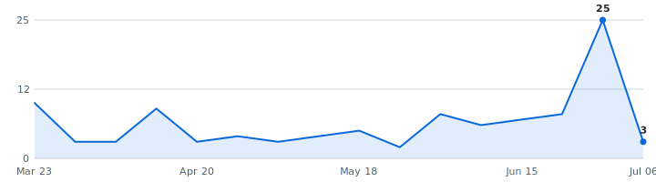

# Summer 2027 Tech Internships

   

A self-updating engine that tracks tech internships so you don't have to. Instead of refreshing a dozen career pages by hand, it reads company hiring feeds directly and keeps one live list, newest roles on top, refreshed automatically throughout the day.

**98 open roles · 25 new this week · 3,889 companies tracked · updated Jul 24, 2026 at 12:29 UTC**

**⭐Star this repo⭐** to save it and get updates when new roles are added.

**Live:** [dashboard](https://zshah101.github.io/Automated-List-Of-Summer-2027-and-Fall-2026-Tech-Internships/) · [RSS feed](https://zshah101.github.io/Automated-List-Of-Summer-2027-and-Fall-2026-Tech-Internships/feed.xml) (instant alerts in any RSS app) · [JSON API](https://zshah101.github.io/Automated-List-Of-Summer-2027-and-Fall-2026-Tech-Internships/api/jobs.json)

**🔔 New roles in your inbox:** [subscribe by email](https://zshah101.github.io/Automated-List-Of-Summer-2027-and-Fall-2026-Tech-Internships/#subscribe) - one email a day, only when new internships actually appeared, one-click unsubscribe. (Prefer RSS-to-email? [Feedrabbit works too](https://feedrabbit.com/subscriptions/new?url=https%3A%2F%2Fraw.githubusercontent.com%2Fzshah101%2FAutomated-List-Of-Summer-2027-and-Fall-2026-Tech-Internships%2Fmain%2Fdocs%2Ffeed.xml).)

## What this is

This is an engine, not a hand-kept list. It polls company career feeds several times a day, finds the internships, removes duplicates, and rebuilds this page on its own. Every link comes straight from the source, so it's real and current, not a stale list someone forgot to update (speed matters).

## What makes this different

- **📅 [Drop Radar](#drop-radar)** - the only list that shows **what's coming**: each marquee company's typical opening window, then confirmed with the real drop date the moment the engine catches it live.
- **Visa intel, computed** - 🇺🇸 / 🛂 flags detected automatically from every job description, plus ✓ for employers with a real H-1B track record (official USCIS data). The big lists crowdsource this by hand; here it's code.
- **Real posted dates on every role** - pulled from each job portal itself, so newest-first actually means newest.
- **Skill tags + pay, extracted** - every posting's text is scanned for the stack it wants (Python, C++, PyTorch, ...) and the pay it states - searchable on the [dashboard](https://zshah101.github.io/Automated-List-Of-Summer-2027-and-Fall-2026-Tech-Internships/), included in the CSV and API.
- **Alerts your way** - [email digests](https://zshah101.github.io/Automated-List-Of-Summer-2027-and-Fall-2026-Tech-Internships/#subscribe), [RSS](https://zshah101.github.io/Automated-List-Of-Summer-2027-and-Fall-2026-Tech-Internships/feed.xml), or Discord - plus a [live dashboard](https://zshah101.github.io/Automated-List-Of-Summer-2027-and-Fall-2026-Tech-Internships/) with search, filters, and an F-1 friendly toggle.
- **An engine, not a spreadsheet** - 3,889 companies polled every hour across 12 job platforms, 175+ tests, full source in this repo.

## Scope

- **Roles:** Software Engineering, Data Science & Machine Learning (and closely related technical internships)
- **Region:** United States
- **Cycles:** Summer 2027 and Fall 2026

## About

I'm an international student studying in the United States, so I built this for the search I'm doing myself. The list is US roles only for now - that's where I'm searching. Use it to spot roles early and apply before they fill up - being first genuinely helps.

## Where this is going

I'm building this in the open and adding to it as it grows. Recently shipped: **email alerts**, the **Drop Radar**, **auto-detected sponsorship flags**, and the **live dashboard**. Next up: personalized alerts (pick your categories), per-company hiring pages, and a ghost-posting detector. If it helps you, a star means a lot and tells me to keep going.

## How to use

- Roles are grouped by cycle below - **newest posting on top, oldest at the bottom.**
- The **Posted** column is the date the company published the role.
- **Flags:** 🇺🇸 = requires U.S. citizenship or a security clearance · 🛂 = the posting says it won't sponsor a work visa · 🆕 = spotted in the last 48 hours. Sponsorship flags are detected automatically from each job description - treat them as a strong hint and confirm on the posting.
- **✓ after a company name** = a real H-1B track record: USCIS approved 10+ petitions for that employer in FY2022–2023 (matched automatically against the official [H-1B Employer Data Hub](https://www.uscis.gov/tools/reports-and-studies/h-1b-employer-data-hub)). No ✓ doesn't mean they won't sponsor - it means we can't prove they have.
- Track your applications with [`data/internships.csv`](data/internships.csv) (opens in Excel / Google Sheets).
- Missing a company? Adding one takes a single line, see [CONTRIBUTING.md](CONTRIBUTING.md).

---

## Summer 2027  (68 open)

| Company | Role | Category | Location | Posted | Apply |
|---|---|---|---|---|---|
| Quadrillion | Software Engineering Intern (Summer 2027) 🆕 | Software | New York City | Jul 24, 2026 | [Apply](https://jobs.ashbyhq.com/quadrillion-labs/a4acc44c-31ce-41a0-ab44-2500487b4d05) |
| Anthelion Capital | Quant Developer / Quant Research Intern - 2026/2027 🆕 | Quant | New York City | Jul 23, 2026 | [Apply](https://jobs.ashbyhq.com/anthelioncap/5e2ea37b-2369-474e-b717-c24c60976e96) |
| Appian ✓ | Software Engineering Intern 🛂 🆕 | Software | McLean, Virginia | Jul 23, 2026 | [Apply](https://job-boards.greenhouse.io/appian/jobs/8041237) |
| Tenstorrent ✓ | Software Engineering Intern, Power Modeling & AI Tools ~ 🆕 | Data & ML/AI | Santa Clara, California, United States | Jul 23, 2026 | [Apply](https://job-boards.greenhouse.io/tenstorrentuniversity/jobs/5186916007) |
| Sentara Health | Cyber Security Compliance Intern ~ 🆕 | Security | Virginia Beach, VA | Jul 23, 2026 | [Apply](https://sentara.wd1.myworkdayjobs.com/SCS/job/Virginia-Beach-VA/Cyber-Security-Compliance-Intern_JR-97927-1) |
| Hewlett Packard (HP) | Software Engineering Intern, Device Experiences ~ 🆕 | Software | San Francisco +2 more | Jul 22, 2026 | [Apply](https://hp.wd5.myworkdayjobs.com/ExternalCareerSite/job/San-Francisco-California-United-States-of-America/Software-Engineering-Intern--Device-Experiences_3164166-1) |
| Pony Dot Ai | Research Intern - Deep Learning ~ 🆕 | Data & ML/AI | Fremont, California, United States | Jul 22, 2026 | [Apply](https://apply.workable.com/pony-dot-ai/j/4C1F53EF5D/) |
| Pony Dot Ai | Software Engineer Intern - Generalist ~ 🆕 | Software | Fremont, California, United States | Jul 22, 2026 | [Apply](https://apply.workable.com/pony-dot-ai/j/BA5FFDBC71/) |
| Moog | Intern, Software Engineering ~ 🆕 | Software | Buffalo, NY | Jul 22, 2026 | [Apply](https://moog.wd5.myworkdayjobs.com/moog_external_career_site/job/Buffalo-NY/Intern--Software-Engineering_R-26-18885-1) |
| Carnegie Mellon University ✓ | Research Intern - School of Computer Science - LTI ~ 🆕 | Software | Pittsburgh, PA | Jul 22, 2026 | [Apply](https://cmu.wd5.myworkdayjobs.com/cmu/job/Pittsburgh-PA/Research-Intern---School-of-Computer-Science---LTI_2024870) |
| Virtu Financial ✓ | 2027 Internship - Software Engineer | Software | Austin, TX; New York | Jul 21, 2026 | [Apply](https://job-boards.greenhouse.io/virtu/jobs/8624410002) |
| Hyperlight | Software Engineer Intern ~ 🆕 | Software | Cambridge, Massachusetts, United States | Jul 20, 2026 | [Apply](https://apply.workable.com/hyperlight/j/5581EA0668/) |
| HireVue | Data Science Intern / Fully Remote US ~ | Data & ML/AI | Sandy, UT, United States (Remote) | Jul 20, 2026 | [Apply](https://jobs.smartrecruiters.com/HireVue/744000138728139) |
| Western Digital ✓ | Summer 2027 - Software Engineering Internship | Software | San Jose, CA, United States | Jul 20, 2026 | [Apply](https://jobs.smartrecruiters.com/WesternDigital/744000138727213) |
| AVEVA ✓ | Software Developer Intern- Drexel Co-op US ~ | Software | Philadelphia +2 more | Jul 20, 2026 | [Apply](https://aveva.wd3.myworkdayjobs.com/AVEVA_careers/job/Philadelphia-Pennsylvania-United-States-of-America/Software-Developer-Intern--Drexel-Co-op-US_R014478) |
| Chicago Trading Company | Software Engineering Internship - Summer 2027 | Software | Chicago, Illinois, United States | Jul 20, 2026 | [Apply](https://job-boards.greenhouse.io/ctccampusboard/jobs/4708230005) |
| Acds | AI Operations Intern-Caddell Reynolds ~ | Data & ML/AI | Fort Smith, AR | Jul 20, 2026 | [Apply](https://jobs.lever.co/acds/01fdf41b-a835-4e00-8d01-0275677a8f08) |
| Deepgram | Software Engineering- Internship (Fall 2026/Summer 2027) | Software | USA / Remote | Jul 17, 2026 | [Apply](https://jobs.ashbyhq.com/deepgram/dc8693b5-72ce-4ca3-ab15-9c8434d35da1) |
| Chevron Corporation ✓ | 2026-2027 Information Technology - Software Engineer - Intern 🛂 | Software | Houston, Texas, United States of America | Jul 16, 2026 | [Apply](https://chevron.wd5.myworkdayjobs.com/University/job/Houston-Texas-United-States-of-America/XMLNAME-2026-2027-Information-Technology---Software-Engineer---Intern_R000072398-1) |
| Tencent ✓ | Research Intern – Video World Models (Research & ML Systems) ~ | Data & ML/AI | US-California-Palo Alto | Jul 15, 2026 | [Apply](https://tencent.wd1.myworkdayjobs.com/Tencent_Careers/job/US-California-Palo-Alto/Research-Intern---Video-World-Models--Research---ML-Systems-_R107752-1) |
| The Trade Desk ✓ | 2027 North America Software Engineering Internship | Software | Bellevue +5 more | Jul 15, 2026 | [Apply](https://job-boards.greenhouse.io/thetradedesk/jobs/5187605007) |
| Five Rings | Summer Intern 2027 - Software Developer | Software | New York | Jul 14, 2026 | [Apply](https://job-boards.greenhouse.io/fiveringsllc/jobs/5349707008) |
| Acds | AI Operations Intern - Naukr AI ~ | Data & ML/AI | Bentonville, AR | Jul 13, 2026 | [Apply](https://jobs.lever.co/acds/41bee5e2-6477-428f-b359-34b4071d545f) |
| Akuna Capital ✓ | Software Engineer Intern - C++, Summer 2027 | Software | Chicago, IL | Jul 13, 2026 | [Apply](https://www.akunacapital.com/careers/job/8018847/?gh_jid=8018847) |
| Akuna Capital ✓ | Software Engineer Intern - Python, Summer 2027 | Software | Chicago, IL | Jul 13, 2026 | [Apply](https://www.akunacapital.com/careers/job/8018853/?gh_jid=8018853) |
| Akuna Capital ✓ | Platform Engineer Intern, Summer 2027 | Software | Chicago, IL | Jul 13, 2026 | [Apply](https://www.akunacapital.com/careers/job/8018856/?gh_jid=8018856) |
| Hudson River Trading ✓ | Software Engineering Internship (C++ or Python) – Summer 2027 | Software | Austin +9 more | Jul 13, 2026 | [Apply](https://www.hudsonrivertrading.com/careers/job/?gh_jid=8052083) |
| Palantir ✓ | Forward Deployed Infrastructure Engineer, Internship - US Government ~ 🇺🇸 | Software | Washington, D.C. | Jul 10, 2026 | [Apply](https://jobs.lever.co/palantir/3db7e40a-28e0-4ad1-96c5-93de5bc96aa9) |
| Xsolla | AI-First Engineering Intern ~ | Data & ML/AI | Los Angeles, United States | Jul 10, 2026 | [Apply](https://jobs.lever.co/xsolla/1c0e5375-2352-4a2c-a816-48ddebbdd3d6) |
| Manhattan Associates ✓ | A.I. Developer Co-Op (Boston, MA) ~ | Software | US - Home Office | Jul 10, 2026 | [Apply](https://manh.wd5.myworkdayjobs.com/campus/job/US---Home-Office/AI-Developer-Co-Op--Boston--MA-_16931) |
| Jump Trading | Campus AI Research Engineer (Intern) ~ | Data & ML/AI | Chicago; New York | Jul 08, 2026 | [Apply](https://www.jumptrading.com/hr/job?gh_jid=8052281) |
| Jump Trading | Campus AI Research Engineer - Deep Learning (Intern) ~ | Data & ML/AI | Chicago; New York | Jul 08, 2026 | [Apply](https://www.jumptrading.com/hr/job?gh_jid=8052338) |
| Jump Trading | Campus AI Research Engineer – Research Automation (Intern) ~ | Data & ML/AI | Chicago; New York | Jul 08, 2026 | [Apply](https://www.jumptrading.com/hr/job?gh_jid=8052351) |
| Copart ✓ | DevOps Engineering Intern ~ | Software | Dallas, TX - Headquarters | Jul 08, 2026 | [Apply](https://copart.wd12.myworkdayjobs.com/copart/job/Dallas-TX---Headquarters/DevOps-Engineering-Intern_JR109490) |
| VetsEZ | Full Stack Developer Intern (Remote Opportunity) ~ | Software | Dallas, TX | Jul 06, 2026 | [Apply](https://vetsez.breezy.hr/p/d18961a7a7e701-full-stack-developer-intern-remote-opportunity) |
| Tower Research Capital ✓ | Quantitative Developer Intern - Summer 2027 | Quant | New York, Chicago | Jul 05, 2026 | [Apply](https://www.tower-research.com/open-positions/?gh_jid=8044334) |
| Bot Auto | Intern, Deep Learning Engineer ~ | Data & ML/AI | Houston, TX | Jul 02, 2026 | [Apply](https://job-boards.greenhouse.io/botauto/jobs/5289440008) |
| ConnectPrep | Data Analyst Internship ~ 🇺🇸 | Data & ML/AI | Washington +2 more | Jul 02, 2026 | [Apply](https://apply.workable.com/connectprep/j/C0CA13664F/) |
| Palantir ✓ | Forward Deployed Software Engineer, Internship - Intel ~ | Software | Washington, D.C. | Jul 01, 2026 | [Apply](https://jobs.lever.co/palantir/9e40d77f-b07c-437b-98e7-def9b0184d89) |
| Nelnet ✓ | Intern - AI Engineer ~ | Data & ML/AI | Lincoln, NE | Jul 01, 2026 | [Apply](https://nelnet.wd1.myworkdayjobs.com/MyNelnet/job/Lincoln-NE/Intern---AI-Engineer_R22763) |
| IMC Trading | Software Engineer Intern - Summer 2027 | Software | Chicago, United States | Jul 01, 2026 | [Apply](https://job-boards.eu.greenhouse.io/imc/jobs/4823924101) |
| IMC Trading | Machine Learning Research Intern - Summer 2027 - Chicago | Data & ML/AI | Chicago, United States | Jul 01, 2026 | [Apply](https://job-boards.eu.greenhouse.io/imc/jobs/4907430101) |
| Palantir ✓ | Forward Deployed Software Engineer, Internship - Commercial ~ | Software | Chicago, IL | Jun 30, 2026 | [Apply](https://jobs.lever.co/palantir/d5486403-c050-4920-b2e0-91b69b61ebb2) |
| Sony | Research Intern on Generative and Protective AI for Content Creation ~ | Data & ML/AI | Remote - New York | Jun 30, 2026 | [Apply](https://sonyglobal.wd1.myworkdayjobs.com/SonyGlobalCareers/job/Remote---New-York/Research-Intern-on-Generative-and-Protective-AI-for-Content-Creation_JR-119335) |
| Halo Industries | Software Engineer Intern - Machine Learning Workflow ~ 🆕 | Data & ML/AI | Santa Clara, California, United States | Jun 29, 2026 | [Apply](https://apply.workable.com/halo-industries/j/29728B1DAF/) |
| Veeda AI | Internship - Veeda AI Scientist ~ | Data & ML/AI | California | Jun 29, 2026 | [Apply](https://jobs.ashbyhq.com/veeda-labs/58cc42fb-1d6f-4e5f-860d-3b97bdccc6f4) |
| Lila Sciences | Co-Op, LS AI, ML Scientist for Protein Engineering ~ | Data & ML/AI | San Francisco, CA USA | Jun 29, 2026 | [Apply](https://job-boards.greenhouse.io/lilasciences/jobs/4289387009) |
| Copart ✓ | Software Engineering Intern ~ | Software | Dallas, TX - Headquarters | Jun 26, 2026 | [Apply](https://copart.wd12.myworkdayjobs.com/copart/job/Dallas-TX---Headquarters/Software-Engineering-Intern_JR109672) |
| Altasciences | Process Innovation - Software Engineering Intern ~ | Software | Overland Park, Kansas | Jun 24, 2026 | [Apply](https://altasciences.wd1.myworkdayjobs.com/Careers/job/Overland-Park-Kansas/Process-Innovation---Software-Engineering-Intern_R102750) |
| RFCUNY | Data Analyst Intern ~ | Data & ML/AI | New York, NY | Jun 23, 2026 | [Apply](https://rfcuny.wd108.myworkdayjobs.com/RFCUNY/job/New-York-NY/Data-Analyst-Intern_JR2987) |
| Centerfield ✓ | Data Science Intern ~ | Data & ML/AI | Los Angeles, California | Jun 22, 2026 | [Apply](https://jobs.ashbyhq.com/centerfield/916dcf42-d69a-4f00-875a-f8fe630e0f33) |
| Nio | AI Robotics Researcher Intern (Dexterous Manipulation) ~ | Data & ML/AI | San Jose-US | Jun 19, 2026 | [Apply](https://nio.wd3.myworkdayjobs.com/NIO_Careers/job/San-Jose-US/AI-Robotics-Researcher-Intern--Dexterous-Manipulation-_R-000144) |
| iHerb | Software Development Intern ~ | Software | United States of America - Remote / Hom… | Jun 17, 2026 | [Apply](https://job-boards.greenhouse.io/iherb/jobs/7776154003) |
| Institute of Foundation Models | AI Research Internship - WM ~ | Data & ML/AI | Sunnyvale, CA | Jun 12, 2026 | [Apply](https://jobs.lever.co/ifm-us/3eec355c-6dde-4a3e-8cdf-b2a8930d5678) |
| Voloridge | Quantitative Developer Intern 2027 | Quant | Jupiter, FL | Jun 11, 2026 | [Apply](https://job-boards.greenhouse.io/voloridgeinvestmentmanagement/jobs/4224862009) |
| Lila Sciences | Co-op, Machine Learning for Digital Twins ~ | Data & ML/AI | Cambridge, MA USA | Jun 11, 2026 | [Apply](https://job-boards.greenhouse.io/lilasciences/jobs/4280809009) |
| Anduril | 2027 Software Engineer Intern 🇺🇸 | Software | Atlanta +17 more | Jun 10, 2026 | [Apply](https://boards.greenhouse.io/andurilindustries/jobs/5148079007?gh_jid=5148079007) |
| Centerfield ✓ | Software Engineer Intern ~ | Software | Los Angeles, California | Jun 09, 2026 | [Apply](https://jobs.ashbyhq.com/centerfield/3279e803-56ab-4e12-8168-c2fd60bc8e60) |
| Tenstorrent ✓ | CPU/AI Workload Analysis Intern ~ | Data & ML/AI | Santa Clara, California, United States | Jun 08, 2026 | [Apply](https://job-boards.greenhouse.io/tenstorrentuniversity/jobs/5158533007) |
| Scale AI ✓ | AI Builder Intern ~ | Data & ML/AI | San Francisco, CA; New York, NY | Jun 06, 2026 | [Apply](https://job-boards.greenhouse.io/scaleai/jobs/4703343005) |
| Clarity Innovations | Junior Software Engineer Internship ~ 🇺🇸 | Software | Herndon, VA | Jun 05, 2026 | [Apply](https://job-boards.greenhouse.io/clarityinnovates/jobs/5155449007) |
| XPENG Motors | AI Infra Onboard Performance Intern ~ | Data & ML/AI | Santa Clara, CA | Jun 05, 2026 | [Apply](https://job-boards.greenhouse.io/xpengmotors/jobs/8581353002) |
| TransMarket Group | DevOps/SRE Intern ~ | Software | Chicago, Illinois, United States | Jun 02, 2026 | [Apply](https://job-boards.greenhouse.io/transmarketgroup/jobs/5151577007?gh_jid=5151577007) |
| Fluxergy | Firmware Engineer Intern ~ | Hardware | Irvine, California | Jun 02, 2026 | [Apply](https://jobs.lever.co/fluxergy-2/c592763e-56ba-4d20-b751-3a4574470eec) |
| Walleye Capital | Investment Data Science Intern (Summer 2027) | Data & ML/AI | New York, New York | Jun 01, 2026 | [Apply](https://job-boards.greenhouse.io/walleyecapital-external-students/jobs/4676587006) |
| Walleye Capital | Quantic – Quantitative Developer Intern (Summer 2027) | Quant | Boston, MA | Jun 01, 2026 | [Apply](https://job-boards.greenhouse.io/walleyecapital-external-students/jobs/4679168006) |
| Walleye Capital | Volatility Trading Developer Intern (Summer 2027) | Quant | New York, New York | Jun 01, 2026 | [Apply](https://job-boards.greenhouse.io/walleyecapital-external-students/jobs/4679434006) |
| Ellipsis Labs | Software Engineer - 2027 Interns | Software | New York, New York | Mar 26, 2026 | [Apply](https://jobs.ashbyhq.com/ellipsislabs/02136b22-35b1-4b3d-8bef-567c3380a849) |

_~ = the title doesn't state a year; bucketed here from its posting date (45 of 68)._

## Fall 2026  (30 open)

| Company | Role | Category | Location | Posted | Apply |
|---|---|---|---|---|---|
| Astranis | Software Engineer Intern - Enterprise Systems (Fall 2026) 🇺🇸 🆕 | Software | San Francisco, CA | Jul 23, 2026 | [Apply](https://job-boards.greenhouse.io/astranis/jobs/4699071006) |
| Medtronic ✓ | Intern AI Vision for Equipment Development | Data & ML/AI | Lausanne, Vaud, Switzerland | Jul 20, 2026 | [Apply](https://medtronic.wd1.myworkdayjobs.com/redeploymentmedtroniccareers/job/Lausanne-Vaud-Switzerland/Intern-AI-Vision-for-Equipment-Development_R72173) |
| Moog | Intern, IT Computer Science - Data Analytics | Data & ML/AI | Buffalo, NY | Jul 16, 2026 | [Apply](https://moog.wd5.myworkdayjobs.com/moog_external_career_site/job/Buffalo-NY/Intern--IT-Computer-Science---Data-Analytics_R-26-17145) |
| NVIDIA ✓ | Performance Engineer Intern, Systems Software-  Fall 2026 | Software | US, MO, St. Louis | Jul 06, 2026 | [Apply](https://nvidia.wd5.myworkdayjobs.com/NVIDIAExternalCareerSite/job/US-MO-St-Louis/Performance-Engineer-Intern--Systems-Software---Fall-2026_JR2015779) |
| Saronic | Enterprise Technology Intern - AI and Automation (Fall 2026) 🇺🇸 | Data & ML/AI | Austin, TX | Jul 02, 2026 | [Apply](https://jobs.ashbyhq.com/saronic/c95c2e3a-4c67-47b0-a03d-0e0317ac11a3) |
| NVIDIA ✓ | Applied Research Intern, NLP - Fall 2026 | Data & ML/AI | US, CA, Santa Clara | Jul 01, 2026 | [Apply](https://nvidia.wd5.myworkdayjobs.com/NVIDIAExternalCareerSite/job/US-CA-Santa-Clara/Applied-Research-Intern--NLP---Fall-2026_JR2010488) |
| Junior | Software Engineering Intern — Fall 2026 🇺🇸 | Software | New York City | Jun 30, 2026 | [Apply](https://jobs.ashbyhq.com/junior/23ee686b-d305-4ac9-860d-16c99ddb4891) |
| Charlesriveranalytics90 | Software QA Tester Intern/Co-op (Fall 2026) | Software | Cambridge, MA | Jun 29, 2026 | [Apply](https://job-boards.greenhouse.io/charlesriveranalytics90/jobs/8035563) |
| Altom Transport | Fall Software Development Intern ~ | Software | Hammond, Indiana, United States | Jun 23, 2026 | [Apply](https://apply.workable.com/altom-transport/j/9FC654F05E/) |
| Figure | Firmware Intern [Fall 2026] | Hardware | San Jose, CA | Jun 22, 2026 | [Apply](https://job-boards.greenhouse.io/figureai/jobs/4691070006) |
| Intuitive Surgical ✓ | Computer Vision Engineering Intern - Fall 2026 | Data & ML/AI | Sunnyvale, CA, United States | Jun 22, 2026 | [Apply](https://jobs.smartrecruiters.com/Intuitive/744000133458290) |
| SoloPulse | Software Engineer Intern/Co-Op - Fall 2026 | Software | Peachtree Corners, GA | Jun 16, 2026 | [Apply](https://jobs.lever.co/solopulseco/00fbde18-a387-4c9f-97d4-77059aec7b56) |
| Beaconsoftware | Software Engineering Intern | Software | San Francisco, CA | Jun 02, 2026 | [Apply](https://jobs.ashbyhq.com/beaconsoftware/2452d342-a069-4eda-adbe-9df296808ca1) |
| Four Hands | Cybersecurity Intern | Security | Austin, TX | Jun 02, 2026 | [Apply](https://job-boards.greenhouse.io/fourhands/jobs/4267718009) |
| Saronic | Software Engineer Intern (Fall 2026) 🇺🇸 | Software | Austin, TX | May 18, 2026 | [Apply](https://jobs.ashbyhq.com/saronic/1c74957f-0895-415b-9324-08b0994747d7) |
| Astranis | Software Engineer- Backend Intern (Fall 2026) 🇺🇸 | Software | San Francisco, CA | May 13, 2026 | [Apply](https://job-boards.greenhouse.io/astranis/jobs/4681183006) |
| Samsung Research America ✓ | 2026 Fall Intern, ML/NLP Research | Data & ML/AI | 665 Clyde Avenue +3 more | May 08, 2026 | [Apply](https://job-boards.greenhouse.io/samsungresearchamericainternship/jobs/8541339002) |
| Amazon ✓ | Software Development Engineer Intern, AWS Data Services - Fall 2026 (US) | Data & ML/AI | Seattle, Washington, USA | May 06, 2026 | [Apply](https://www.amazon.jobs/en/jobs/10412530/software-development-engineer-intern-aws-data-services-fall-2026-us) |
| Gemini ✓ | Software Engineering Intern (Fall 2026) | Software | New York, New York | May 01, 2026 | [Apply](https://boards.greenhouse.io/embed/job_app?for=gemini&token=7875125&gh_jid=7875125) |
| TMEIC ✓ | Intern - Applications, AI and Machine Learning (Fall 2026) (ET26021) 🛂 | Data & ML/AI | Roanoke, Virginia, United States | Apr 24, 2026 | [Apply](https://apply.workable.com/tmeic-corporation-americas/j/FD4C9770FF/) |
| Lego | Firmware Engineering Co-Op - Fall 2026 | Hardware | United States of America | Apr 20, 2026 | [Apply](https://lego.wd103.myworkdayjobs.com/lego_executive/job/Boston-Hub/Firmware-Engineering-Intern_0000031568) |
| Hermeus | Software Engineering Intern (HIL) - Fall 2026 🇺🇸 | Software | Atlanta, GA | Apr 17, 2026 | [Apply](https://jobs.lever.co/hermeus/10d69ef6-a754-42ab-833c-76adf01367bf) |
| Hermeus | Software Engineering Intern (Modeling & Simulation) - Fall 2026 🇺🇸 | Software | Los Angeles, CA | Apr 17, 2026 | [Apply](https://jobs.lever.co/hermeus/49f7cf3f-bf66-44ca-bf97-ee0f7180a68d) |
| Notion ✓ | Software Engineer Intern (Fall 2026) | Software | San Francisco, California | Apr 06, 2026 | [Apply](https://jobs.ashbyhq.com/notion/5b15697c-fa91-4511-9482-c98a6ff29f90) |
| SharkNinja ✓ | Fall 2026: SharkByte Applied AI & Analytics Co-op (July/August to December) | Data & ML/AI | Miami +8 more | Apr 02, 2026 | [Apply](https://job-boards.greenhouse.io/sharkninjaoperatingllc/jobs/4669676006) |
| Hermeus | Software Engineering Intern (HMI) - Fall 2026 🇺🇸 | Software | Atlanta, GA | Apr 01, 2026 | [Apply](https://jobs.lever.co/hermeus/a3a1f0ea-6a4f-42e5-81c8-3b34dac22a67) |
| Motorola ✓ | Intern - Embedded Software, System, and Test Engineer - 2026 🇺🇸 | Software | Irvine, CA | Mar 30, 2026 | [Apply](https://motorolasolutions.wd5.myworkdayjobs.com/Careers/job/Irvine-CA/Intern---Embedded-Software--System--and-Test-Engineer---2026_R62372) |
| Varda Space | Flight Software Internship - Fall 2026 🇺🇸 | Software | El Segundo, California, United States | Mar 23, 2026 | [Apply](https://job-boards.greenhouse.io/vardaspace/jobs/7676465003) |
| Amazon ✓ | Robotics - Software Development Engineer Intern/Co-op - 2026 | Hardware | Westboro, Wisconsin, USA | Dec 03, 2025 | [Apply](https://www.amazon.jobs/en/jobs/3136266/robotics-software-development-engineer-intern-co-op-2026) |
| Amazon ✓ | Amazon Industrial Robotics - Applied Scientist II Intern / Co-op - 2026, Amazon Industrial Robotics | Data & ML/AI | North Reading, Massachusetts, USA | Nov 25, 2025 | [Apply](https://www.amazon.jobs/en/jobs/3132414/amazon-industrial-robotics-applied-scientist-ii-intern-co-op-2026-amazon-industrial-robotics) |

_~ = the title doesn't state a year; bucketed here from its posting date (1 of 30)._

## 📅 Drop Radar — when companies usually post for Summer 2027

Stop refreshing career pages. Every date here is **real or verified** — no third-party list. 🎯 = the engine **saw the drop itself** from the company's own careers API; the rest are hand-checked typical opening windows for marquee names. ✅ = already live in the list above.

> **Heads up:** companies trend *earlier* every cycle, and "~Aug" is a month, not a day. Treat "expected" as when to **start watching**, and "rolling" companies as worth checking year-round.

| Company | Typical opening | Expected this cycle | Status |
|---|---|---|---|
| Citadel | ~Aug | ~Aug · in ~8d | ⏳ waiting |
| Citadel Securities | ~Aug | ~Aug · in ~8d | ⏳ waiting |
| Databricks | ~Aug | ~Aug · in ~8d | ⏳ waiting |
| DoorDash | ~Aug | ~Aug · in ~8d | ⏳ waiting |
| DRW | ~Aug | ~Aug · in ~8d | ⏳ waiting |
| Google | ~Aug | ~Aug · in ~8d | ⏳ waiting |
| Jane Street | ~Aug | ~Aug · in ~8d | ⏳ waiting |
| Meta | ~Aug | ~Aug · in ~8d | ⏳ waiting |
| Optiver | ~Aug | ~Aug · in ~8d | ⏳ waiting |
| Pinterest | ~Aug | ~Aug · in ~8d | ⏳ waiting |
| Salesforce | ~Aug | ~Aug · in ~8d | ⏳ waiting |
| SIG | ~Aug | ~Aug · in ~8d | ⏳ waiting |
| Snowflake | ~Aug | ~Aug · in ~8d | ⏳ waiting |
| Uber | ~Aug | ~Aug · in ~8d | ⏳ waiting |
| Adobe | ~Sep | ~Sep · in ~39d | ⏳ waiting |
| Airbnb | ~Sep | ~Sep · in ~39d | ⏳ waiting |
| Bloomberg | ~Sep | ~Sep · in ~39d | ⏳ waiting |
| Dropbox | ~Sep | ~Sep · in ~39d | ⏳ waiting |
| Plaid | ~Sep | ~Sep · in ~39d | ⏳ waiting |
| Point72 | ~Sep | ~Sep · in ~39d | ⏳ waiting |
| Robinhood | ~Sep | ~Sep · in ~39d | ⏳ waiting |
| Roblox | ~Sep | ~Sep · in ~39d | ⏳ waiting |
| Stripe | ~Sep | ~Sep · in ~39d | ⏳ waiting |
| D.E. Shaw | ~Oct | ~Oct | ⏳ waiting |
| Coinbase | ~Dec | ~Dec | ⏳ waiting |
| Ramp | ~Dec | ~Dec | ⏳ waiting |
| Two Sigma | ~Dec | ~Dec | ⏳ waiting |
| Apple | rolling | year-round | ⏳ waiting |
| Datadog | rolling | year-round | ⏳ waiting |
| Jump Trading | rolling | year-round | ⏳ waiting |

_56 companies on the [full radar](https://zshah101.github.io/Automated-List-Of-Summer-2027-and-Fall-2026-Tech-Internships/#radar). **21** dated from our own live observations 🎯 (this grows every cycle). "~Aug" = hand-verified typical month, not a promise of the day; "rolling" = posts year-round; "waiting" = not seen in our tracked feeds yet, not a guarantee it isn't out somewhere else._

<strong>Recently closed</strong> — 35 roles taken down in the last 14 days

| Company | Role | Cycle | Closed |
|---|---|---|---|
| Quadrillion | Software Engineering Intern | Summer 2027 | 2026-07-23 |
| Exowatt | Software Engineering Intern - Agent Platform (AI) | Summer 2027 | 2026-07-23 |
| Exowatt | Software Engineering Intern  - Inventory Automation & IoT/Robotics | Summer 2027 | 2026-07-23 |
| Intel | AI Software Engineering Intern | Summer 2027 | 2026-07-23 |
| Lila Sciences | Co-Op, AI Security | Summer 2027 | 2026-07-23 |
| Sentara Health | Enterprise Data & AI Intern- Fall 2026 Internship | Fall 2026 | 2026-07-23 |
| SS&C | Healthcare AI & Automation Intern | Summer 2027 | 2026-07-23 |
| Nokia | AI R&D Engineer Co-op | Summer 2027 | 2026-07-23 |
| GenBio AI | Software Engineering Intern | Summer 2027 | 2026-07-22 |
| Skydio | Software Engineer Intern Fall 2026/Winter 2027 | Fall 2026 | 2026-07-22 |
| Generac | Intern Firmware Engineering | Summer 2027 | 2026-07-22 |
| Centific | Tech Intern - Responsible AI | Summer 2027 | 2026-07-22 |
| Center for AI Safety | Research Engineer Intern (Fall 2026) | Fall 2026 | 2026-07-22 |
| Axon | 2027 US Software Engineering Internship | Summer 2027 | 2026-07-21 |
| Axon | 2027 US Firmware Engineering Internship | Summer 2027 | 2026-07-21 |
| Kulicke & Soffa | Intern, Software Engineering | Summer 2027 | 2026-07-21 |
| Samsung Research America | 2026 Fall Intern, Computer Vision/AI | Fall 2026 | 2026-07-21 |
| DNV | AI Research Internship | Summer 2027 | 2026-07-21 |
| Fortive | IT Infrastructure Internship | Summer 2027 | 2026-07-21 |
| Altera Corporation | AI Software Development Engineer - Intern | Summer 2027 | 2026-07-20 |
| Reliable Robotics | Flight Software Engineering Intern (Fall 2026 Internship) | Fall 2026 | 2026-07-20 |
| Acds | AI Software Engineer Intern- Bastazo | Summer 2027 | 2026-07-20 |
| Motorola | Intern – Web Interface Software Engineer (2026) | Fall 2026 | 2026-07-20 |
| Torch Technologies | Software Engineer Intern | Summer 2027 | 2026-07-19 |
| Copart | Software Engineering Intern | Summer 2027 | 2026-07-18 |
| onsemi | Fall 2026 - AI & Data Analytics Intern | Fall 2026 | 2026-07-17 |
| Traackr | Software Engineering Intern (Part-Time, Internal Tooling) | Summer 2027 | 2026-07-16 |
| Uber Freight | Data Scientist Intern - Fall 2026 | Fall 2026 | 2026-07-15 |
| Rocket Lab | Software Intern Fall 2026 | Fall 2026 | 2026-07-15 |
| NVIDIA | Quantum Error Correction Research Scientist Intern - Fall 2026 | Fall 2026 | 2026-07-13 |
| NVIDIA | Quantum Research Scientist Intern - Fall 2026 | Fall 2026 | 2026-07-13 |
| NVIDIA | Software Engineering Intern, JAX - Fall 2026 | Fall 2026 | 2026-07-13 |
| Skydio | Middleware Software Engineer Intern - Fall 2026 | Fall 2026 | 2026-07-13 |
| CACI | Software Engineering Intern - Fall 2026 | Fall 2026 | 2026-07-13 |
| Vertex Pharmaceuticals | Vertex Fall Co-op 2026, AI and Governance | Fall 2026 | 2026-07-10 |

---

## Hiring timeline

Internships posted per week, from each role's real published date - redrawn automatically on every run. When this line takes off, recruiting season is open:

<picture>
  <source media="(prefers-color-scheme: dark)" srcset="docs/trends-dark.svg">
  
</picture>

## How it stays current

A small Python engine reads public company hiring feeds directly, keeps the roles that match the scope above, de-duplicates across sources, records each role's published date once (so it never shifts), and regenerates this page through GitHub Actions. It polls every company concurrently (async) with retry/backoff and per-host rate limits. The full source is in this repo.

_Engine (last run): 3,889 companies across 12 ATS platforms · 99% fetch success · completed in 295.3s · median detection latency 1012 min · real posted dates on 100% of open roles._

## Contributing

Adding a company takes one line, see [CONTRIBUTING.md](CONTRIBUTING.md). Suggestions and pull requests are welcome.

## Note on dates

The **Posted** column shows when a role was published, with the newest at the top. I pull the posting date straight from each job portal, but a lot of them don't expose one publicly, so those rows show a dash (—) for now instead of a guessed date. The ones that do publish a date are dated. Know the real date for a dashed role? Open a PR and I'll merge it.

Roles can close at any time, so always confirm on the company's own site before applying.
