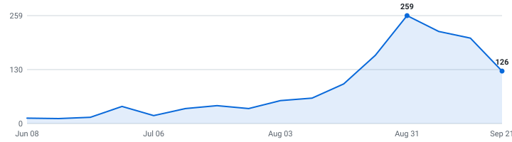

# 🎓 Summer 2027 Tech Internships

**A self-updating engine that tracks tech internships so you don't have to.**

&nbsp;&nbsp;&nbsp;

### 548 open roles (401 listed below) · 235 new this week

4,414 employers tracked · data as of Sep 04, 2026 at 04:41 UTC

_362 have a cycle the employer stated · 186 are recent postings whose cycle isn't stated (listed separately, never mixed in)._

**[🖥️ Live dashboard](https://zshah101.github.io/Automated-List-Of-Summer-2027-and-Fall-2026-Tech-Internships/)** · **[📡 RSS](https://zshah101.github.io/Automated-List-Of-Summer-2027-and-Fall-2026-Tech-Internships/feed.xml)** · **[⚙️ JSON API](https://zshah101.github.io/Automated-List-Of-Summer-2027-and-Fall-2026-Tech-Internships/api/jobs.json)** · **[✉️ Email alerts](https://zshah101.github.io/Automated-List-Of-Summer-2027-and-Fall-2026-Tech-Internships/#subscribe)**

> [!TIP]
> **⭐ Star this repo** to save it and get updates when new roles are added.

Instead of refreshing a dozen career pages by hand, it reads company hiring feeds directly and keeps one live list — newest roles on top, refreshed automatically throughout the day.

**🔔 New roles in your inbox:** [subscribe by email](https://zshah101.github.io/Automated-List-Of-Summer-2027-and-Fall-2026-Tech-Internships/#subscribe) - one email a day, only when new internships actually appeared, unsubscribe from any email in two clicks. (Prefer RSS-to-email? [Feedrabbit works too](https://feedrabbit.com/subscriptions/new?url=https%3A%2F%2Fraw.githubusercontent.com%2Fzshah101%2FAutomated-List-Of-Summer-2027-and-Fall-2026-Tech-Internships%2Fmain%2Fdocs%2Ffeed.xml).)

---

## What this is

This is an engine, not a hand-kept list. It polls company career feeds every 30 minutes, finds the internships, removes duplicates, and rebuilds this page on its own.

Every link comes straight from the source — so it's real and current, not a stale list someone forgot to update. Speed matters.

## What makes this different

| | |
|---|---|
| 📅 **[Drop Radar](#drop-radar)** | A forecast of **what's coming**. Each marquee company's typical opening window, replaced by the real drop date the moment the engine catches it live. Windows are estimates and labelled as such; only dates the engine saw itself are marked verified. |
| 🛂 **Visa intel, computed** | 🇺🇸 / 🛂 flags detected automatically from every job description, plus ✓ for employers with a real H-1B track record (USCIS data, FY2022-23 — a history, not a promise). The big lists crowdsource this by hand; here it's code. Most postings say nothing either way, and those show as unknown rather than guessed. |
| 📆 **A real date on nearly every role** | Taken from the job portal itself wherever the portal states one, so newest-first actually means newest. The exact coverage figure is printed at the bottom of this page every run. |
| 🧰 **Skill tags + pay, extracted** | Every posting's text is scanned for the stack it wants (Python, C++, PyTorch, …) and the pay it states — searchable on the [dashboard](https://zshah101.github.io/Automated-List-Of-Summer-2027-and-Fall-2026-Tech-Internships/), and included in the CSV and API. |
| 🔔 **Alerts your way** | [Email digests](https://zshah101.github.io/Automated-List-Of-Summer-2027-and-Fall-2026-Tech-Internships/#subscribe) or [RSS](https://zshah101.github.io/Automated-List-Of-Summer-2027-and-Fall-2026-Tech-Internships/feed.xml) — point any reader, or a Slack/Discord RSS integration, at it. Plus a [live dashboard](https://zshah101.github.io/Automated-List-Of-Summer-2027-and-Fall-2026-Tech-Internships/) with search, filters, and a saved-roles list that never leaves your browser. |
| ⚙️ **An engine, not a spreadsheet** | 4,661 job-board endpoints (4,414 distinct employers; some run more than one board) polled every 30 minutes across 12 ATS platforms. Full source and tests in this repo. |

## Scope

| | |
|---|---|
| **Roles** | Software Engineering, Data Science & Machine Learning (and closely related technical internships) |
| **Region** | United States |
| **Cycles** | Summer 2027 and Fall 2026 |

## About

I'm an international student studying in the United States, so I built this for the search I'm doing myself. The list is US roles only for now — that's where I'm searching.

Use it to spot roles early and apply before they fill up. Being first genuinely helps.

## Where this is going

I'm building this in the open and adding to it as it grows.

**Recently shipped:** email alerts · the Drop Radar · auto-detected sponsorship flags · the live dashboard

**Next up:** personalized alerts (pick your categories) · per-company hiring pages · a ghost-posting detector

If it helps you, a star means a lot and tells me to keep going.

## How to use

<b>Reading the table — flags, dates, and the cycle split</b> (click to expand)

- Roles are grouped by cycle below - **newest posting on top, oldest at the bottom.**
- A cycle section holds only roles whose **employer stated that cycle** - in the title, or in the posting's own text. Postings that name no cycle anywhere are in *Recently posted — cycle not stated* further down, with **no cycle guessed for them**. Same quality bar, different amount of evidence.
- The **Posted** column is the date the company published the role.
- **_(3 openings)_ after a role title** = the employer has that many separate live requisitions for the same job, in the same place, for the same cycle. They're all real and each takes its own application, so they're linked individually (**Apply**, then **#2**, **#3**) instead of repeating the row. Counts still count requisitions, and the CSV export is never grouped.
- **🆁 after a company name** = **this role is remote** — the posting's own location or title says so. It marks the role on that row, not the whole company.
- **Flags after a role title:** 🇺🇸 = requires U.S. citizenship or a security clearance · 🛂 = the posting says it won't sponsor a work visa · 🆕 = spotted in the last 48 hours. Sponsorship flags are detected automatically from each job description - treat them as a strong hint and confirm on the posting.
- **✓ after a company name** = a real H-1B track record: USCIS approved 10+ petitions for that employer in FY2022–2023 (matched automatically against the official [H-1B Employer Data Hub](https://www.uscis.gov/tools/reports-and-studies/h-1b-employer-data-hub)). No ✓ doesn't mean they won't sponsor - it means we can't prove they have.
- Track your applications with [`data/internships.csv`](data/internships.csv) (opens in Excel / Google Sheets).
- Missing a company? Adding one takes a single line, see [CONTRIBUTING.md](CONTRIBUTING.md).

---

## Summer 2027  (214 employer-stated)

| Company | Role | Category | Location | Skills | Posted | Apply |
|---|---|---|---|---|---|---|
| Amazon ✓ | Software Development Engineer Intern, ROBOTICS - 2027 🆕 | Hardware | North Reading, Massachusetts, USA | Python, Java, C++, C# | Sep 04, 2026 | [Apply](https://www.amazon.jobs/en/jobs/10529525/software-development-engineer-intern-robotics-2027) |
| Skydio ✓ | Autonomy Engineer Intern, Computer Vision / Deep Learning, Summer 2027 🆕 | Data & ML/AI | San Mateo, California, United States | Computer Vision, Python, C++, PyTorch | Sep 03, 2026 | [Apply](https://jobs.ashbyhq.com/skydio/ae4a6f7d-a240-4fa2-8c8e-04cc906e4ef9) |
| DriveTime | Database Engineering Intern (Summer 2027) 🆕 | Software | 1720 W Rio Salado Pkwy Tempe, AZ 85281 | Python, SQL, Azure, Snowflake | Sep 03, 2026 | [Apply](https://drivetime.wd1.myworkdayjobs.com/drivetime/job/1720-W-Rio-Salado-Pkwy-Tempe-AZ-85281/Data-Engineer-Intern--Summer-2027-_R16300) |
| DriveTime | Software Engineering Intern (Summer 2027) 🆕 | Software | 1720 W Rio Salado Pkwy Tempe, AZ 85281 | Python, Java, C#, TypeScript | Sep 03, 2026 | [Apply](https://drivetime.wd1.myworkdayjobs.com/drivetime/job/1720-W-Rio-Salado-Pkwy-Tempe-AZ-85281/Software-Engineer-Intern--Summer-2027-_R16294) |
| The Exploration Company | Summer 2027 Internship (Software) 🇺🇸 🆕 | Software | California | No skills listed | Sep 03, 2026 | [Apply](https://jobs.ashbyhq.com/the-exploration-company/86270058-8eec-4692-b49d-97ce59fd54ac) |
| Waymo ✓ | 2027 Summer Intern, MS, Software Engineering, Behavior Test 🆕 | Software | San Francisco, California, USA | Python, SQL | Sep 03, 2026 | [Apply](https://careers.withwaymo.com/jobs?gh_jid=8174504) |
| Hermeus | GNC & Flight Software Intern - Spring/Summer 2027 🇺🇸 🆕 | Software | Atlanta, GA | Python, C++, TypeScript, JavaScript | Sep 03, 2026 | [Apply](https://jobs.lever.co/hermeus/555263f6-c5ec-4489-ab07-1aea546b70e7) |
| Mastercard | Site Reliability Engineering Intern, Summer 2027 – St. Louis, MO, US 🆕 | Software | O'Fallon, Missouri | Python, Bash, AWS, GCP | Sep 03, 2026 | [Apply](https://mastercard.wd1.myworkdayjobs.com/Campus/job/OFallon-Missouri/Site-Reliability-Engineering-Intern--Summer-2027---St-Louis--MO--US_R-287654) |
| Sierra Nevada Corporation | Software Engineering Intern (Summer 2027) 🇺🇸 🆕 | Software | Dayton, OH | MATLAB | Sep 03, 2026 | [Apply](https://snc.wd1.myworkdayjobs.com/snc_external_career_site/job/Dayton-OH/Software-Engineering-Intern--Summer-2027-_R0030754) |
| Sierra Nevada Corporation | Software Engineering Intern (Summer 2027) 🇺🇸 🆕 | Software | Folsom, CA | MATLAB | Sep 03, 2026 | [Apply](https://snc.wd1.myworkdayjobs.com/snc_external_career_site/job/Folsom-CA/Software-Engineering-Intern--Summer-2027-_R0030761-1) |
| Sierra Nevada Corporation | Software Engineering Intern (Summer 2027) 🇺🇸 🆕 | Software | Lone Tree, CO | MATLAB | Sep 03, 2026 | [Apply](https://snc.wd1.myworkdayjobs.com/snc_external_career_site/job/Lone-Tree-CO/Software-Engineering-Intern--Summer-2027-_R0030757) |
| AXQ Capital | Quantitative Research Intern (Summer 2027) 🆕 | Quant | New York | Python | Sep 03, 2026 | [Apply](https://job-boards.greenhouse.io/axq/jobs/6181069004) |
| Skyward | Software Engineer - Intern 🆕 | Software | Stevens Point, WI, United States | No skills listed | Sep 03, 2026 | [Apply](https://jobs.smartrecruiters.com/Skyward1/744000147320799) |
| Cigna Group | Artificial Intelligence Innovation Development Program (AIIDP) Summer Internship 🆕 | Data & ML/AI | NC +2 more | Python, SQL, LLMs | Sep 03, 2026 | [Apply](https://cigna.wd5.myworkdayjobs.com/cignacareers/job/NC-Raleigh-701-Corporate-Center-Dr-STE-200/Ai-Innovation-Development-Program--AIIDP--Summer-internship_26010712) |
| Waymo ✓ | 2027 Summer Intern, BS, SysEng Software Engineer 🆕 | Software | Mountain View, California, USA | Python, C++ | Sep 03, 2026 | [Apply](https://careers.withwaymo.com/jobs?gh_jid=8174099) |
| Saab | Software Engineering Co-Op (Summer 2027) 🇺🇸 🆕 | Software | East Syracuse, NY (Collamer) | Python, Java, C++, JavaScript | Sep 03, 2026 | [Apply](https://saabusa.wd1.myworkdayjobs.com/saab_careers/job/East-Syracuse-NY-Collamer/Software-Engineering-Co-Op--Summer-2027-_R-03237-1) |
| InfiniteQuant | Quantitative Researcher - Internship - Summer 2027 🆕 | Quant | New York, NY, United States | Python, C++, Pandas | Sep 03, 2026 | [Apply](https://jobs.smartrecruiters.com/InfiniteQuant/744000147161390) |
| InfiniteQuant 🆁 | Quantitative Developer - Internship - Summer 2027 🆕 | Quant | New York +2 more | Python, C++ | Sep 03, 2026 | [Apply](https://jobs.smartrecruiters.com/InfiniteQuant/744000147163879) |
| Momentive ✓ | Summer 2027 Intern - Enterprise Reporting & Analytics - Data Science 🆕 | Data & ML/AI | US NY Niskayuna | Python, SQL, LLMs, Snowflake | Sep 03, 2026 | [Apply](https://momentive.wd1.myworkdayjobs.com/MC/job/US-NY-Niskayuna/Summer-2027-Intern---Enterprise-Reporting---Analytics---Data-Science_R9807-1) |
| Momentive ✓ | Summer 2027 Intern - Software Development 🆕 | Software | US NY Niskayuna | Java, SQL, Git | Sep 03, 2026 | [Apply](https://momentive.wd1.myworkdayjobs.com/MC/job/US-NY-Niskayuna/Summer-2027-Intern---Software-Development_R9756) |
| Hermeus | Software Engineering Intern (Command & Control) - Spring/Summer 2027 🇺🇸 🆕 | Software | Atlanta, GA | C++, TypeScript, JavaScript, React | Sep 03, 2026 | [Apply](https://jobs.lever.co/hermeus/5b08e2df-c9db-4831-aece-67d89e744796) |
| McKesson ✓ | Software Installation & IT Support Intern - Summer 2027 🆕 | Software | USA, CO, Longmont | No skills listed | Sep 02, 2026 | [Apply](https://mckesson.wd3.myworkdayjobs.com/External_Careers/job/USA-CO-Longmont/Software-Installation---IT-Support-Intern---Summer-2027_JR0152304) |
| McKesson ✓ | Software Engineer Intern - Summer 2027 🆕 _(2 openings)_ | Software | USA, CO, Longmont | Python, Java, C++, C# | Sep 02, 2026 | [Apply](https://mckesson.wd3.myworkdayjobs.com/External_Careers/job/USA-CO-Longmont/Software-Engineer-Intern---Summer-2027_JR0152469) [#2](https://mckesson.wd3.myworkdayjobs.com/External_Careers/job/USA-CO-Longmont/Software-Engineer-Intern---Summer-2027_JR0152742) |
| McKesson ✓ | Data Analyst Intern - Summer 2027 🆕 | Data & ML/AI | USA, OH, Columbus | SQL, Tableau | Sep 02, 2026 | [Apply](https://mckesson.wd3.myworkdayjobs.com/External_Careers/job/USA-OH-Columbus/Data-Analyst-Intern---Summer-2027_JR0150844) |
| General Matter | Summer 2027 Internship - Embedded Software Engineering 🆕 | Software | Los Angeles, CA | Python, C++, Go, Rust | Sep 02, 2026 | [Apply](https://job-boards.greenhouse.io/generalmatter/jobs/5377131008) |
| Grant Thornton ✓ | Cybersecurity and Privacy Intern - Summer 2027 🛂 🆕 | Security | Los Angeles, CA, United States | No skills listed | Sep 02, 2026 | [Apply](https://ehzq.fa.us2.oraclecloud.com/hcmUI/CandidateExperience/en/sites/CX_1/job/115752) |
| Allied Solutions | AI Solutions Intern 🆕 | Data & ML/AI | Carmel, IN | No skills listed | Sep 02, 2026 | [Apply](https://alliedsolutions.wd501.myworkdayjobs.com/Allied_External/job/Carmel-IN/AI-Solutions-Intern_R-011074) |
| Allied Solutions | Data Science Intern 🆕 | Data & ML/AI | Carmel, IN | Python, SQL | Sep 02, 2026 | [Apply](https://alliedsolutions.wd501.myworkdayjobs.com/Allied_External/job/Carmel-IN/Data-Science-Intern_R-011077) |
| Allied Solutions | Software Delivery Management Intern 🆕 | Software | Carmel, IN | Azure | Sep 02, 2026 | [Apply](https://alliedsolutions.wd501.myworkdayjobs.com/Allied_External/job/Carmel-IN/Software-Delivery-Management-Intern_R-011086) |
| RTX | Software Engineering Co-op (Summer/Fall 2027) 🛂 🆕 | Software | US-IA-CEDAR RAPIDS-105 ~ 400 Collins Rd… | Python, C++ | Sep 02, 2026 | [Apply](https://globalhr.wd5.myworkdayjobs.com/rec_rtx_ext_gateway/job/US-IA-CEDAR-RAPIDS-105--400-Collins-Rd-NE--BLDG-105/Software-Engineering-Co-op--Summer-Fall-2027-_01870194) |
| HD Supply ✓ | Graduate Intern, Artificial Intelligence & Data Science - Summer 2027 🆕 | Data & ML/AI | Atlanta-GA-US | Python, SQL, LLMs, AWS | Sep 02, 2026 | [Apply](https://hdsupply.wd1.myworkdayjobs.com/External/job/Atlanta-GA-US/Graduate-Intern--Artificial-Intelligence---Data-Science---Summer-2027_R26004952) |
| CACI | DevOps/Software Engineering Intern - Summer 2027 🆕 | Software | Sterling, VA, US | Python, Java, Linux, Git | Sep 02, 2026 | [Apply](https://caci.wd1.myworkdayjobs.com/external/job/Sterling-VA-US/DevOps-Software-Engineering-Intern---Summer-2027_331466) |
| Northrop Grumman | 2027 Software Engineer Intern - Linthicum Maryland 🇺🇸 🆕 | Software | United States-Maryland-Linthicum | No skills listed | Sep 02, 2026 | [Apply](https://ngc.wd1.myworkdayjobs.com/Northrop_Grumman_External_Site/job/United-States-Maryland-Linthicum/XMLNAME-2027-Software-Engineer-Intern---Linthicum-Maryland_R10248910) |
| Auto-Owners Insurance | Business Intelligence Developer Internship - Summer 2027 🆕 | Software | Lansing, MI | Python, SQL, Tableau | Sep 02, 2026 | [Apply](https://aoins.wd5.myworkdayjobs.com/AutoOwners/job/Lansing-MI/Business-Intelligence-Developer-Internship---Summer-2027_R_14417) |
| FOTH | Civil Engineering Intern-Coastal Infrastructure (Summer 2027) 🆕 | Software | Newport, Rhode Island | No skills listed | Sep 01, 2026 | [Apply](https://jobs.lever.co/foth/072d5e17-c095-49bc-ac02-4cd558bb5d64) |
| FOTH | Civil Engineering Intern-Waterfront Infrastructure (Summer 2027) 🆕 | Software | Green Bay, Wisconsin | No skills listed | Sep 01, 2026 | [Apply](https://jobs.lever.co/foth/95f75d08-ec27-48ff-8c60-dcf2d5720885) |
| IAT Insurance Group | Cyber Security Internship 🛂 🆕 | Security | Raleigh NC | No skills listed | Sep 01, 2026 | [Apply](https://iatinsurancegroup.wd1.myworkdayjobs.com/iat/job/Raleigh-NC/Cyber-Security-Internship_JR100410) |
| Tarrant Regional Water District | Summer 2027 Infrastructure Engineering Intern (T036) 🆕 | Software | Fort Worth, TX | No skills listed | Sep 01, 2026 | [Apply](https://trwd.wd1.myworkdayjobs.com/TRWDCareers/job/Fort-Worth-TX/Summer-2027-Infrastructure-Engineering-Intern--T036-_JR100218) |
| Stryker ✓ | Summer 2027 Internship - Statistical Programming - California | Software | Irvine, California | No skills listed | Sep 01, 2026 | [Apply](https://stryker.wd1.myworkdayjobs.com/StrykerCareers/job/Irvine-California/Summer-2027-Internship---Statistical-Programming---California_R572769) |
| Hermeus | Software Engineering Intern (HIL) - Spring/Summer 2027 🇺🇸 | Software | Atlanta, GA | Python, C++, MATLAB | Sep 01, 2026 | [Apply](https://jobs.lever.co/hermeus/d87ed913-affc-475e-b721-c5b5f11c3c7b) |
| DraftKings ✓ | Data Science Intern-Referral (Summer 2027) | Data & ML/AI | Boston, MA | Python, Git | Sep 01, 2026 | [Apply](https://draftkings.wd1.myworkdayjobs.com/Employee_Referral_Portal/job/Boston-MA/Data-Science-Intern-Referral--Summer-2027-_JR14960) |
| DraftKings ✓ | Software Engineer Intern-Referral (Summer 2027) | Software | Boston, MA | No skills listed | Sep 01, 2026 | [Apply](https://draftkings.wd1.myworkdayjobs.com/Employee_Referral_Portal/job/Boston-MA/Software-Engineer-Intern-Referral--Summer-2027-_JR14932) |
| Vermeer | IT Software Engineer Internship Summer 2027 | Software | Pella, Iowa, USA - Corporate Office | C#, TypeScript, JavaScript, Azure | Sep 01, 2026 | [Apply](https://vermeer.wd5.myworkdayjobs.com/externalcareersite/job/Pella-Iowa-USA---Corporate-Office/IT-Software-Engineer-Internship-Summer-2027_REQ-22178) |
| HP IQ | Software Engineering Intern, Connectivity (Summer 2027) | Software | San Francisco, CA | Python, C++ | Sep 01, 2026 | [Apply](https://job-boards.greenhouse.io/hpiq/jobs/6176783004) |
| CACI | AWS Cloud Engineering Intern - Summer 2027 | Software | Sarasota, FL, US | AWS, Python, Java, Bash | Sep 01, 2026 | [Apply](https://caci.wd1.myworkdayjobs.com/external/job/Sarasota-FL-US/AWS-Cloud-Engineering-Intern---Summer-2027_331437) |
| First National Bank | Summer 2027 AI/ML Modeler Intern 🛂 | Data & ML/AI | Pittsburgh, PA | Python, SQL, scikit-learn, Pandas | Sep 01, 2026 | [Apply](https://fnbcorp.wd501.myworkdayjobs.com/FNBCORP/job/Pittsburgh-PA/Summer-2027-AI-ML-Modeler-Intern_2026-01851) |
| Johnson & Johnson | Data Science Co-Op, Summer 2027 🛂 | Data & ML/AI | Cincinnati +2 more | Python, SQL, scikit-learn, Pandas | Sep 01, 2026 | [Apply](https://jj.wd5.myworkdayjobs.com/JJ/job/Cincinnati-Ohio-United-States-of-America/Data-Science-Co-Op--Summer-2027_R-096746) |
| Johnson & Johnson | Software Engineering Co-Op. Summer 2027 🛂 | Software | Cincinnati +2 more | Python, C++, Linux | Sep 01, 2026 | [Apply](https://jj.wd5.myworkdayjobs.com/JJ/job/Cincinnati-Ohio-United-States-of-America/Software-Engineering-Co-Op-Summer-2027_R-096743) |
| Stanley Black & Decker ✓ | Embedded Engineering Summer Intern 2027 | Software | Towson, MD, United States | No skills listed | Sep 01, 2026 | [Apply](https://sbdinc.wd1.myworkdayjobs.com/Stanley_Black_Decker_Career_Site/job/Towson-MD-United-States/Embedded-Engineering-Summer-Intern-2027_REQ-1000052019) |
| Texas Instruments ✓ | IT Infrastructure Intern - Summer 2027 | Software | Pella, IA, United States | LLMs | Sep 01, 2026 | [Apply](https://ebgj.fa.us2.oraclecloud.com/hcmUI/CandidateExperience/en/sites/CX_1/job/253297) |
| Texas Instruments ✓ | Software Intern - Summer 2027 | Software | Pella +5 more | Python, Java, C++, JavaScript | Sep 01, 2026 | [Apply](https://ebgj.fa.us2.oraclecloud.com/hcmUI/CandidateExperience/en/sites/CX_1/job/253299) |
| Texas Instruments ✓ | Data Engineer Intern - Summer 2027 | Data & ML/AI | Pella +5 more | Python, SQL, LLMs, Git | Sep 01, 2026 | [Apply](https://ebgj.fa.us2.oraclecloud.com/hcmUI/CandidateExperience/en/sites/CX_1/job/253304) |
| Clarios ✓ | IT Digital/AI Intern (Summer 2027) 🛂 | Data & ML/AI | United States, Wisconsin, Milwaukee | No skills listed | Sep 01, 2026 | [Apply](https://clarios.wd5.myworkdayjobs.com/clarioscareers/job/United-States-Wisconsin-Milwaukee/IT-Digital-AI-Intern--Summer-2027-_WD49910) |
| Teledyne | EADSIM Software Engineering Intern (Summer 2027) 🇺🇸 | Software | US - Huntsville, AL | Python, C++, Git | Sep 01, 2026 | [Apply](https://flir.wd1.myworkdayjobs.com/flircareers/job/US---Huntsville-AL/EADSIM-Software-Engineering-Intern--Summer-2027-_REQ36667) |
| First National Bank | Summer 2027 AI and Innovation Intern - Pittsburgh, PA 🛂 | Data & ML/AI | Pittsburgh, PA | LLMs | Sep 01, 2026 | [Apply](https://fnbcorp.wd501.myworkdayjobs.com/FNBCORP/job/Pittsburgh-PA/Summer-2027-AI-and-Innovation-Intern---Pittsburgh--PA_2026-01811) |
| First National Bank | Summer 2027 Data Science Intern - Pittsburgh, PA 🛂 | Data & ML/AI | Pittsburgh, PA | No skills listed | Sep 01, 2026 | [Apply](https://fnbcorp.wd501.myworkdayjobs.com/FNBCORP/job/Pittsburgh-PA/Summer-2027-Data-Science-Intern---Pittsburgh--PA_2026-02016) |
| Newrez ✓ | 2027 Summer Internship - Software Developer | Software | TX, Coppell | C#, SQL, Git, Tableau | Sep 01, 2026 | [Apply](https://newrez.wd1.myworkdayjobs.com/NRZ/job/TX-Coppell/XMLNAME-2027-Summer-Internship---Software-Developer_R10390) |
| PIMCO ✓ | 2027 Summer Intern - Masters Quant Research Analyst, Client Solutions & Analytics, US | Quant | Newport Beach, CA USA | Python | Sep 01, 2026 | [Apply](https://pimco.wd1.myworkdayjobs.com/pimco-careers/job/Newport-Beach-CA-USA/XMLNAME-2027-Summer-Intern---Masters-Quant-Research-Analyst--Client-Solutions---Analytics--US_R106816) |
| American Express ✓ | Campus Undergraduate Summer Internship Program - 2027 Data Engineer, Enterprise Technology Services- Charlotte, NC | Data & ML/AI | Charlotte, NC, United States | Python, Java, SQL, AWS | Sep 01, 2026 | [Apply](https://egug.fa.us2.oraclecloud.com/hcmUI/CandidateExperience/en/sites/CX_1/job/26011828) |
| American Express ✓ | Campus Undergraduate Summer Internship Program - 2027 Data Engineer, Enterprise Technology Services- Sunrise, FL | Data & ML/AI | Sunrise, FL, United States | Python, Java, SQL, AWS | Sep 01, 2026 | [Apply](https://egug.fa.us2.oraclecloud.com/hcmUI/CandidateExperience/en/sites/CX_1/job/26011831) |
| American Express ✓ | Campus Undergraduate Summer Internship Program - 2027 Data Engineer, Enterprise Technology Services- Phoenix, AZ | Data & ML/AI | Phoenix, AZ, United States | Python, Java, SQL, AWS | Sep 01, 2026 | [Apply](https://egug.fa.us2.oraclecloud.com/hcmUI/CandidateExperience/en/sites/CX_1/job/26012333) |
| Vermeer | Embedded Software Engineer Internship Summer 2027 | Software | Pella, Iowa, USA - Corporate Office | C++, MATLAB, Git | Sep 01, 2026 | [Apply](https://vermeer.wd5.myworkdayjobs.com/externalcareersite/job/Pella-Iowa-USA---Corporate-Office/Embedded-Software-Engineer-Internship-Summer-2027_REQ-22165) |
| CACI | Software Engineering Co-op - Spring & Summer 2027 | Software | Danbury, CT, US | Python, Java, C++, C# | Aug 31, 2026 | [Apply](https://caci.wd1.myworkdayjobs.com/external/job/Danbury-CT-US/Software-Engineering-Co-op---Spring---Summer-2027_331356-1) |
| BlueCross BlueShield of Nebraska | Cyber Intern: Summer 2027 | Security | Omaha, NE | Azure | Aug 31, 2026 | [Apply](https://nebraskablue.wd1.myworkdayjobs.com/BCBSNE/job/Omaha-NE/Cyber-Intern--Summer-2027_JR101407) |
| BlueCross BlueShield of Nebraska | IS Intern: AI & Automation (Managed Services) Summer 2027 | Data & ML/AI | Omaha, NE | Python, SQL, Bash, Azure | Aug 31, 2026 | [Apply](https://nebraskablue.wd1.myworkdayjobs.com/BCBSNE/job/Omaha-NE/IS-Intern--Summer-2027_JR101411) |
| HP IQ | Software Engineer Intern, Cloud Services (Summer 2027) | Software | San Francisco, CA | Spring | Aug 31, 2026 | [Apply](https://job-boards.greenhouse.io/hpiq/jobs/6111955004) |
| HP IQ | Software Engineering Intern, AML Platform (Summer 2027) | Software | San Francisco, CA | Python, PyTorch, TensorFlow | Aug 31, 2026 | [Apply](https://job-boards.greenhouse.io/hpiq/jobs/6114781004) |
| Olsson | Civil Engineering Internship - Federal Infrastructure Site Design | Software | North Kansas City, MO | No skills listed | Aug 31, 2026 | [Apply](https://job-boards.greenhouse.io/olsson/jobs/5396116008) |
| Grant Thornton ✓ | AI, Data & Technology Intern - Summer 2027 🛂 | Data & ML/AI | Dallas, TX, United States | No skills listed | Aug 31, 2026 | [Apply](https://ehzq.fa.us2.oraclecloud.com/hcmUI/CandidateExperience/en/sites/CX_1/job/115733) |
| Grant Thornton ✓ | AI, Data & Technology Intern - Summer 2027 🛂 | Data & ML/AI | Minneapolis, MN, United States | No skills listed | Aug 31, 2026 | [Apply](https://ehzq.fa.us2.oraclecloud.com/hcmUI/CandidateExperience/en/sites/CX_1/job/115750) |
| United Parcel Service (UPS) | UPS Information Security Summer 2027 Internship - NJ 🇺🇸 | Security | US - UPS TECHNOLOGY HEADQUARTERS & DATA… | Python, Java, C++, SQL | Aug 31, 2026 | [Apply](https://hcmportal.wd5.myworkdayjobs.com/Search/job/US---UPS-TECHNOLOGY-HEADQUARTERS--DATACENTER-NJRAR/UPS-Information-Security-Summer-2027-Internship---NJ_R26029761) |
| Mastercard | Platform Engineering Intern, Summer 2027 – St. Louis, MO, US _(3 openings)_ | Software | O'Fallon, Missouri | Python, Terraform, Linux, Git | Aug 31, 2026 | [Apply](https://mastercard.wd1.myworkdayjobs.com/Campus/job/OFallon-Missouri/Platform-Engineering-Intern--Summer-2027---St-Louis--MO--US_R-284875) [#2](https://mastercard.wd1.myworkdayjobs.com/Campus/job/OFallon-Missouri/Platform-Engineering-Intern--Summer-2027---St-Louis--MO--US_R-284868) [#3](https://mastercard.wd1.myworkdayjobs.com/Campus/job/OFallon-Missouri/Platform-Engineering-Intern--Summer-2027---St-Louis--MO--US_R-284873) |
| Oshkosh | Engineer Intern - Software (Summer 2027) | Software | Dodge Center, Minnesota, United States | C++ | Aug 31, 2026 | [Apply](https://oshkoshcorporation.wd5.myworkdayjobs.com/Oshkosh/job/Dodge-Center-Minnesota-United-States/Engineer-Intern---Software--Summer-2026-_R49786) |
| Awetomaton | Platform Engineering Intern 🇺🇸 | Software | Beavercreek, OH | Python, Java, AWS, GCP | Aug 31, 2026 | [Apply](https://job-boards.greenhouse.io/awetomaton/jobs/5394046008) |
| DraftKings ✓ | Software Engineer Intern (Summer 2027) _(2 openings)_ | Software | Boston, MA | Java, C#, TypeScript, Git | Aug 31, 2026 | [Apply](https://draftkings.wd1.myworkdayjobs.com/Campus_Career_Portal/job/Boston-MA/Software-Engineer-Intern--Summer-2027-_JR14928) [#2](https://draftkings.wd1.myworkdayjobs.com/Campus_Career_Portal/job/Boston-MA/Software-Engineer-Intern--Summer-2027-_JR14929) |
| Stryker ✓ | Summer 2027 Internship - Software Engineering - Florida | Software | Fort Lauderdale, Florida | No skills listed | Aug 31, 2026 | [Apply](https://stryker.wd1.myworkdayjobs.com/StrykerCareers/job/Fort-Lauderdale-Florida/Summer-2027-Internship---Software-Engineering---Florida_R572629-1) |
| Stryker ✓ | Summer 2027 Internship - Software Engineering - Indiana | Software | Fort Wayne, Indiana | No skills listed | Aug 31, 2026 | [Apply](https://stryker.wd1.myworkdayjobs.com/StrykerCareers/job/Fort-Wayne-Indiana/Summer-2027-Internship---Software-Engineering---Indiana_R572631) |
| Equifax ✓ | Site Reliability Engineer Intern | Software | USA - Missouri - St. Louis - Lackland | Python, Java, GCP | Aug 30, 2026 | [Apply](https://equifax.wd5.myworkdayjobs.com/UR_External/job/USA---Missouri---St-Louis---Lackland/Site-Reliability-Engineer-Intern_J00178674) |
| Northwood Space | Software Engineering Intern (2027 Summer Internship) 🇺🇸 | Software | Torrance, CA | C++, Go, Rust, AWS | Aug 29, 2026 | [Apply](https://jobs.ashbyhq.com/northwoodspace/ce3d4b73-461e-4128-a6f1-f933897e8119) |
| Northwood Space | Embedded Software Engineering Intern (2027 Summer Internship) 🇺🇸 | Software | Torrance, CA | Python, C++, Rust, Linux | Aug 29, 2026 | [Apply](https://jobs.ashbyhq.com/northwoodspace/d0cca9dd-ea90-4c3b-94b4-17761932d11c) |
| Workiva 🆁 | Summer 2027 Intern - Software Engineering | Software | USA - Remote | Python, Java, C++, C# | Aug 28, 2026 | [Apply](https://workiva.wd503.myworkdayjobs.com/careers/job/USA---Remote/Summer-2027-Intern---Software-Engineering_R12190) |
| Philips | Intern – Data AI/ML Engineering – Plymouth, MN – Summer 2027 | Data & ML/AI | Plymouth, Minnesota, United States | Azure, Git | Aug 28, 2026 | [Apply](https://philips.wd3.myworkdayjobs.com/jobs-and-careers/job/Plymouth-Minnesota-United-States/Intern---Data-AI-ML-Engineering---Plymouth--MN---Summer-2027_590404) |
| Charles River Associates (CRA) | (2028 Bachelor's/Master's graduates) Cyber and Forensic Technology Consulting Analyst/Associate Intern (Summer 2027) | Security | Boston +11 more | Python, C#, SQL | Aug 28, 2026 | [Apply](https://job-boards.greenhouse.io/charlesriverassociates/jobs/8128811) |
| Stantec | Roadway Design Intern - Infrastructure (Summer 2027) | Software | Raleigh, NC, United States | No skills listed | Aug 28, 2026 | [Apply](https://hdhl.fa.us6.oraclecloud.com/hcmUI/CandidateExperience/en/sites/CX_1/job/1007361) |
| Booz Allen | University - 2027 Summer Games Cyber Security Intern - Atlanta, GA 🇺🇸 | Security | Atlanta, GA | Linux | Aug 28, 2026 | [Apply](https://bah.wd1.myworkdayjobs.com/bah_jobs/job/Atlanta-GA/University---2027-Summer-Games-Cyber-Security-Intern---Atlanta--GA_R0248139) |
| Booz Allen | University - 2027 Summer Games Software Developer Intern - Atlanta, GA 🇺🇸 | Software | Atlanta, GA | Python, Java, C++, JavaScript | Aug 28, 2026 | [Apply](https://bah.wd1.myworkdayjobs.com/bah_jobs/job/Atlanta-GA/University---2027-Summer-Games-Software-Developer-Intern---Atlanta--GA_R0248138) |
| Booz Allen | University, 2027 Summer Games Data Scientist Intern 🇺🇸 | Data & ML/AI | Atlanta, GA | No skills listed | Aug 28, 2026 | [Apply](https://bah.wd1.myworkdayjobs.com/bah_jobs/job/Atlanta-GA/University--2027-Summer-Games-Data-Scientist-Intern_R0248140) |
| Conagra Brands ✓ | Cybersecurity Internship - Summer 2027 | Security | Omaha, Nebraska | No skills listed | Aug 28, 2026 | [Apply](https://conagrabrands.wd1.myworkdayjobs.com/Careers_US/job/Omaha-Nebraska/Cybersecurity-Internship---Summer-2027_Req-039965) |
| Hewlett Packard (HP) | Software and Engineering Intern Roles - Imaging and Print 🛂 | Software | Corvallis +2 more | Python, Java, C++, C# | Aug 28, 2026 | [Apply](https://hp.wd5.myworkdayjobs.com/ExternalCareerSite/job/Corvallis-Oregon-United-States-of-America/Software-and-Engineering-Intern-Roles---Imaging-and-Print_3168142-1) |
| Mastercard | Data Scientist Intern, Summer 2027 – St. Louis, MO, US 🆕 _(3 openings)_ | Data & ML/AI | O'Fallon, Missouri | No skills listed | Aug 28, 2026 | [Apply](https://mastercard.wd1.myworkdayjobs.com/Campus/job/OFallon-Missouri/Data-Scientist-Intern--Summer-2027---St-Louis--MO--US_R-284869) [#2](https://mastercard.wd1.myworkdayjobs.com/Campus/job/OFallon-Missouri/Data-Scientist-Intern--Summer-2027---St-Louis--MO--US_R-284879) [#3](https://mastercard.wd1.myworkdayjobs.com/Campus/job/OFallon-Missouri/Data-Scientist-Intern--Summer-2027---St-Louis--MO--US_R-284877) |
| Workiva 🆁 | Summer 2027 Intern - Machine Learning Engineering | Data & ML/AI | USA - Remote | Python, AWS, Kubernetes, Docker | Aug 27, 2026 | [Apply](https://workiva.wd503.myworkdayjobs.com/careers/job/USA---Remote/Summer-2027-Intern---Machine-Learning-Engineering_R12194-1) |
| AnaVation | Computer Science Internship Summer 2027 🇺🇸 | Software | Huntsville, AL | Python, Java, Node.js, AWS | Aug 27, 2026 | [Apply](https://jobs.lever.co/anavationllc/f7c83978-8510-409c-a5a3-17618511f819) |
| Amazon ✓ | Software Development Engineer Intern, Annapurna Labs - 2027 | Software | Cupertino, California, USA | Python, Java, C++, PyTorch | Aug 27, 2026 | [Apply](https://www.amazon.jobs/en/jobs/10517567/software-development-engineer-intern-annapurna-labs-2027) |
| AbbVie ✓ | 2027 Business Technology Solutions Intern - Cybersecurity (Undergraduate) | Security | North Chicago +2 more | Python, Java, C#, JavaScript | Aug 27, 2026 | [Apply](https://jobs.smartrecruiters.com/AbbVie/3743990014896329) |
| AbbVie ✓ | 2027 Business Technology Solutions Intern - Cybersecurity (Undergraduate) | Security | Irvine, CA, United States (Hybrid) | Python, Java, C#, JavaScript | Aug 27, 2026 | [Apply](https://jobs.smartrecruiters.com/AbbVie/3743990014900496) |
| AbbVie ✓ | 2027 Business Technology Solutions Intern - Cybersecurity (Undergraduate) | Security | South San Francisco +2 more | Python, Java, C#, JavaScript | Aug 27, 2026 | [Apply](https://jobs.smartrecruiters.com/AbbVie/3743990014900536) |
| Air Products | Summer Intern- IT & Cyber Audit (2027) | Security | Allentown, Pennsylvania | No skills listed | Aug 27, 2026 | [Apply](https://airproducts.wd5.myworkdayjobs.com/AP0001/job/Allentown-Pennsylvania/Summer-Intern--IT---Cyber-Audit--2027-_JR-2026-21954) |
| Manulife Financial | Summer Intern 2027 - AI | Data & ML/AI | Boston, Massachusetts | Python, Java, SQL, PyTorch | Aug 27, 2026 | [Apply](https://manulife.wd3.myworkdayjobs.com/MFCJH_Jobs/job/Boston-Massachusetts/Summer-Intern-2027---AI_JR26081682) |
| Manulife Financial | Summer Intern 2027 - Software Engineering | Software | Boston, Massachusetts | Python, Java, JavaScript, HTML/CSS | Aug 27, 2026 | [Apply](https://manulife.wd3.myworkdayjobs.com/MFCJH_Jobs/job/Boston-Massachusetts/Summer-Intern-2027---Software-Engineering_JR26081680) |
| Auto-Owners Insurance | Software Developer Internship - Summer 2027 | Software | Lansing, MI | Java, JavaScript, React, Node.js | Aug 26, 2026 | [Apply](https://aoins.wd5.myworkdayjobs.com/AutoOwners/job/Lansing-MI/Software-Developer-Internship_R_2121) |
| Wavetronix | Computer Science Internship Summer 2027 | Software | Springville, UT | No skills listed | Aug 26, 2026 | [Apply](https://wavetronix.breezy.hr/p/565668353504-computer-science-internship-summer-2027) |
| Leidos ✓ | Cybersecurity Analyst Intern 🇺🇸 | Security | Alexandria, VA | No skills listed | Aug 26, 2026 | [Apply](https://leidos.wd5.myworkdayjobs.com/External/job/Alexandria-VA/Cybersecurity-Analyst-Intern_R-00190671) |
| Leidos ✓ | Cybersecurity Analyst Intern 🇺🇸 | Security | Odenton, MD | Python, Bash, Linux | Aug 26, 2026 | [Apply](https://leidos.wd5.myworkdayjobs.com/External/job/Odenton-MD/Cybersecurity-Analyst-Intern_R-00190663) |
| Leidos ✓ | Cybersecurity Analyst Intern 🇺🇸 | Security | Pearl Harbor, HI | Python, Bash, Linux | Aug 26, 2026 | [Apply](https://leidos.wd5.myworkdayjobs.com/External/job/Pearl-Harbor-HI/Cybersecurity-Analyst-Intern_R-00190665) |
| The Hartford | Tech & Data Program Summer 2027 – Data Engineer Intern (Charlotte) 🛂 | Data & ML/AI | Charlotte, NC | Python, SQL, LLMs, AWS | Aug 26, 2026 | [Apply](https://thehartford.wd5.myworkdayjobs.com/Careers_External/job/Charlotte-NC/Tech---Data-Program-Summer-2027---Data-Engineer-Intern--Charlotte-_R2626648) |
| The Hartford | Tech & Data Program Summer 2027 - Software Engineer Intern (Charlotte) 🛂 | Data & ML/AI | Charlotte, NC | Python, Java, C#, JavaScript | Aug 26, 2026 | [Apply](https://thehartford.wd5.myworkdayjobs.com/Careers_External/job/Charlotte-NC/Tech---Data-Program-Summer-2027---Software-Engineer-Intern--Charlotte-_R2626649) |
| The Hartford | Tech & Data Program Summer 2027 - Data Engineer Intern (Chicago) 🛂 | Data & ML/AI | Chicago, IL | Python, SQL, LLMs, AWS | Aug 26, 2026 | [Apply](https://thehartford.wd5.myworkdayjobs.com/Careers_External/job/Chicago-IL/Tech---Data-Program-Summer-2027---Data-Engineer-Intern--Chicago-_R2626650) |
| Verisk | AI Intern / 2027 Summer Internship Program | Data & ML/AI | Jersey City, NJ, United States | LLMs, Tableau | Aug 26, 2026 | [Apply](https://fa-ewmy-saasfaprod1.fa.ocs.oraclecloud.com/hcmUI/CandidateExperience/en/sites/CX_1/job/4682) |
| WhiteWater Midstream | Data Science Intern - Summer 2027 | Data & ML/AI | Austin, TX | Python, SQL, Tableau | Aug 26, 2026 | [Apply](https://job-boards.greenhouse.io/whitewatermidstream/jobs/5217853007) |
| QTS | Summer 2027 Internship: Internal Data Center Infrastructure Projects 🇺🇸 | Data & ML/AI | Irving, TX | No skills listed | Aug 26, 2026 | [Apply](https://qtsdatacenters.wd5.myworkdayjobs.com/qts/job/Irving-TX/Summer-2027-Internship--Internal-Data-Center-Infrastructure-Projects_R2026-1906) |
| Fannie Mae ✓ | Campus – Treasury & Capital Markets Program Intern (Quantitative Research Track) 🛂 | Quant | Washington, DC | Python, SQL | Aug 26, 2026 | [Apply](https://fanniemae.wd1.myworkdayjobs.com/FannieMaeCareers/job/Washington-DC/Campus---Treasury---Capital-Markets-Program-Intern--Quantitative-Research-Track-_JR2872) |
| Honeywell | Software Engineer & Computer Science - Summer 2027 Intern (US Person Required) 🇺🇸 | Software | United States | No skills listed | Aug 25, 2026 | [Apply](https://ibqbjb.fa.ocs.oraclecloud.com/hcmUI/CandidateExperience/en/sites/CX_1/job/155557) |
| Honeywell | Software Engineer & Computer Science - Summer 2027 Intern | Software | United States | No skills listed | Aug 25, 2026 | [Apply](https://ibqbjb.fa.ocs.oraclecloud.com/hcmUI/CandidateExperience/en/sites/CX_1/job/155558) |
| DTCC | Application Developer Intern [2027 Intern Program] | Software | Jersey City +8 more | Python, Java, TypeScript, JavaScript | Aug 25, 2026 | [Apply](https://ebxr.fa.us2.oraclecloud.com/hcmUI/CandidateExperience/en/sites/CX_1/job/214459) |
| DTCC | Infrastructure Engineer Intern [2027 Intern Program] | Software | Jersey City +8 more | Python, SQL, Bash, AWS | Aug 25, 2026 | [Apply](https://ebxr.fa.us2.oraclecloud.com/hcmUI/CandidateExperience/en/sites/CX_1/job/214473) |
| DTCC | Information Security Intern [2027 Intern Program] | Security | Jersey City +8 more | No skills listed | Aug 25, 2026 | [Apply](https://ebxr.fa.us2.oraclecloud.com/hcmUI/CandidateExperience/en/sites/CX_1/job/214476) |
| Honeywell | Information Systems, IT, Cyber Engineer & Data Science - Summer 2027 Intern (US Person Required) 🇺🇸 | Data & ML/AI | United States | No skills listed | Aug 25, 2026 | [Apply](https://ibqbjb.fa.ocs.oraclecloud.com/hcmUI/CandidateExperience/en/sites/CX_1/job/155554) |
| Verkada ✓ | Backend Software Engineering Intern 2027 | Software | San Mateo, CA United States | Python, Go, Computer Vision, AWS | Aug 25, 2026 | [Apply](https://job-boards.greenhouse.io/verkada/jobs/5210813007) |
| Verkada ✓ | Frontend Software Engineering Intern 2027 | Software | San Mateo, CA United States | TypeScript, JavaScript, React, Angular | Aug 25, 2026 | [Apply](https://job-boards.greenhouse.io/verkada/jobs/5210942007) |
| Verkada ✓ | Embedded Software Engineering Intern 2027 | Software | San Mateo, CA United States | C++, Linux | Aug 25, 2026 | [Apply](https://job-boards.greenhouse.io/verkada/jobs/5211595007) |
| GlobalFoundries | Cybersecurity Intern (Summer 2027) | Security | USA - New York - Malta | No skills listed | Aug 25, 2026 | [Apply](https://globalfoundries.wd1.myworkdayjobs.com/External/job/USA---New-York---Malta/Cybersecurity-Intern--Summer-2027-_JR-2604459) |
| BTI360 | Software Engineering Intern | Software | Herndon,VA | Python, Java, C++, SQL | Aug 24, 2026 | [Apply](https://job-boards.greenhouse.io/bti36021/jobs/8155152) |
| Sage | Software Engineering Intern (Full Stack) – Summer 2027 | Software | New York, New York, United States | Python, Java, TypeScript, JavaScript | Aug 24, 2026 | [Apply](https://job-boards.greenhouse.io/sage49/jobs/6131185004) |
| Sage | Software Engineering Intern (Edge) – Summer 2027 | Software | New York, New York, United States | Python, Java, AWS, Linux | Aug 24, 2026 | [Apply](https://job-boards.greenhouse.io/sage49/jobs/6131191004) |
| Advanced Space | 2027 Software Engineering Summer Internship | Software | Westminster, CO | Python, C++, Bash, Linux | Aug 24, 2026 | [Apply](https://job-boards.greenhouse.io/advancedspace/jobs/4324855009) |
| Advanced Space | 2027 Machine Learning Summer Internship | Data & ML/AI | Westminster, CO | Python, C++, PyTorch, TensorFlow | Aug 24, 2026 | [Apply](https://job-boards.greenhouse.io/advancedspace/jobs/4324875009) |
| Advanced Space | 2027 DevOps Summer Internship | Software | Westminster, CO | Python, Bash, AWS, Kubernetes | Aug 24, 2026 | [Apply](https://job-boards.greenhouse.io/advancedspace/jobs/4333179009) |
| Freddie Mac | Multifamily Software Development Intern – Summer 2027 | Software | McLean, VA | Java, Angular, Spring, AWS | Aug 24, 2026 | [Apply](https://freddiemac.wd5.myworkdayjobs.com/External/job/McLean-VA/Multifamily-Software-Development-Intern---Summer-2027_JR17564) |
| Freddie Mac | Single-Family Software Developer Intern- Summer 2027 | Software | McLean, VA | Python, Java, C++, Angular | Aug 24, 2026 | [Apply](https://freddiemac.wd5.myworkdayjobs.com/External/job/McLean-VA/Single-Family-Software-Developer-Intern--Summer-2027_JR17544) |
| Motorola | Android Applications Developer Intern - Summer 2027 🇺🇸 | Software | Chicago, IL | Kotlin, Git | Aug 24, 2026 | [Apply](https://motorolasolutions.wd5.myworkdayjobs.com/Careers/job/Chicago-IL/Android-Applications-Developer-Intern---Summer-2027_R67740) |
| BNY | 2027 BNY Summer Internship Program - Engineering (Data Science) - Jersey City, NJ | Data & ML/AI | Jersey City, NJ, United States | Python, Java, JavaScript, HTML/CSS | Aug 24, 2026 | [Apply](https://eofe.fa.us2.oraclecloud.com/hcmUI/CandidateExperience/en/sites/CX_1001/job/81238) |
| BNY | 2027 BNY Summer Internship Program - Engineering (Data Science) - Lake Mary, FL | Data & ML/AI | Lake Mary, FL, United States | Python, Java, JavaScript, HTML/CSS | Aug 24, 2026 | [Apply](https://eofe.fa.us2.oraclecloud.com/hcmUI/CandidateExperience/en/sites/CX_1001/job/81239) |
| BNY | 2027 BNY Summer Internship Program - Engineering (Data Science) - New York, NY | Data & ML/AI | New York, NY, United States | Python, Java, JavaScript, HTML/CSS | Aug 24, 2026 | [Apply](https://eofe.fa.us2.oraclecloud.com/hcmUI/CandidateExperience/en/sites/CX_1001/job/81240) |
| Hewlett Packard (HP) | Software Internship Roles - HP Solutions (HPS) 🛂 | Software | Spring, Texas, United States of America | Python, Java, C++, TypeScript | Aug 21, 2026 | [Apply](https://hp.wd5.myworkdayjobs.com/ExternalCareerSite/job/Spring-Texas-United-States-of-America/Software-Internship-Roles---HP-Solutions--HPS-_3167906-1) |
| Dev Technology Group | React/Node Developer Intern (Summer 2027) 🇺🇸 🆕 | Software | Reston, Virginia | React, Java, TypeScript, JavaScript | Aug 20, 2026 | [Apply](https://job-boards.greenhouse.io/devtechnology/jobs/8726212002) |
| Fannie Mae ✓ | Campus – Data Science Intern (Analytics & Modeling Program) 🛂 | Data & ML/AI | Washington, DC | Python, SQL, Git | Aug 20, 2026 | [Apply](https://fanniemae.wd1.myworkdayjobs.com/FannieMaeCareers/job/Washington-DC/Campus---Data-Science-Intern--Analytics---Modeling-Program-_JR2815) |
| Fifth Third Bank | Information Security Co-op - Cyber Threat Interdiction - Summer 2027 | Security | Cincinnati, OH | No skills listed | Aug 20, 2026 | [Apply](https://fifththird.wd5.myworkdayjobs.com/53careers/job/Cincinnati-OH/Information-Security-Co-op---Cyber-Threat-Interdiction---Summer-2027_R71582) |
| Fifth Third Bank | Information Security Co-op – Identity & Access Management – Summer 2027 | Security | Cincinnati, OH | No skills listed | Aug 20, 2026 | [Apply](https://fifththird.wd5.myworkdayjobs.com/53careers/job/Cincinnati-OH/Information-Security-Co-op---Identity---Access-Management---Summer-2027_R71591) |
| Fifth Third Bank | Software Engineer Co-Op - Enterprise Finance Applications - Summer 2027 | Software | Cincinnati, OH | Java, LLMs, Node.js, Angular | Aug 20, 2026 | [Apply](https://fifththird.wd5.myworkdayjobs.com/53careers/job/Cincinnati-OH/Software-Engineer-Co-Op---Enterprise-Finance-Applications---Summer-2027_R71588) |
| Dev Technology Group | AI/ML Intern (Summer 2027) 🇺🇸 🆕 | Data & ML/AI | Reston, Virginia | Python, Java, PyTorch, TensorFlow | Aug 19, 2026 | [Apply](https://job-boards.greenhouse.io/devtechnology/jobs/8726074002) |
| Dev Technology Group | Microsoft Power Platform & AI Intern (Summer 2027) 🇺🇸 🆕 | Data & ML/AI | Reston, Virginia | Python, Java, C#, JavaScript | Aug 19, 2026 | [Apply](https://job-boards.greenhouse.io/devtechnology/jobs/8726259002) |
| General Matter | Summer 2027 Internship - Software Engineering | Software | Los Angeles, CA | Python, C++, Linux | Aug 19, 2026 | [Apply](https://job-boards.greenhouse.io/generalmatter/jobs/5377118008) |
| Continental Resources | Data Analyst Intern (Summer 2027) | Data & ML/AI | Oklahoma City, OK | Python, SQL, HTML/CSS | Aug 18, 2026 | [Apply](https://clr.wd5.myworkdayjobs.com/CLR_Careers/job/Oklahoma-City-OK/Data-Analyst-Intern--Summer-2027-_R02591-1) |
| PIMCO ✓ | 2027 Summer Intern - Technology Analyst, Software Engineering | Software | Austin, TX USA | Python, Java, C++, C# | Aug 18, 2026 | [Apply](https://pimco.wd1.myworkdayjobs.com/pimco-careers/job/Austin-TX-USA/XMLNAME-2027-Summer-Intern---Technology-Analyst--Software-Engineering_R106745) |
| Xantium | Quantitative Developer Intern | Quant | London, England, New York, New York | Python, C++ | Aug 17, 2026 | [Apply](https://job-boards.greenhouse.io/xantium/jobs/4360768009) |
| Xantium | Quantitative Researcher Intern | Quant | London, England, New York, New York | No skills listed | Aug 17, 2026 | [Apply](https://job-boards.greenhouse.io/xantium/jobs/4371217009) |
| Hilton Worldwide | 2027 Corporate Summer Internship - Technology (Software Engineering and Cyber) | Security | Memphis +8 more | No skills listed | Aug 17, 2026 | [Apply](https://efet.fa.us2.oraclecloud.com/hcmUI/CandidateExperience/en/sites/CX_1009/job/218257) |
| Vanguard | College to Corporate IT Internship - Data Analyst (NC) _(2 openings)_ | Data & ML/AI | Charlotte, NC | No skills listed | Aug 17, 2026 | [Apply](https://vanguard.wd5.myworkdayjobs.com/vanguard_external/job/Charlotte-NC/College-to-Corporate-IT-Internship---Data-Analyst--NC-_177677-1) [#2](https://vanguard.wd5.myworkdayjobs.com/vanguard_external/job/Charlotte-NC/College-to-Corporate-IT-Internship---Data-Analyst--NC-_181767) |
| Conagra Brands ✓ | IT Infrastructure Internship - Summer 2027 | Software | Omaha, Nebraska | No skills listed | Aug 17, 2026 | [Apply](https://conagrabrands.wd1.myworkdayjobs.com/Careers_US/job/Omaha-Nebraska/IT-Infrastructure-Internship---Summer-2027_Req-039788) |
| Conagra Brands ✓ | Software Development Internship - Summer 2027 | Software | Omaha, Nebraska | Azure, Git | Aug 17, 2026 | [Apply](https://conagrabrands.wd1.myworkdayjobs.com/Careers_US/job/Omaha-Nebraska/Software-Development-Internship---Summer-2027_Req-039787) |
| Vanguard | College to Corporate IT Internship - Data Science (NC) _(2 openings)_ | Data & ML/AI | Charlotte, NC | No skills listed | Aug 17, 2026 | [Apply](https://vanguard.wd5.myworkdayjobs.com/vanguard_external/job/Charlotte-NC/College-to-Corporate-IT-Internship---Data-Science--NC-_177682-1) [#2](https://vanguard.wd5.myworkdayjobs.com/vanguard_external/job/Charlotte-NC/College-to-Corporate-IT-Internship---Data-Science--NC-_181765) |
| Vanguard | College to Corporate IT Internship - Data Science (PA) _(2 openings)_ | Data & ML/AI | Malvern, PA | No skills listed | Aug 17, 2026 | [Apply](https://vanguard.wd5.myworkdayjobs.com/vanguard_external/job/Malvern-PA/College-to-Corporate-IT-Internship---Data-Science--PA-_177680-1) [#2](https://vanguard.wd5.myworkdayjobs.com/vanguard_external/job/Malvern-PA/College-to-Corporate-IT-Internship---Data-Science--PA-_181766) |
| KeyBank | 2027 Summer Key Technology & Services: Cyber/Information Security Track Internship- Cleveland | Security | Brooklyn, OH | Python, C#, JavaScript, SQL | Aug 17, 2026 | [Apply](https://keybank.wd5.myworkdayjobs.com/External_Career_Site/job/Brooklyn-OH/XMLNAME-2027-Summer-Key-Technology---Services--Cyber-Information-Security-Track-Internship--Cleveland_R-41384) |
| The Voleon Group | Software Engineer Intern - (Summer 2027) | Software | Berkeley, CA | Linux, Git | Aug 14, 2026 | [Apply](https://jobs.ashbyhq.com/voleon/57f1b666-2f4b-4bad-aac0-fa42a1c8fdf6) |
| Freeform | Software Engineering Intern (Summer 2027) | Software | Los Angeles, CA (On-site) | C++, Linux | Aug 14, 2026 | [Apply](https://job-boards.greenhouse.io/freeformfuturecorp/jobs/7872198003) |
| The Nuclear Company | Summer 2027 AI Applied Research Internship 🇺🇸 | Data & ML/AI | Washington, DC | Python, PyTorch | Aug 14, 2026 | [Apply](https://job-boards.greenhouse.io/thenuclearcompany/jobs/5391923008) |
| Notion | Software Engineer Intern (Summer 2027) | Software | San Francisco, California | Python, TypeScript, LLMs, React | Aug 14, 2026 | [Apply](https://jobs.ashbyhq.com/notion/3fba1c39-c5cb-47d7-9ad2-1cec4d7e9d0c) |
| Motorola | Android Platform Software Engineering Intern - Summer 2027 🇺🇸 🆕 _(2 openings)_ | Software | Plantation, FL, More... | Python, Java, C++, Linux | Aug 14, 2026 | [Apply](https://motorolasolutions.wd5.myworkdayjobs.com/Careers/job/Plantation-FL/Android-Platform-Software-Engineering-Intern---Summer-2027_R67362-1) [#2](https://motorolasolutions.wd5.myworkdayjobs.com/Careers/job/Plantation-FL/Android-Platform-Software-Engineering-Intern---Summer-2027_R68363) |
| Teledyne | NHRC Software Engineering Internship (Summer 2027) 🇺🇸 _(2 openings)_ | Software | US - Huntsville, AL | Java, C++, C#, .NET | Aug 13, 2026 | [Apply](https://flir.wd1.myworkdayjobs.com/flircareers/job/US---Huntsville-AL/NHRC-Software-Engineering-Internship--Summer-2027-_REQ36193) [#2](https://flir.wd1.myworkdayjobs.com/flircareers/job/US---Huntsville-AL/NHRC-Software-Engineering-Internship--Summer-2027-_REQ36194-2) |
| Western Digital | Summer 2027 Intern - Software Engineering | Software | San Jose, CA, United States | Python, Java, C++, Go | Aug 12, 2026 | [Apply](https://jobs.smartrecruiters.com/WesternDigital/744000143171017) |
| Northwestern Mutual | Public Investments Quantitative Analyst Intern, Summer 2027 | Quant | Milwaukee, WI Corporate | Python, SQL, dbt, Snowflake | Aug 12, 2026 | [Apply](https://northwesternmutual.wd5.myworkdayjobs.com/corporate-careers/job/Milwaukee-WI-Corporate/Public-Investments-Quantitative-Analyst-Intern--Summer-2027_JR-45807) |
| RTX | Software Engineering Intern (Summer 2027) 🇺🇸 | Software | US-IA-CEDAR RAPIDS-137 ~ 855 35Th St NE… | Python, Rust | Aug 12, 2026 | [Apply](https://globalhr.wd5.myworkdayjobs.com/rec_rtx_ext_gateway/job/US-IA-CEDAR-RAPIDS-137--855-35Th-St-NE--BLDG-137/Software-Engineering-Intern--Summer-2027-_01865875) |
| Hewlett Packard (HP) | Enterprise Operations Software Internship 🛂 | Software | Spring, Texas, United States of America | Python, Java, C++, SQL | Aug 11, 2026 | [Apply](https://hp.wd5.myworkdayjobs.com/ExternalCareerSite/job/Spring-Texas-United-States-of-America/Enterprise-Operations-Software-Internship_3167271-2) |
| DV Trading | Software Engineer Intern - Summer 2027 (DV Commodities) | Software | New York | Python, C++ | Aug 10, 2026 | [Apply](https://job-boards.greenhouse.io/dvtrading/jobs/4719119005) |
| Montenson | AI Intern 🛂 | Data & ML/AI | MN, United States | LLMs, Computer Vision | Aug 10, 2026 | [Apply](https://fa-esgu-saasfaprod1.fa.ocs.oraclecloud.com/hcmUI/CandidateExperience/en/sites/CX_1/job/23339) |
| ING | Summer 2027 Internship - Tech (Information Security) | Security | New York | Python | Aug 10, 2026 | [Apply](https://ing.wd3.myworkdayjobs.com/icsgblcor/job/New-York/Summer-2027-Internship---Tech--Information-Security-_REQ-10119620) |
| ING | Summer 2027 Internship - Tech (Infrastructure) | Software | New York | Python, Azure, Git | Aug 10, 2026 | [Apply](https://ing.wd3.myworkdayjobs.com/icsgblcor/job/New-York/Summer-2027-Internship---Tech--Infrastructure-_REQ-10119621) |
| General Dynamics Information Technology ✓ | PTOC  AI/Machine Learning Internship -DC Metro Area 🇺🇸 | Data & ML/AI | USA VA Falls Church | Python | Aug 07, 2026 | [Apply](https://gdit.wd5.myworkdayjobs.com/external_career_site/job/USA-VA-Falls-Church/Summer-2027-AI-Machine-Learning-Internship--DC-Metro-Area_RQ225912) |
| The Nuclear Company | Summer 2027 AI/ML Engineering Intern 🇺🇸 | Data & ML/AI | Washington, DC | Python, PyTorch, LLMs, AWS | Aug 07, 2026 | [Apply](https://job-boards.greenhouse.io/thenuclearcompany/jobs/5383231008) |
| The Nuclear Company | Summer 2027 Software Engineering Intern 🇺🇸 | Software | Washington, DC | Python, Java, C++, Rust | Aug 07, 2026 | [Apply](https://job-boards.greenhouse.io/thenuclearcompany/jobs/5383236008) |
| General Dynamics Information Technology ✓ | Summer 2027 Software Developer Internship 🇺🇸 _(4 openings)_ | Software | USA MD Annapolis Junction | Python, Java, C++, Rust | Aug 06, 2026 | [Apply](https://gdit.wd5.myworkdayjobs.com/external_career_site/job/USA-MD-Annapolis-Junction/Summer-2027-Software-Developer-Internship_RQ225450-1) [#2](https://gdit.wd5.myworkdayjobs.com/external_career_site/job/USA-MD-Annapolis-Junction/Summer-2027-Software-Developer-Internship_RQ225456-1) [#3](https://gdit.wd5.myworkdayjobs.com/external_career_site/job/USA-MD-Annapolis-Junction/Summer-2027-Software-Developer-Internship_RQ225469-1) [#4](https://gdit.wd5.myworkdayjobs.com/external_career_site/job/USA-MD-Annapolis-Junction/Summer-2027-Software-Developer-Internship_RQ225717-1) |
| General Dynamics Information Technology ✓ | GDIT 2027 Summer AI / ML Internship 🇺🇸 | Data & ML/AI | USA VA Falls Church - 3150 Fairview Par… | No skills listed | Aug 05, 2026 | [Apply](https://gdit.wd5.myworkdayjobs.com/external_career_site/job/USA-VA-Falls-Church---3150-Fairview-Park-Dr-VAS095/GDIT-2027-Summer-AI---ML-Internship_RQ225401) |
| Roblox ✓ | [Summer 2027] Software Engineer Intern | Software | San Mateo, CA, United States | Python, Java, C++, C# | Aug 05, 2026 | [Apply](https://careers.roblox.com/jobs/8072713?gh_jid=8072713) |
| Belvedere Trading | Software Engineer Intern - Summer 2027 | Software | Chicago, Illinois | Java, C++, C# | Aug 04, 2026 | [Apply](https://jobs.lever.co/belvederetrading/10746b3d-1760-4573-9b63-b93f5a5e4fc0) |
| Belvedere Trading | Quantitative Trading Intern - Summer 2027 | Quant | Chicago, Illinois | Python, C++, C# | Aug 04, 2026 | [Apply](https://jobs.lever.co/belvederetrading/cbde47db-c60b-4339-a8f4-a8e4f30505ab) |
| JPMorganChase ✓ | 2027 Quantitative Research – Markets – Summer Internship - Analyst – United States | Quant | New York, NY, United States | Python, C++ | Aug 04, 2026 | [Apply](https://jpmc.fa.oraclecloud.com/hcmUI/CandidateExperience/en/sites/CX_1/job/210774038) |
| JPMorganChase ✓ | 2027 Quantitative Research – Markets – Summer Internship - Associate– United States | Quant | New York, NY, United States | Python, C++ | Aug 04, 2026 | [Apply](https://jpmc.fa.oraclecloud.com/hcmUI/CandidateExperience/en/sites/CX_1/job/210774061) |
| JPMorganChase ✓ | 2027 Quantitative Research – Asset Management – Summer Internship – Analyst - United States | Quant | New York, NY, United States | Python, Java, C++, SQL | Aug 04, 2026 | [Apply](https://jpmc.fa.oraclecloud.com/hcmUI/CandidateExperience/en/sites/CX_1/job/210774074) |
| Pentair | IT & Cybersecurity Leadership Development Internship Program -  Summer 2027 🛂 | Security | Golden Valley, MN | No skills listed | Aug 03, 2026 | [Apply](https://pentair.wd5.myworkdayjobs.com/pentair_careers/job/Golden-Valley-MN/IT---Cybersecurity-Leadership-Development-Internship-Program----Summer-2027_R23700) |
| CNO Financial Group 🆁 | Artificial Intelligence (AI) IT Intern 2027 - REMOTE | Data & ML/AI | Carmel, IN | No skills listed | Aug 03, 2026 | [Apply](https://cnoinc.wd5.myworkdayjobs.com/Careers/job/Carmel-IN/Artificial-Intelligence--AI--IT-Intern-2027---REMOTE_JR170389) |
| HPR (Hyannis Port Research) | Software Engineering Intern - Summer 2027 | Software | Needham, MA | Python, Java, Bash, Linux | Aug 01, 2026 | [Apply](https://job-boards.greenhouse.io/hyannisportresearch/jobs/7822989003) |
| Melius | Software Engineering Intern [Spring/Summer 2027] | Software | New York City | TypeScript, LLMs, React, Next.js | Jul 31, 2026 | [Apply](https://jobs.ashbyhq.com/melius/b61f063a-4f94-4e50-a4ef-05aaab552280) |
| Heliux | Software Engineer (Internship, Summer 2027) | Software | HQ (San Francisco, CA) | Python, Java, Rust, TypeScript | Jul 31, 2026 | [Apply](https://jobs.ashbyhq.com/heliux/ff2b6f4b-00d0-4afe-b4f5-2dbf443409ef) |
| Appian ✓ | Information Security Engineer Intern 🛂 | Security | McLean, Virginia | LLMs | Jul 27, 2026 | [Apply](https://job-boards.greenhouse.io/appian/jobs/8088496) |
| PDT Partners | Summer 2027 Software Engineering Intern | Software | New York, NY | No skills listed | Jul 24, 2026 | [Apply](https://job-boards.greenhouse.io/pdtpartners/jobs/8077685) |
| Quadrillion | Software Engineering Intern (Summer 2027) | Software | New York City | Python, Pandas, React | Jul 24, 2026 | [Apply](https://jobs.ashbyhq.com/quadrillion-labs/a4acc44c-31ce-41a0-ab44-2500487b4d05) |
| Appian ✓ | Software Engineering Intern 🛂 | Software | McLean, Virginia | LLMs | Jul 23, 2026 | [Apply](https://job-boards.greenhouse.io/appian/jobs/8041237) |
| Virtu Financial | 2027 Internship - Quantitative Trading | Quant | Austin, TX; Chicago; New York | Python, Java, C++, SQL | Jul 21, 2026 | [Apply](https://job-boards.greenhouse.io/virtu/jobs/8624408002) |
| Virtu Financial | 2027 Internship - Frontend Engineer (UI) | Software | New York | Python, Java, C++, JavaScript | Jul 21, 2026 | [Apply](https://job-boards.greenhouse.io/virtu/jobs/8657500002) |
| Chicago Trading Company | Quant Trading Internship - Summer 2027 | Quant | Chicago, Illinois, United States | Python | Jul 20, 2026 | [Apply](https://job-boards.greenhouse.io/ctccampusboard/jobs/4708188005) |
| Axon | 2027 US Firmware Engineering Internship | Hardware | Seattle, Washington, United States | Python, C++, Go, Rust | Jul 20, 2026 | [Apply](https://job-boards.greenhouse.io/axontalentcommunity/jobs/7837246003) |
| Chicago Trading Company | Software Engineering Internship - Summer 2027 | Software | Chicago, Illinois, United States | Python, Java, C++ | Jul 20, 2026 | [Apply](https://job-boards.greenhouse.io/ctccampusboard/jobs/4708230005) |
| Old Mission Capital | Software Engineer – 2027 Internship Program (June Start) | Software | Chicago, IL, United States | Python, C++, TypeScript | Jul 15, 2026 | [Apply](https://www.oldmissioncapital.com/careers/?gh_jid=7796180003) |
| The Trade Desk ✓ | 2027 North America Software Engineering Internship | Software | Bellevue +5 more | No skills listed | Jul 15, 2026 | [Apply](https://job-boards.greenhouse.io/thetradedesk/jobs/5187605007) |
| Five Rings | Summer Intern 2027 - Quantitative Trader | Quant | New York | No skills listed | Jul 14, 2026 | [Apply](https://job-boards.greenhouse.io/fiveringsllc/jobs/5139668008) |
| Five Rings | Summer Intern 2027 - Software Developer | Software | New York | Python, C++, Linux | Jul 14, 2026 | [Apply](https://job-boards.greenhouse.io/fiveringsllc/jobs/5349707008) |
| Akuna Capital ✓ | Quantitative Research Intern, Summer 2027 | Quant | Chicago, IL | Python | Jul 13, 2026 | [Apply](https://www.akunacapital.com/careers/job/8036614/?gh_jid=8036614) |
| Hudson River Trading ✓ | Algorithm Development (Quant Research & Trading) Internship – Summer 2027 | Quant | London +5 more | Python, C++, MATLAB, Pandas | Jul 13, 2026 | [Apply](https://www.hudsonrivertrading.com/careers/job/?gh_jid=7964062) |
| Akuna Capital ✓ | Software Engineer Intern - C++, Summer 2027 | Software | Chicago, IL | C++, Python | Jul 13, 2026 | [Apply](https://www.akunacapital.com/careers/job/8018847/?gh_jid=8018847) |
| Akuna Capital ✓ | Software Engineer Intern - Python, Summer 2027 | Software | Chicago, IL | Python | Jul 13, 2026 | [Apply](https://www.akunacapital.com/careers/job/8018853/?gh_jid=8018853) |
| Hudson River Trading ✓ | Software Engineering Internship (C++ or Python) – Summer 2027 | Software | Austin +11 more | Python, C++ | Jul 13, 2026 | [Apply](https://www.hudsonrivertrading.com/careers/job/?gh_jid=8052083) |
| Flow Traders | Quantitative Trading Intern Summer 2027 | Quant | New York | No skills listed | Jul 08, 2026 | [Apply](https://job-boards.greenhouse.io/flowtraders/jobs/8047166) |
| Tower Research Capital ✓ | Quantitative Trader/Researcher Intern - Summer 2027 | Quant | New York, Chicago | Python, C++, Linux | Jul 05, 2026 | [Apply](https://www.tower-research.com/open-positions/?gh_jid=8024128) |
| Tower Research Capital ✓ | Quantitative Developer Intern - Summer 2027 | Quant | New York, Chicago | Python, C++, Linux | Jul 05, 2026 | [Apply](https://www.tower-research.com/open-positions/?gh_jid=8044334) |
| IMC Trading ✓ | Quantitative Trader Intern - Summer 2027 | Quant | Chicago, United States | Python, MATLAB | Jul 01, 2026 | [Apply](https://job-boards.eu.greenhouse.io/imc/jobs/4823923101) |
| IMC Trading ✓ | Quantitative Research Intern (BS/MS) - Summer 2027 | Quant | Chicago, United States | Python, C++ | Jul 01, 2026 | [Apply](https://job-boards.eu.greenhouse.io/imc/jobs/4907399101) |
| IMC Trading ✓ | Software Engineer Intern - Summer 2027 | Software | Chicago, United States | Java, C++ | Jul 01, 2026 | [Apply](https://job-boards.eu.greenhouse.io/imc/jobs/4823924101) |
| Voloridge | Quantitative Research Intern 2027 | Quant | Jupiter, FL | Python | Jun 11, 2026 | [Apply](https://job-boards.greenhouse.io/voloridgeinvestmentmanagement/jobs/4226247009) |
| Voloridge | Quantitative Developer Intern 2027 | Quant | Jupiter, FL | Python, C++, C#, SQL | Jun 11, 2026 | [Apply](https://job-boards.greenhouse.io/voloridgeinvestmentmanagement/jobs/4224862009) |
| Anduril | 2027 Software Engineer Intern 🇺🇸 | Software | Atlanta +26 more | Python, Java, C++, Rust | Jun 10, 2026 | [Apply](https://boards.greenhouse.io/andurilindustries/jobs/5148079007?gh_jid=5148079007) |
| Walleye Capital | Quantic – Quantitative Developer Intern (Summer 2027) | Quant | Boston, MA | Python, Bash, PyTorch, TensorFlow | Jun 01, 2026 | [Apply](https://job-boards.greenhouse.io/walleyecapital-external-students/jobs/4679168006) |
| Ellipsis Labs | Software Engineer - 2027 Interns | Software | New York, New York | Python, Java, C++, Rust | Mar 26, 2026 | [Apply](https://jobs.ashbyhq.com/ellipsislabs/02136b22-35b1-4b3d-8bef-567c3380a849) |
| Virtu Financial | 2027 Internship - Quantitative Researcher (Undergrad) | Quant | New York | Python, C++, Pandas | Sep 12, 2025 | [Apply](https://job-boards.greenhouse.io/virtu/jobs/8142539002) |
| Point72 ✓ | Summer 2027 Quantitative Research Internship | Quant | New York | Python, C++ | Aug 15, 2024 | [Apply](https://boards.greenhouse.io/point72/jobs/7297642002?gh_jid=7297642002) |

## Fall 2026  (32 employer-stated)

| Company | Role | Category | Location | Skills | Posted | Apply |
|---|---|---|---|---|---|---|
| Availity 🆁 | Data Science Intern 🆕 | Data & ML/AI | Remote - United States | Python, SQL, scikit-learn, Pandas | Sep 03, 2026 | [Apply](https://availity.wd1.myworkdayjobs.com/availity_careers_us/job/Remote---United-States/Data-Science-Intern_R0008483) |
| Eurofins | AI & Automation Intern 🆕 | Data & ML/AI | Barcelona, CT, International (ES) | Python, SQL | Sep 03, 2026 | [Apply](https://jobs.smartrecruiters.com/Eurofins/744000147214369) |
| Hadrian | Software Engineer Intern 🇺🇸 🆕 | Software | Los Angeles, CA | Python, TypeScript | Sep 02, 2026 | [Apply](https://jobs.ashbyhq.com/hadrian-automation/2b0423c6-947d-4226-8d23-90743bd5e63e) |
| Hadrian | Data Science/ Data Engineer Intern 🇺🇸 🆕 | Data & ML/AI | Los Angeles, CA | Python, SQL | Sep 02, 2026 | [Apply](https://jobs.ashbyhq.com/hadrian-automation/f718bcfe-3f5b-4682-a294-697499caf813) |
| Stantec | Roadway Design Co-op Student - Infrastructure (Fall 2026) 🆕 | Software | Raleigh, NC, United States | No skills listed | Sep 02, 2026 | [Apply](https://hdhl.fa.us6.oraclecloud.com/hcmUI/CandidateExperience/en/sites/CX_1/job/1007497) |
| CACI | Software Engineering Co-op - Fall 2026 🆕 | Software | King of Prussia, PA, US | Python, Java, C++, React | Sep 02, 2026 | [Apply](https://caci.wd1.myworkdayjobs.com/external/job/King-of-Prussia-PA-US/Software-Engineering-Co-op---Fall-2026_331472) |
| Philips | Co-op - Software Development Engineer (Automation) – Cambridge, MA – Fall 2026 🆕 | Software | Cambridge (US) +2 more | Python, Java, C#, Azure | Sep 02, 2026 | [Apply](https://philips.wd3.myworkdayjobs.com/jobs-and-careers/job/Cambridge-US-Massachusetts-United-States/Co-op---Software-Development-Engineer--Automation----Cambridge--MA---Fall-2026_590708) |
| Xcel Energy | IT Infrastructure Intern - CO | Software | Denver, CO, 80205 | Python | Aug 31, 2026 | [Apply](https://xcelenergy.wd1.myworkdayjobs.com/External/job/Denver-CO-80205/IT-Infrastructure-Intern---CO_JR115917) |
| Amazon ✓ | Robotics - Software Development Engineer Fall Intern/Co-op - 2026 | Hardware | Westboro, Massachusetts, USA | Python, Java, C++, C# | Aug 27, 2026 | [Apply](https://www.amazon.jobs/en/jobs/10517149/robotics-software-development-engineer-fall-intern-co-op-2026) |
| ABB ✓ | AI Robotics UI/UX Intern- Fall 2026 | Data & ML/AI | Milpitas, California, USA | TypeScript, JavaScript, React, Angular | Aug 27, 2026 | [Apply](https://abb.wd3.myworkdayjobs.com/external_career_page/job/Milpitas-California-USA/AI-Robotics-UI-UX-Intern--Fall-2026_JR00044847-1) |
| ABB ✓ | Physical AI Robotics Simulation Intern- Fall 2026 | Data & ML/AI | Milpitas, California, USA | No skills listed | Aug 27, 2026 | [Apply](https://abb.wd3.myworkdayjobs.com/external_career_page/job/Milpitas-California-USA/Physical-AI-Robotics-Simulation-Intern--Fall-2026_JR00044848-1) |
| Rivet Industries | Software Engineer Intern, XR Team (Fall 2026) | Software | Bellevue, WA | No skills listed | Aug 24, 2026 | [Apply](https://jobs.ashbyhq.com/rivet/4e02461a-9f6c-4d3c-a511-6d54f31999bc) |
| Phoebe | Software Engineering Intern | Software | New York City | Python, TypeScript, LLMs, React | Aug 20, 2026 | [Apply](https://jobs.ashbyhq.com/phoebe-work/1ffe3e63-2163-447e-a8b0-1fff8b87e0ca) |
| Moog | Intern, IT Computer Science | Software | Buffalo, NY | SQL | Aug 19, 2026 | [Apply](https://moog.wd5.myworkdayjobs.com/moog_external_career_site/job/Buffalo-NY/Intern--IT-Computer-Science_R-26-19378) |
| onsemi | Fall 2026 - Tax AI and Automation Intern | Data & ML/AI | Scottsdale, AZ, United States | No skills listed | Aug 14, 2026 | [Apply](https://hctz.fa.us2.oraclecloud.com/hcmUI/CandidateExperience/en/sites/CX_1001/job/2506307) |
| The Nuclear Company | Fall 2026 AI/ML Engineering Intern 🇺🇸 | Data & ML/AI | Washington, DC | Python, PyTorch, LLMs, AWS | Aug 07, 2026 | [Apply](https://job-boards.greenhouse.io/thenuclearcompany/jobs/5383163008) |
| Johnson & Johnson | Software Engineer Coop 🛂 | Software | Cincinnati +2 more | Python, C++, Linux | Aug 07, 2026 | [Apply](https://jj.wd5.myworkdayjobs.com/JJ/job/Cincinnati-Ohio-United-States-of-America/Software-Engineer-Coop_R-092820) |
| Warner Bros. | Bleacher Report Social Programming Intern: LA - Fall 2026 | Software | CA Burbank Bldg. 700 +2 more | No skills listed | Aug 06, 2026 | [Apply](https://warnerbros.wd5.myworkdayjobs.com/global/job/CA-Burbank-Bldg-700-Second-Century-Tower-1/Bleacher-Report-Social-Programming-Intern--LA---Fall-2026_R000107469) |
| NVIDIA ✓ | Software Engineering Intern, Dynamo - Fall 2026 | Software | US, CA, Santa Clara | Python, Go, Rust, LLMs | Aug 05, 2026 | [Apply](https://nvidia.wd5.myworkdayjobs.com/NVIDIAExternalCareerSite/job/US-CA-Santa-Clara/Software-Engineering-Intern--Dynamo---Fall-2026_JR2022295) |
| Melius | Software Engineering Intern [Fall/Winter 2026] | Software | New York City | TypeScript, LLMs, React, Next.js | Jul 30, 2026 | [Apply](https://jobs.ashbyhq.com/melius/6a944911-dbbf-44c7-ba52-7866f7b433cf) |
| Red Bull | 2026 Internship, Fall - Data Science | Data & ML/AI | Morristown, NJ, United States | SQL | Jul 22, 2026 | [Apply](https://jobs.smartrecruiters.com/RedBull/744000139168339) |
| Louisiana Blue | CW Healthcare Price and Transparency Data Analyst Intern | Data & ML/AI | Corporate - Baton Rouge, LA | SQL, Tableau | Jul 20, 2026 | [Apply](https://bcbsla.wd1.myworkdayjobs.com/Generation_Blue/job/Corporate---Baton-Rouge-LA/Healthcare-Price-and-Transparency-Data-Analyst-Intern_R11903) |
| Moog | Intern, IT Computer Science - Data Analytics | Data & ML/AI | Buffalo, NY | No skills listed | Jul 16, 2026 | [Apply](https://moog.wd5.myworkdayjobs.com/moog_external_career_site/job/Buffalo-NY/Intern--IT-Computer-Science---Data-Analytics_R-26-17145) |
| NVIDIA ✓ | Applied Research Intern, NLP - Fall 2026 | Data & ML/AI | US, CA, Santa Clara | Python, PyTorch | Jul 01, 2026 | [Apply](https://nvidia.wd5.myworkdayjobs.com/NVIDIAExternalCareerSite/job/US-CA-Santa-Clara/Applied-Research-Intern--NLP---Fall-2026_JR2010488) |
| Junior | Software Engineering Intern — Fall 2026 🇺🇸 | Software | New York City | TypeScript, JavaScript, LLMs, Next.js | Jun 30, 2026 | [Apply](https://jobs.ashbyhq.com/junior/23ee686b-d305-4ac9-860d-16c99ddb4891) |
| Figure | Firmware Intern [Fall 2026] | Hardware | San Jose, CA | Python, C++ | Jun 22, 2026 | [Apply](https://job-boards.greenhouse.io/figureai/jobs/4691070006) |
| SoloPulse | Software Engineer Intern/Co-Op - Fall 2026 | Software | Peachtree Corners, GA | Python, C++, PyTorch, CUDA | Jun 16, 2026 | [Apply](https://jobs.lever.co/solopulseco/00fbde18-a387-4c9f-97d4-77059aec7b56) |
| Beacon Software | Software Engineering Intern | Software | San Francisco, CA | Python, TypeScript, LLMs, dbt | Jun 02, 2026 | [Apply](https://jobs.ashbyhq.com/beaconsoftware/2452d342-a069-4eda-adbe-9df296808ca1) |
| Amazon ✓ | Software Development Engineer Intern, AWS Data Services - Fall 2026 (US) | Data & ML/AI | Seattle, Washington, USA | AWS, Python, Java, C++ | May 06, 2026 | [Apply](https://www.amazon.jobs/en/jobs/10412530/software-development-engineer-intern-aws-data-services-fall-2026-us) |
| Motorola | Intern - Embedded Software, System, and Test Engineer - 2026 🇺🇸 | Software | Irvine, CA | No skills listed | Mar 30, 2026 | [Apply](https://motorolasolutions.wd5.myworkdayjobs.com/Careers/job/Irvine-CA/Intern---Embedded-Software--System--and-Test-Engineer---2026_R62372) |
| Hermeus | Flight Software Engineering Intern - Fall 2026 🇺🇸 | Software | Atlanta, GA | C++ | Mar 04, 2026 | [Apply](https://jobs.lever.co/hermeus/51378fa0-0327-45fd-9420-b6e7d8b56440) |
| Amazon ✓ | Robotics - Applied Scientist II Intern / Co-op - 2026 (Robotics, Manipulation, Perception, Motion Planning, Autonomous Mobile Robots, Computer Vision, Machine Learning, Controls, and more) | Data & ML/AI | North Reading, Massachusetts, USA | Computer Vision, Python, Java, C++ | Oct 08, 2025 | [Apply](https://www.amazon.jobs/en/jobs/3104589/robotics-applied-scientist-ii-intern-co-op-2026-robotics-manipulation-perception-motion-planning-autonomous-mobile-robots-computer-vision-machine-learning-controls-and-more) |

## Recently posted — cycle not stated  (133 roles)

These postings never name a cycle — not in the title, not in the posting text — so neither do we. They're recent tech internships (posted within the last few weeks), often exactly the early drops worth applying to first; we just can't tell you which cycle they're for, and we'd rather say so than guess. The moment a posting's own text states a cycle, the role moves up into that section automatically.

| Company | Role | Category | Location | Skills | Posted | Apply |
|---|---|---|---|---|---|---|
| Corteva | R & D Intern - Computer & Data Science 🆕 _(2 openings)_ | Data & ML/AI | Indianapolis, Indiana, United States | Python, AWS, GCP, Azure | Sep 03, 2026 | [Apply](https://corteva.wd5.myworkdayjobs.com/corteva/job/Indianapolis-Indiana-United-States/R---D-Intern---Computer---Data-Science_248131W) [#2](https://corteva.wd5.myworkdayjobs.com/corteva/job/Indianapolis-Indiana-United-States/R-D-Intern---Computer---Data-Science-_248071W) |
| Corteva | R&D Internship – Computer & Data Science 🆕 | Data & ML/AI | Indianapolis, Indiana, United States | No skills listed | Sep 03, 2026 | [Apply](https://corteva.wd5.myworkdayjobs.com/corteva/job/Indianapolis-Indiana-United-States/R-D-Internship---Computer---Data-Science-_248130W) |
| Premier ✓ | Data Science Intern 🆕 | Data & ML/AI | Charlotte, NC | No skills listed | Sep 03, 2026 | [Apply](https://premierinc.wd1.myworkdayjobs.com/External_Professional/job/Charlotte-NC/Data-Science-Intern_R0008481) |
| Premier ✓ | Software Engineer Intern 🆕 | Software | Charlotte, NC | JavaScript, React | Sep 03, 2026 | [Apply](https://premierinc.wd1.myworkdayjobs.com/External_Professional/job/Charlotte-NC/Software-Engineer-Intern_R0008480) |
| Winsupply ✓ | Data Analyst Intern 🆕 | Data & ML/AI | Moraine, OH, United States | No skills listed | Sep 03, 2026 | [Apply](https://jobs.smartrecruiters.com/Winsupply1/3743990015046116) |
| Dynamic Catholic | Internship - Front-End UX Intern 🛂 🆕 | Other | Erlanger, Kentucky | JavaScript, HTML/CSS | Sep 02, 2026 | [Apply](https://jobs.lever.co/dynamiccatholic/603f082e-07c8-4b1c-ac09-8963c51229ad) |
| Dynamic Catholic | Internship - Software Developer - Commerce Cloud 🆕 | Software | Erlanger, Kentucky | JavaScript, HTML/CSS | Sep 02, 2026 | [Apply](https://jobs.lever.co/dynamiccatholic/e94fa581-892c-4958-9515-0221f862ce57) |
| Reflect Orbital | Flight Software Engineering Intern 🆕 | Software | Hawthorne, CA | No skills listed | Sep 02, 2026 | [Apply](https://jobs.ashbyhq.com/reflect-orbital/d2ad1427-89aa-404d-8678-7b8e6dace5e2) |
| Reflect Orbital | Embedded Firmware Engineering Intern 🆕 | Hardware | Hawthorne, CA | Python, C++ | Sep 02, 2026 | [Apply](https://jobs.ashbyhq.com/reflect-orbital/d5ade048-5555-4a77-b002-d117254b6e6b) |
| Lawrence Livermore National Laboratory (LLNL) 🆁 | Protocol and Special Events Undergraduate AI and Digital Solutions Intern 🇺🇸 🆕 | Data & ML/AI | Livermore, CA, United States (Remote) | LLMs | Sep 02, 2026 | [Apply](https://jobs.smartrecruiters.com/LLNL/3743990015035697) |
| Hewlett Packard (HP) | Software Product Security Engineer Intern 🛂 🆕 | Security | Spring, Texas, United States of America | Python, C++, C#, TypeScript | Sep 02, 2026 | [Apply](https://hp.wd5.myworkdayjobs.com/ExternalCareerSite/job/Spring-Texas-United-States-of-America/Software-Product-Security-Engineer-Intern_UNI4744-1) |
| Flagship Pioneering | Pioneering Intelligence: Agentic AI Co-Op 🆕 | Data & ML/AI | Cambridge, MA USA | Python | Sep 02, 2026 | [Apply](https://job-boards.greenhouse.io/fspco-op012325/jobs/8769080002) |
| National Information Solutions Cooperative (NISC) | Intern - Data Engineer 🆕 | Data & ML/AI | Mandan, ND | Python, Java, SQL, Scala | Sep 02, 2026 | [Apply](https://job-boards.greenhouse.io/testnisc/jobs/8167886) |
| National Information Solutions Cooperative (NISC) | Intern - Software Development 🆕 | Software | Mandan, ND | Java, TypeScript, JavaScript, Angular | Sep 02, 2026 | [Apply](https://job-boards.greenhouse.io/testnisc/jobs/8174096) |
| Sherwin-Williams ✓ | Year-Round IT Co-op, Cybersecurity 🆕 | Security | Cleveland, OH, United States | No skills listed | Sep 02, 2026 | [Apply](https://ejhp.fa.us6.oraclecloud.com/hcmUI/CandidateExperience/en/sites/CX_2/job/2622615) |
| Winsupply ✓ | Software Developer Intern 🆕 | Software | Moraine, OH, United States | Python, Java, Angular | Sep 02, 2026 | [Apply](https://jobs.smartrecruiters.com/Winsupply1/3743990015014717) |
| Magna International ✓ | Intern - Engineering Software 🆕 | Software | Southfield, Michigan, US | Python, C++, Bash, Linux | Sep 02, 2026 | [Apply](https://magna.wd3.myworkdayjobs.com/Magna/job/Southfield-Michigan-US/Intern---Engineering-Software_R00258617) |
| Stryker ✓ | Commercial Operations Software Engineering Intern - Flower Mound, TX 🆕 | Software | Flower Mound, Texas | No skills listed | Sep 02, 2026 | [Apply](https://stryker.wd1.myworkdayjobs.com/StrykerCareers/job/Flower-Mound-Texas/Commercial-Operations-Software-Engineering-Intern---Flower-Mound--TX_R572941) |
| Genuine Parts Company ✓ | Software Engineer - QA Analyst Intern 🆕 _(2 openings)_ | Software | Birmingham, AL, USA | Java, SQL, Selenium | Sep 02, 2026 | [Apply](https://genpt.wd1.myworkdayjobs.com/Careers/job/Birmingham-AL-USA/Software-Engineer---QA-Analyst-Intern_R26_0000029235) [#2](https://genpt.wd1.myworkdayjobs.com/Careers/job/Birmingham-AL-USA/Software-Engineer---QA-Analyst-Intern_R26_0000029236) |
| Genuine Parts Company ✓ | Web Developer Intern 🆕 | Software | Birmingham, AL, USA | Java, React, Next.js, Angular | Sep 02, 2026 | [Apply](https://genpt.wd1.myworkdayjobs.com/Careers/job/Birmingham-AL-USA/Web-Developer-Intern_R26_0000029238) |
| Acumatica 🆁 | AI & Automation Intern, Office of the CFO 🆕 | Data & ML/AI | Bellevue, WA, United States (Remote) | Python, LLMs | Sep 01, 2026 | [Apply](https://jobs.smartrecruiters.com/Acumatica/744000146749696) |
| Ingredion | AI & Data Scientist Intern 🆕 | Data & ML/AI | Westchester, IL | SQL, PyTorch, TensorFlow, scikit-learn | Sep 01, 2026 | [Apply](https://ingredion.wd1.myworkdayjobs.com/IngredionCareers/job/Westchester-IL/AI---Data-Scientist-Intern_Req-40007-1) |
| US Foods ✓ 🆁 | Intern – AI Automation (Hybrid: Onsite & Remote) 🛂 🆕 | Data & ML/AI | Rosemont IL | LLMs | Sep 01, 2026 | [Apply](https://usfoods.wd1.myworkdayjobs.com/usfoodscareersExternal/job/Rosemont-IL/Intern---AI-Automation--Hybrid--Onsite---Remote-_R282109) |
| US Foods ✓ 🆁 | Intern – Cybersecurity Operations (Hybrid: Onsite & Remote) 🛂 🆕 | Security | Rosemont IL | Python, Bash, Linux | Sep 01, 2026 | [Apply](https://usfoods.wd1.myworkdayjobs.com/usfoodscareersExternal/job/Rosemont-IL/Intern---Cybersecurity-Operations--Hybrid--Onsite---Remote-_R282117) |
| US Foods ✓ 🆁 | Intern – Cybersecurity Risk (Hybrid: Onsite & Remote) 🛂 🆕 | Security | Rosemont IL | No skills listed | Sep 01, 2026 | [Apply](https://usfoods.wd1.myworkdayjobs.com/usfoodscareersExternal/job/Rosemont-IL/Intern---Cybersecurity-Risk--Hybrid--Onsite---Remote-_R282118) |
| Altera Corporation | Graduate Intern - Engineering Infrastructure 🆕 | Software | San Jose, California, United States | Python, Bash, AWS, Terraform | Sep 01, 2026 | [Apply](https://altera.wd1.myworkdayjobs.com/altera/job/San-Jose-California-United-States/Graduate-Intern---Engineering-Infrastructure_R03066) |
| Rockwell Automation ✓ | Intern, Content IDE Software Development (LCS) 🛂 | Software | Mayfield Heights, Ohio, United States | Git | Sep 01, 2026 | [Apply](https://rockwellautomation.wd1.myworkdayjobs.com/External_Rockwell_Automation/job/Mayfield-Heights-Ohio-United-States/Intern--Content-IDE-Software-Development--LCS-_R26-5010-2) |
| Rockwell Automation ✓ | Intern, Cyber Professional Services (LCS) 🛂 | Security | Mayfield Heights, Ohio, United States | No skills listed | Sep 01, 2026 | [Apply](https://rockwellautomation.wd1.myworkdayjobs.com/External_Rockwell_Automation/job/Mayfield-Heights-Ohio-United-States/Intern--Cyber-Professional-Services--LCS-_R26-5042-2) |
| Valon | Software Engineer Intern | Software | New York | Python, React, GCP, Kubernetes | Sep 01, 2026 | [Apply](https://jobs.ashbyhq.com/valon/b5a62c0c-823c-42dd-8cb5-e4b1455bcc64) |
| Eulerity | Backend Developer Intern | Software | New York, New York | Java, LLMs, Git | Sep 01, 2026 | [Apply](https://job-boards.greenhouse.io/eulerity/jobs/4709040006) |
| CWAN | Quant Developer Intern _(4 openings)_ | Quant | Office - New York | Java | Sep 01, 2026 | [Apply](https://clearwateranalytics.wd1.myworkdayjobs.com/Clearwater_Analytics_Careers/job/Office---New-York/Quant-Developer-Intern_R12182) [#2](https://clearwateranalytics.wd1.myworkdayjobs.com/Clearwater_Analytics_Careers/job/Office---New-York/Quant-Developer-Intern_R12183) [#3](https://clearwateranalytics.wd1.myworkdayjobs.com/Clearwater_Analytics_Careers/job/Office---New-York/Quant-Developer-Intern_R12184) [#4](https://clearwateranalytics.wd1.myworkdayjobs.com/Clearwater_Analytics_Careers/job/Office---New-York/Quant-Developer-Intern_R12185) |
| Genuine Parts Company ✓ | Cloud Developer Intern | Software | Birmingham, AL, USA | Java, GCP, Linux, Git | Sep 01, 2026 | [Apply](https://genpt.wd1.myworkdayjobs.com/Careers/job/Birmingham-AL-USA/Cloud-Developer-Intern_R26_0000029133) |
| Northern Trust ✓ | Technology Intern – Data Science and Analytics 🛂 | Data & ML/AI | Chicago, IL | Python, SQL, Bash, LLMs | Sep 01, 2026 | [Apply](https://ntrs.wd1.myworkdayjobs.com/northerntrust/job/Chicago-IL/Technology-Intern---Data-Science-and-Analytics_R160865-1) |
| Northern Trust ✓ | Technology Intern – Information Security 🛂 | Security | Chicago, IL | Python, Java, SQL, Bash | Sep 01, 2026 | [Apply](https://ntrs.wd1.myworkdayjobs.com/northerntrust/job/Chicago-IL/Technology-Intern---Information-Security_R160869-1) |
| Northern Trust ✓ | Technology Intern – Infrastructure and IT Management 🛂 | Software | Chicago, IL | Bash, LLMs | Sep 01, 2026 | [Apply](https://ntrs.wd1.myworkdayjobs.com/northerntrust/job/Chicago-IL/Technology-Intern---Infrastructure-and-IT-Management_R160872-1) |
| Stryker ✓ 🆁 | Data Science Intern - Remote | Data & ML/AI | Florida, Virtual Address | Python, SQL | Sep 01, 2026 | [Apply](https://stryker.wd1.myworkdayjobs.com/StrykerCareers/job/Florida-Virtual-Address/Data-Science-Intern_R572731) |
| Tencent | AI Business Analyst Intern | Data & ML/AI | US-California-Palo Alto | No skills listed | Sep 01, 2026 | [Apply](https://tencent.wd1.myworkdayjobs.com/Tencent_Careers/job/US-California-Palo-Alto/AI-Business-Analyst-Intern_R108039-1) |
| Emerson Electric | AI Engineering Co-Op | Data & ML/AI | Marshalltown, IA, United States | Python, LLMs, Git | Sep 01, 2026 | [Apply](https://hdjq.fa.us2.oraclecloud.com/hcmUI/CandidateExperience/en/sites/CX_1/job/26007510) |
| Emerson Electric | Software Engineering Co-Op | Software | Marshalltown, IA, United States | Java, JavaScript, SQL, HTML/CSS | Sep 01, 2026 | [Apply](https://hdjq.fa.us2.oraclecloud.com/hcmUI/CandidateExperience/en/sites/CX_1/job/26008442) |
| Emerson Electric | Embedded Software Co-Op | Software | Marshalltown, IA, United States | C++, C# | Sep 01, 2026 | [Apply](https://hdjq.fa.us2.oraclecloud.com/hcmUI/CandidateExperience/en/sites/CX_1/job/26008443) |
| Talentpluto 🆁 | AI/ML Engineering Intern 🆕 | Data & ML/AI | United States (Remote) | Python, TypeScript, JavaScript, LLMs | Aug 31, 2026 | [Apply](https://apply.workable.com/talentpluto/j/6F93C25627/) |
| Talentpluto 🆁 | Backend Engineering Intern 🆕 | Software | United States (Remote) | Python, TypeScript, JavaScript | Aug 31, 2026 | [Apply](https://apply.workable.com/talentpluto/j/CCC60EBB0C/) |
| Pluralis Research | Research Scientist Intern | Data & ML/AI | USA or Australia | PyTorch | Aug 31, 2026 | [Apply](https://jobs.ashbyhq.com/pluralis-research/c8f78978-a693-4863-bcc0-66af5c3fd0be) |
| Brunswick ✓ | Mercury Marine: Software Controls Engineering Intern | Software | Fond du Lac, WI | MATLAB | Aug 31, 2026 | [Apply](https://brunswick.wd1.myworkdayjobs.com/search/job/Fond-du-Lac-WI/Mercury-Marine--Software-Controls-Engineering-Intern_JR-051436) |
| Katalyst Space Technologies | Engineering Intern (Electrical / Mechanical / GNC / Software) | Hardware | Broomfield, Colorado, United States | Python, C++, MATLAB, Linux | Aug 31, 2026 | [Apply](https://job-boards.greenhouse.io/katalyst/jobs/6176711004) |
| Stripe ✓ | Software Engineer, Intern (Summer or Winter) | Software | San Francisco, Seattle, New York City | Java, JavaScript, Scala, Ruby | Aug 31, 2026 | [Apply](https://stripe.com/jobs/search?gh_jid=8128745) |
| Epic Games ✓ | Frontend Programmer Intern | Software | Cary,North Carolina,United States | TypeScript, JavaScript, React, Unreal | Aug 31, 2026 | [Apply](https://epicgames.com/careers/jobs/6173862004?gh_jid=6173862004) |
| Integra FEC | (SPRING) Data Analyst Intern 🛂 | Data & ML/AI | Austin, Texas | Python, SQL | Aug 31, 2026 | [Apply](https://job-boards.greenhouse.io/integrainterns/jobs/5406101008) |
| Integra FEC | (SUMMER) Data Analyst Intern 🛂 | Data & ML/AI | Austin, Texas | Python, SQL | Aug 31, 2026 | [Apply](https://job-boards.greenhouse.io/integrainterns/jobs/5406110008) |
| Copart ✓ | AI Engineer Intern | Data & ML/AI | Dallas, TX - Headquarters | Python, Java, SQL, PyTorch | Aug 31, 2026 | [Apply](https://copart.wd12.myworkdayjobs.com/copart/job/Dallas-TX---Headquarters/AI-Engineer-Intern_JR110948) |
| Marmon Holdings | AI Intern | Data & ML/AI | Sauget, IL | No skills listed | Aug 31, 2026 | [Apply](https://marmon.wd501.myworkdayjobs.com/Marmon_Careers/job/Sauget-IL/AI-Intern_JR0000045510) |
| Micron Technology ✓ | Intern - AI Systems and Infrastructure Engineering | Data & ML/AI | Austin, TX | Python, C++, PyTorch, LLMs | Aug 31, 2026 | [Apply](https://micron.wd1.myworkdayjobs.com/External/job/Austin-TX/Intern---AI-Systems-and-Infrastructure-Engineering_JR109990) |
| Nike ✓ | NIKE, Inc. Artificial Intelligence, Data, & Machine Learning Engineering Undergraduate Internship | Data & ML/AI | Beaverton, Oregon | Python, SQL, LLMs, Computer Vision | Aug 31, 2026 | [Apply](https://nike.wd1.myworkdayjobs.com/nke/job/Beaverton-Oregon/NIKE--Inc-Artificial-Intelligence--Data----Machine-Learning-Engineering-Undergraduate-Internship_R-91110) |
| Nike ✓ | NIKE, Inc. Software Engineering Undergraduate Internship | Software | Beaverton, Oregon | Python, Java, C#, JavaScript | Aug 31, 2026 | [Apply](https://nike.wd1.myworkdayjobs.com/nke/job/Beaverton-Oregon/NIKE--Inc-Software-Engineering-Undergraduate-Internship_R-91111) |
| IGS Energy 🆁 | Software Engineer Intern 🛂 | Software | Ohio Remote | No skills listed | Aug 31, 2026 | [Apply](https://igsenergy.wd1.myworkdayjobs.com/IGS/job/Ohio-Remote/Software-Engineer-Intern_R6263) |
| Intel ✓ | AI Solutions Engineering Graduate Intern | Data & ML/AI | US, Oregon, Hillsboro | Python, C++, PyTorch, TensorFlow | Aug 31, 2026 | [Apply](https://intel.wd1.myworkdayjobs.com/external/job/US-Oregon-Hillsboro/AI-Solutions-Engineering-Graduate-Intern_JR0286546) |
| Talentpluto | Full Stack Engineering Intern 🆕 | Software | New York, New York, United States | TypeScript, JavaScript, React, Next.js | Aug 28, 2026 | [Apply](https://apply.workable.com/talentpluto/j/D3050663DF/) |
| Xaira Therapeutics | AI Scientist Intern, Computational Protein Design | Data & ML/AI | Seattle +5 more | PyTorch, LLMs | Aug 28, 2026 | [Apply](https://job-boards.greenhouse.io/xairatherapeutics/jobs/5225658007) |
| Analog Devices ✓ | AI/ML Engineer Intern | Data & ML/AI | US, MA, Wilmington | Python, C++, PyTorch, TensorFlow | Aug 28, 2026 | [Apply](https://analogdevices.wd1.myworkdayjobs.com/External/job/US-MA-Wilmington/AI-ML-Engineer-Intern_R265579) |
| Booz Allen | University – Summer 27, Cybersecurity Analyst Intern 🇺🇸 | Security | McLean, VA | Python, Java, C++, JavaScript | Aug 28, 2026 | [Apply](https://bah.wd1.myworkdayjobs.com/bah_jobs/job/McLean-VA/University---Summer-27--Cybersecurity-Analyst-Intern_R0248214) |
| Booz Allen | AI Software Developer Intern 🇺🇸 | Data & ML/AI | San Diego, CA | Python, PyTorch, TensorFlow, scikit-learn | Aug 28, 2026 | [Apply](https://bah.wd1.myworkdayjobs.com/bah_jobs/job/San-Diego-CA/AI-Software-Developer-Intern_R0248115) |
| Brunswick ✓ | Software Engineer Intern 🛂 | Software | Menomonee Falls, WI | Python, JavaScript, SQL | Aug 28, 2026 | [Apply](https://brunswick.wd1.myworkdayjobs.com/search/job/Menomonee-Falls-WI/Software-Engineer-Intern_JR-051426-1) |
| Leidos ✓ | Data Science Intern 🇺🇸 | Data & ML/AI | San Diego, CA | Python | Aug 28, 2026 | [Apply](https://leidos.wd5.myworkdayjobs.com/External/job/San-Diego-CA/Data-Science-Intern_R-00190740) |
| TIAA | Churchill Summer Internship: Investment Infrastructure & Technology (IIT) | Software | New York, NY, USA | Python, SQL, Git | Aug 28, 2026 | [Apply](https://tiaa.wd1.myworkdayjobs.com/Search/job/New-York-NY-USA/Churchill-Summer-Internship--Investment-Infrastructure---Technology--IIT-_R260800515-1) |
| Booz Allen | University - Applied AI Intern 🇺🇸 | Data & ML/AI | Washington, DC | Python, Java, C++, JavaScript | Aug 27, 2026 | [Apply](https://bah.wd1.myworkdayjobs.com/Confidential/job/Washington-DC/University---Applied-AI-Intern_R0248111) |
| Micron Technology ✓ | Intern - Technical Customer Management, AI | Data & ML/AI | Longmont-MAX- Office, CO | Python, SQL | Aug 27, 2026 | [Apply](https://micron.wd1.myworkdayjobs.com/External/job/Longmont-MAX--Office-CO/Intern---Technical-Customer-Management--AI_JR109454) |
| Ambarella ✓ | Software Architecture Engineer Intern | Software | US Headquarters | Python, C++, TensorFlow, Computer Vision | Aug 27, 2026 | [Apply](https://ambarella.wd108.myworkdayjobs.com/ambarella/job/US-Headquarters/Software-Architecture-Engineer-Intern_JR100365) |
| Ambarella ✓ | Software Development Engineer Intern | Software | US Headquarters | Python, C++, Computer Vision | Aug 27, 2026 | [Apply](https://ambarella.wd108.myworkdayjobs.com/ambarella/job/US-Headquarters/Software-Development-Engineer-Intern_JR100366-1) |
| Ambarella ✓ | Software Engineer Intern | Software | US Headquarters | Python, C++, PyTorch, TensorFlow | Aug 27, 2026 | [Apply](https://ambarella.wd108.myworkdayjobs.com/ambarella/job/US-Headquarters/Software-Engineer-Intern_JR100363) |
| Ancestry | Software Engineer – Observability, Co-op | Software | Draper, Utah | Python, Java, TypeScript, JavaScript | Aug 26, 2026 | [Apply](https://ancestry.wd501.myworkdayjobs.com/Careers/job/Draper-Utah/Software-Engineer---Observability--Co-op_R003434) |
| Chemours 🆁 | AI & Data Science Intern | Data & ML/AI | US - Remote | Python, JavaScript, SQL, scikit-learn | Aug 26, 2026 | [Apply](https://chemours.wd103.myworkdayjobs.com/Chemours/job/US---Remote/AI---Data-Science-Intern_JR15013) |
| Auto-Owners Insurance | Intern - Analytics Web Systems Developer | Data & ML/AI | Lansing, MI | C++, C#, JavaScript, SQL | Aug 26, 2026 | [Apply](https://aoins.wd5.myworkdayjobs.com/AutoOwners/job/Lansing-MI/Intern---Analytics-Web-Systems-Developer_R_14272) |
| National Laboratory of the Rockies | Undergraduate/graduate intern - software and data infrastructure for autonomous thin film experimentation (Year-Round) | Data & ML/AI | Golden, CO | Python, Computer Vision, Git | Aug 26, 2026 | [Apply](https://nrel.wd5.myworkdayjobs.com/NLR/job/Golden-CO/Undergraduate-graduate-intern---software-and-data-infrastructure-for-autonomous-thin-film-experimentation--Year-Round-_R14394) |
| Bosch ✓ | Phone as a Key Software Engineering - Intern | Software | Plymouth, MI, United States | Python, C++, ROS | Aug 26, 2026 | [Apply](https://jobs.smartrecruiters.com/BoschGroup/744000145785190) |
| Maximor AI | Software engineering Intern | Software | New York City | Python, TypeScript, JavaScript, LLMs | Aug 25, 2026 | [Apply](https://jobs.ashbyhq.com/maximor/3ff6e57d-5430-4836-b6f0-19044d8ee6d8) |
| Brunswick ✓ | Mercury Marine: Software Validation Intern | Software | Oshkosh, WI | Python, C++, C# | Aug 25, 2026 | [Apply](https://brunswick.wd1.myworkdayjobs.com/search/job/Oshkosh-WI/Mercury-Marine--Software-Validation-Intern_JR-051160) |
| Nokia | Deepfield Software Engineer Co-op | Software | United States | Python, Rust, JavaScript, LLMs | Aug 25, 2026 | [Apply](https://fa-evmr-saasfaprod1.fa.ocs.oraclecloud.com/hcmUI/CandidateExperience/en/sites/CX_1/job/39908) |
| Nokia | Data Analytics & AI Co-op | Data & ML/AI | United States | Python, SQL | Aug 25, 2026 | [Apply](https://fa-evmr-saasfaprod1.fa.ocs.oraclecloud.com/hcmUI/CandidateExperience/en/sites/CX_1/job/39743) |
| Bosch ✓ | AI Security Research Intern | Data & ML/AI | Pittsburgh, PA, United States | Python, PyTorch, LLMs | Aug 25, 2026 | [Apply](https://jobs.smartrecruiters.com/BoschGroup/744000145507908) |
| Meridian Partners | Machine Learning Engineer Co-op 🇺🇸 | Data & ML/AI | Cambridge +5 more | Python, LLMs, Computer Vision, AWS | Aug 24, 2026 | [Apply](https://job-boards.greenhouse.io/morsecorpcoop/jobs/7968308003) |
| Meridian Partners | Python Software Engineer Graduate Co-op 🇺🇸 | Software | Cambridge +5 more | Python, AWS, Azure, Docker | Aug 24, 2026 | [Apply](https://job-boards.greenhouse.io/morsecorpcoop/jobs/7968485003) |
| Meridian Partners | Embedded Software Engineer Co-op 🇺🇸 | Software | Cambridge, MA | Python, C++, Rust | Aug 24, 2026 | [Apply](https://job-boards.greenhouse.io/morsecorpcoop/jobs/7968605003) |
| Canadian Solar | Data Analyst, Quality Intern | Data & ML/AI | Mesquite, TX | SQL | Aug 24, 2026 | [Apply](https://canadiansolar.wd5.myworkdayjobs.com/CanadianSolar/job/Mesquite-TX/Data-Analyst--Quality-Intern_10001414) |
| Monolithic Power Systems ✓ | AI Developer Intern | Data & ML/AI | San Jose - California | Python, Java, PyTorch, TensorFlow | Aug 24, 2026 | [Apply](https://monolithicpower.wd12.myworkdayjobs.com/MPS_Careers/job/San-Jose---California/AI-Developer-Intern_R-1756) |
| Atoms | Robotics Software Engineer Intern | Hardware | Pittsburgh, PA | Python, Java, C++, Rust | Aug 21, 2026 | [Apply](https://job-boards.greenhouse.io/cssmerge/jobs/8695475002) |
| Ambrook | Software Engineering Intern | Software | New York | TypeScript, React, Next.js, GCP | Aug 21, 2026 | [Apply](https://jobs.ashbyhq.com/ambrook/e458b046-aa7f-4022-bca5-63cdfd495456) |
| Weave | Data Engineer Intern | Data & ML/AI | Weave - Headquarters (Lehi, UT) | Python, SQL, Git, Snowflake | Aug 21, 2026 | [Apply](https://jobs.ashbyhq.com/weave/1318e017-3ea6-4a1f-aac7-1c11a46cda8d) |
| Syska Hennessy Group | Innovations Intern (Full Stack/Front End Engineering) | Software | New York | JavaScript | Aug 21, 2026 | [Apply](https://job-boards.greenhouse.io/syskahennessy/jobs/8147733) |
| H3X Technologies | Embedded Controls Intern (Spring) | Software | Louisville, Colorado | Python, C++, Git | Aug 21, 2026 | [Apply](https://jobs.ashbyhq.com/h3x-technologies/d406e4b4-9b48-438c-a2af-b7feb8563a40) |
| Microchip Technology ✓ | Intern - Engineering (Device Software and Test) | Software | AZ - Chandler | Python, Java, C#, Linux | Aug 20, 2026 | [Apply](https://microchiphr.wd5.myworkdayjobs.com/external/job/AZ---Chandler/Intern---Engineering--Device-Software-and-Test-_R3573-26) |
| Intel ✓ | Software Engineer Graduate Intern | Software | US, Arizona, Phoenix | Java, C#, .NET | Aug 20, 2026 | [Apply](https://intel.wd1.myworkdayjobs.com/external/job/US-Arizona-Phoenix/Software-Engineer-Graduate-Intern_JR0286489) |
| Intel ✓ | Software Engineer Graduate Intern | Software | US, Oregon, Hillsboro | Python, C#, .NET | Aug 20, 2026 | [Apply](https://intel.wd1.myworkdayjobs.com/external/job/US-Oregon-Hillsboro/Software-Engineer-Graduate-Intern_JR0286491) |
| Western Magnetics | Software Engineering Intern | Software | South San Francisco +2 more | Python, TypeScript, JavaScript, LLMs | Aug 20, 2026 | [Apply](https://apply.workable.com/western-magnetics/j/E366930F3F/) |
| Copart ✓ | Site Reliability Engineer Intern | Software | Dallas, TX - Headquarters | Python, AWS, GCP, Kubernetes | Aug 19, 2026 | [Apply](https://copart.wd12.myworkdayjobs.com/copart/job/Dallas-TX---Headquarters/Site-Reliability-Engineer-Intern_JR110631) |
| N1 | Software Engineer Intern (Backend, Rust) | Software | New York City | Rust, C++ | Aug 19, 2026 | [Apply](https://jobs.ashbyhq.com/n1/afe7deb5-9cfd-4926-bcb4-058d418592a6) |
| Garda Capital Partners | Software Engineer Intern | Software | New York, New York, United States | Python, SQL | Aug 18, 2026 | [Apply](https://job-boards.greenhouse.io/gardacp/jobs/6146213004) |
| Sherwin-Williams ✓ | Year-Round IT Database Engineer Co-Op | Software | Cleveland, OH, United States | No skills listed | Aug 18, 2026 | [Apply](https://ejhp.fa.us6.oraclecloud.com/hcmUI/CandidateExperience/en/sites/CX_2/job/2621017) |
| Amcor | Intern - AI Innovation Engineer | Data & ML/AI | ASC Atlanta HQ GA | Python, C#, TypeScript, JavaScript | Aug 18, 2026 | [Apply](https://amcor.wd5.myworkdayjobs.com/amcor_external_career_site/job/ASC-Atlanta-HQ-GA/AI-Innovation-Engineer_REQ_93190) |
| ACDS | Align AI Software Development Intern | Data & ML/AI | Bentonville, AR | Python, TypeScript, JavaScript | Aug 17, 2026 | [Apply](https://jobs.lever.co/acds/5a872bb7-8d9f-46e3-9e72-f5c69445e787) |
| ONEOK | Cyber Security Intern - Tulsa, OK | Security | Tulsa, OK | No skills listed | Aug 14, 2026 | [Apply](https://oneok.wd1.myworkdayjobs.com/ONEOK_Early_Careers/job/Tulsa-OK/Cyber-Security-Intern---Tulsa--OK_R8449) |
| First American 🆁 | Software Engineering Intern _(2 openings)_ | Software | USA, California, Remote | Python, C#, TypeScript, SQL | Aug 14, 2026 | [Apply](https://firstam.wd1.myworkdayjobs.com/firstamericancareers/job/USA-California-Remote/Software-Engineering-Intern_R058261) [#2](https://firstam.wd1.myworkdayjobs.com/firstamericancareers/job/USA-California-Remote/Software-Engineering-Intern_R058260) |
| Crowe ✓ | Data Analytics Developer Intern | Data & ML/AI | Chicago IL USA | SQL, Azure, Tableau | Aug 14, 2026 | [Apply](https://crowe.wd12.myworkdayjobs.com/external_careers/job/Chicago-IL-USA/Data-Analytics-Developer-Intern_R-71041) |
| Valeo | Software Engineer Intern | Software | Troy, MI | Python, C++, Linux | Aug 14, 2026 | [Apply](https://valeo.wd3.myworkdayjobs.com/valeo_jobs/job/Troy-MI/Software-Engineer-Intern_REQ2026076575) |
| Generac | Intern Firmware Engineering | Hardware | Reno, NV - USA | Python, C++, Git | Aug 14, 2026 | [Apply](https://generac.wd5.myworkdayjobs.com/external/job/Reno-NV---USA/Intern-Firmware-Engineering_JR16149) |
| TransMarket Group | Software Engineering Intern | Software | Chicago, Illinois, United States | Python, C++, Linux | Aug 14, 2026 | [Apply](https://job-boards.greenhouse.io/transmarketgroup/jobs/5212335007?gh_jid=5212335007) |
| Crowe ✓ | AI Project Coordinator Intern | Data & ML/AI | Chicago IL USA | LLMs, Azure | Aug 14, 2026 | [Apply](https://crowe.wd12.myworkdayjobs.com/external_careers/job/Chicago-IL-USA/AI-Project-Coordinator-Intern_R-71007) |
| Interco | Paid Internship -- Software Development -- React 🛂 | Software | St. Louis, MO, United States | React, JavaScript, HTML/CSS | Aug 13, 2026 | [Apply](https://jobs.smartrecruiters.com/Interco/744000143346169) |
| Crowe ✓ | AI Engineering Intern | Data & ML/AI | Chicago IL USA | Python, PyTorch, TensorFlow, LLMs | Aug 13, 2026 | [Apply](https://crowe.wd12.myworkdayjobs.com/external_careers/job/Chicago-IL-USA/AI-Engineering-Intern_R-51782) |
| Exa Labs | Software Engineer, Intern | Software | San Francisco, California | C++, Rust | Aug 13, 2026 | [Apply](https://jobs.ashbyhq.com/exa/a9e01521-66f1-481b-89da-ec01d4620f16) |
| ConnectPrep 🆁 | Data Analyst Internship 🇺🇸 | Data & ML/AI | Washington +2 more | Python, SQL, Pandas, Tableau | Aug 13, 2026 | [Apply](https://apply.workable.com/connectprep/j/D1C67258C0/) |
| Oracle | Platform Software Engineer 1 - Full-time Intern Conversion | Software | United States | C++, JavaScript, SQL | Aug 12, 2026 | [Apply](https://eeho.fa.us2.oraclecloud.com/hcmUI/CandidateExperience/en/sites/CX_45001/job/342415) |
| American Fidelity | Software Dev Internship (OKC local only) | Software | Oklahoma City, Oklahoma | No skills listed | Aug 12, 2026 | [Apply](https://americanfidelity.wd5.myworkdayjobs.com/External/job/Oklahoma-City-Oklahoma/Software-Dev-Internship_JR1005) |
| Marmon Holdings | AI Project Management Intern | Data & ML/AI | Chicago, IL | No skills listed | Aug 12, 2026 | [Apply](https://marmon.wd501.myworkdayjobs.com/Marmon_Careers/job/Chicago-IL/AI-Project-Management-Intern_JR0000045089-1) |
| Copart ✓ | Data Analytics Engineer Intern | Data & ML/AI | Dallas, TX - Headquarters | No skills listed | Aug 11, 2026 | [Apply](https://copart.wd12.myworkdayjobs.com/copart/job/Dallas-TX---Headquarters/Data-Analytics-Engineer-Intern_JR110584) |
| Bosch ✓ | Powertrain Controls Software Engineering Intern (6-Months, Full-Time) | Software | Farmington Hills, MI, United States | MATLAB, Linux | Aug 11, 2026 | [Apply](https://jobs.smartrecruiters.com/BoschGroup/744000142898574) |
| Canadian Solar | Intern, IT Infrastructure Support | Software | Walnut Creek, CA | Azure | Aug 10, 2026 | [Apply](https://canadiansolar.wd5.myworkdayjobs.com/CanadianSolar/job/Walnut-Creek-CA/Intern--IT-Infrastructure-Support_10001383) |
| Centerfield | Frontend Engineer Intern (6 month internship) | Software | Los Angeles, California | Java, TypeScript, JavaScript, React | Aug 06, 2026 | [Apply](https://jobs.ashbyhq.com/centerfield/1d7eacc1-37f7-478c-9b0a-fa7974f1a9e4) |
| Nokia | AI R&D Engineer Co-op _(3 openings)_ | Data & ML/AI | United States | PyTorch, TensorFlow, Kafka | Aug 06, 2026 | [Apply](https://fa-evmr-saasfaprod1.fa.ocs.oraclecloud.com/hcmUI/CandidateExperience/en/sites/CX_1/job/39284) [#2](https://fa-evmr-saasfaprod1.fa.ocs.oraclecloud.com/hcmUI/CandidateExperience/en/sites/CX_1/job/39285) [#3](https://fa-evmr-saasfaprod1.fa.ocs.oraclecloud.com/hcmUI/CandidateExperience/en/sites/CX_1/job/39286) |
| KBR ✓ | Software Intern | Software | Houston, Texas | Python, C#, JavaScript, HTML/CSS | Aug 06, 2026 | [Apply](https://kbr.wd5.myworkdayjobs.com/KBR_Careers/job/Houston-Texas/Software-Intern_R2127863) |
| Draper | Embedded Quality & Fielded Systems Intern | Software | Cambridge, MA | Python, C# | Aug 05, 2026 | [Apply](https://draper.wd5.myworkdayjobs.com/Draper_Careers/job/Cambridge-MA/Embedded-Quality---Fielded-Systems-Intern_JR002718) |
| Thales | AppSec Product Support Intern | Security | Texas | No skills listed | Aug 04, 2026 | [Apply](https://thales.wd3.myworkdayjobs.com/careers/job/Texas/AppSec-Product-Support-Intern_R0328978-1) |
| Diversified Automation | Software Engineering Co-op | Software | Louisville, KY | No skills listed | Aug 04, 2026 | [Apply](https://jobs.lever.co/diversified-automation/827a092d-b8a3-4ca9-a84a-e8c236d1aabc) |
| IDEXX | Security Operations (Cybersecurity) internship | Security | Westbrook, ME | No skills listed | Aug 03, 2026 | [Apply](https://idexx.wd1.myworkdayjobs.com/IDEXX/job/Westbrook-ME/Security-Operations--Cybersecurity--internship_J-053268) |
| Microchip Technology ✓ | Intern-Engineering (Firmware Development) | Hardware | TX - Houston - Compaq Center Dr | Python, Java, C++, C# | Aug 03, 2026 | [Apply](https://microchiphr.wd5.myworkdayjobs.com/external/job/TX---Houston---Compaq-Center-Dr/Intern-Engineering--Firmware-Development-_R3372-26) |
| Yotta Labs | Research Engineer Intern - AI Systems | Data & ML/AI | United States | Python, C++, PyTorch, LLMs | Aug 02, 2026 | [Apply](https://jobs.ashbyhq.com/yotta/09821a51-fbe6-42a7-a566-0d2b5d40fae3) |
| PSECU | Data Analyst Intern | Data & ML/AI | Harrisburg, PA | Python, SQL, Tableau | Jul 31, 2026 | [Apply](https://psecu.wd12.myworkdayjobs.com/PSECU/job/Harrisburg-PA/Data-Analyst-Intern_JR100964) |
| Leidos ✓ | Application Developer Intern 🇺🇸 | Software | Indianapolis, IN | Python, JavaScript, SQL, React | Jul 29, 2026 | [Apply](https://leidos.wd5.myworkdayjobs.com/External/job/Indianapolis-IN/Application-Developer-Intern_R-00188193-1) |
| Modal | ML Research Intern | Data & ML/AI | New York | Git | Jul 28, 2026 | [Apply](https://jobs.ashbyhq.com/modal/38888294-6bc7-4dab-b072-6d0f0c2ed79a) |
| CCC Intelligent Solutions ✓ | Applied AI Engineering Intern | Data & ML/AI | Chicago (Green St), IL | Python, TypeScript, JavaScript, LLMs | Jul 27, 2026 | [Apply](https://cccis.wd1.myworkdayjobs.com/broadbean_external/job/Chicago-Green-St-IL/Applied-AI-Engineering-Intern_0014827) |
| Tenstorrent | Software Engineering Intern, Power Modeling & AI Tools | Data & ML/AI | Santa Clara, California, United States | Python, SQL, LLMs, Git | Jul 23, 2026 | [Apply](https://job-boards.greenhouse.io/tenstorrentuniversity/jobs/5186916007) |
| Pony.ai ✓ | Research Intern - Deep Learning | Data & ML/AI | Fremont, California, United States | Python, C++, LLMs, CUDA | Jul 22, 2026 | [Apply](https://apply.workable.com/pony-dot-ai/j/4C1F53EF5D/) |
| Pony.ai ✓ | Software Engineer Intern - Generalist | Software | Fremont, California, United States | Python, C++ | Jul 22, 2026 | [Apply](https://apply.workable.com/pony-dot-ai/j/BA5FFDBC71/) |
| Moog | Intern, Software Engineering | Software | Buffalo, NY | No skills listed | Jul 22, 2026 | [Apply](https://moog.wd5.myworkdayjobs.com/moog_external_career_site/job/Buffalo-NY/Intern--Software-Engineering_R-26-18885-1) |

## 📅 Drop Radar — when companies usually post for Summer 2027

Stop refreshing career pages. 🎯 = the employer's **own posted date**, read from their careers API. (We may have discovered the role after it went live — the date is the employer's, not our discovery time.) The rest are typical opening **months**, hand-checked against each company's careers page and public recruiting guides. ✅ = already live in the list above.

> **Heads up:** companies trend *earlier* every cycle, and "~Aug" is a month, not a day. Treat "expected" as when to **start watching**, and "rolling" companies as worth checking year-round.

| Company | Typical opening | Expected this cycle | Status |
|---|---|---|---|
| Accenture | ~Aug | ~Aug · any day now | ⏳ waiting |
| AQR Capital Management | ~Aug | ~Aug · any day now | ⏳ waiting |
| Atlassian | ~Aug | ~Aug · any day now | ⏳ waiting |
| Bridgewater Associates | ~Aug | ~Aug · any day now | ⏳ waiting |
| Cisco | ~Aug | ~Aug · any day now | ⏳ waiting |
| Citadel | ~Aug | ~Aug · any day now | ⏳ waiting |
| Databricks | ~Aug | ~Aug · any day now | ⏳ waiting |
| DoorDash | ~Aug | ~Aug · any day now | ⏳ waiting |
| DRW | ~Aug | ~Aug · any day now | ⏳ waiting |
| Figma | ~Aug | ~Aug · any day now | ⏳ waiting |
| Google | ~Aug | ~Aug · any day now | ⏳ waiting |
| Intuit | ~Aug | ~Aug · any day now | ⏳ waiting |
| Jane Street | ~Aug | ~Aug · any day now | ⏳ waiting |
| John Deere | ~Aug | ~Aug · any day now | ⏳ waiting |
| Meta | ~Aug | ~Aug · any day now | ⏳ waiting |
| Optiver | ~Aug | ~Aug · any day now | ⏳ waiting |
| Pinterest | ~Aug | ~Aug · any day now | ⏳ waiting |
| Salesforce | ~Aug | ~Aug · any day now | ⏳ waiting |
| SIG | ~Aug | ~Aug · any day now | ⏳ waiting |
| Snowflake | ~Aug | ~Aug · any day now | ⏳ waiting |
| Target | ~Aug | ~Aug · any day now | ⏳ waiting |
| Tesla | ~Aug | ~Aug · any day now | ⏳ waiting |
| Uber | ~Aug | ~Aug · any day now | ⏳ waiting |
| Visa | ~Aug | ~Aug · any day now | ⏳ waiting |
| Walmart | ~Aug | ~Aug · any day now | ⏳ waiting |
| 3M | ~Sep | ~Sep · any day now | ⏳ waiting |
| Adobe | ~Sep | ~Sep · any day now | ⏳ waiting |
| Airbnb | ~Sep | ~Sep · any day now | ⏳ waiting |
| AMD | ~Sep | ~Sep · any day now | ⏳ waiting |
| Anduril Industries | ~Sep | ~Sep · any day now | ⏳ waiting |

_265 companies on the [full radar](https://zshah101.github.io/Automated-List-Of-Summer-2027-and-Fall-2026-Tech-Internships/#radar). **135** dated from our own live observations 🎯 (this grows every cycle). "~Aug" = hand-verified typical month, not a promise of the day; "rolling" = posts year-round; "waiting" = not seen in our tracked feeds yet, not a guarantee it isn't out somewhere else._

<strong>Recently closed</strong> — 40 roles that left the list in the last 14 days

_Why each one left is in the last column, because the two reasons carry different evidence. **Gone from feed** = two consecutive complete reads of the employer's board no longer returned it (strong, but not the employer telling us directly). **Out of scope** = still posted, but it no longer passes our filters — our call, not theirs. **Not recorded** = closed before we started tracking the reason._

| Company | Role | Cycle | Closed | Why |
|---|---|---|---|---|
| RTX | Software Engineering Intern (Summer 2027) | Summer 2027 | 2026-09-04 | gone from feed |
| RTX | Cyber Engineering Intern (Summer 2027) | Summer 2027 | 2026-09-03 | gone from feed |
| RTX | Cyber Engineering Intern (Summer 2027) | Summer 2027 | 2026-09-03 | gone from feed |
| RTX | Cyber Engineering Intern (Summer 2027) | Summer 2027 | 2026-09-03 | gone from feed |
| InfiniteQuant | Quantitative Developer - Internship - Summer 2027 | Summer 2027 | 2026-09-03 | gone from feed |
| InfiniteQuant | Quantitative Researcher - Internship - Summer 2027 | Summer 2027 | 2026-09-03 | gone from feed |
| Northrop Grumman | 2026 Part-Time Cyber Security Engineering Intern - Aurora CO | Fall 2026 | 2026-09-03 | out of scope |
| Hermeus | Software Engineering Intern (Command & Control) - Fall 2026 | Fall 2026 | 2026-09-03 | gone from feed |
| Northrop Grumman | 2027 Cybersecurity Analyst Intern -  Boulder CO | Summer 2027 | 2026-09-03 | out of scope |
| DraftKings | Data Science Intern (Summer 2027) | Summer 2027 | 2026-09-02 | gone from feed |
| Motorola | Mission Critical Networks Software Engineer - 2027 Co-op | Summer 2027 | 2026-09-02 | out of scope |
| RTX | Software Engineering Intern(Summer 2027) | Summer 2027 | 2026-09-02 | gone from feed |
| Ercot | Summer Intern -- Cyber Security | Summer 2027 | 2026-09-02 | gone from feed |
| Amazon | Software Development Engineer Internship - Fall 2026 (US) | Fall 2026 | 2026-08-31 | gone from feed |
| RTX | Software Engineering Intern (Summer 2027) | Summer 2027 | 2026-08-29 | gone from feed |
| RTX | Software Engineering Intern (Summer 2027) | Summer 2027 | 2026-08-29 | gone from feed |
| RTX | Software Engineering Co-op (Summer/Fall 2027) (Onsite) | Summer 2027 | 2026-08-29 | gone from feed |
| RTX | Software Engineering Intern (Summer 2027) | Summer 2027 | 2026-08-29 | gone from feed |
| RTX | Software Engineering Intern (Summer 2027) | Summer 2027 | 2026-08-29 | gone from feed |
| RTX | Software Engineering Intern (Summer 2027) | Summer 2027 | 2026-08-29 | gone from feed |
| RTX | Software Engineering Intern (Summer 2027) | Summer 2027 | 2026-08-29 | gone from feed |
| The Nuclear Company | Fall 2026 AI Software Engineering Intern | Fall 2026 | 2026-08-29 | gone from feed |
| Intuitive Surgical | Computer Vision Engineering Intern - Fall 2026 | Fall 2026 | 2026-08-29 | gone from feed |
| Astranis | Software Engineer Intern - Enterprise Systems (Fall 2026) | Fall 2026 | 2026-08-28 | gone from feed |
| Amazon | Robotics - Software Development Engineer Intern/Co-op - 2026 | Fall 2026 | 2026-08-28 | out of scope |
| Northrop Grumman | 2027 Software Test Engineering Intern- Huntsville AL | Summer 2027 | 2026-08-28 | out of scope |
| Northrop Grumman | 2027 Software Engineering Intern- Huntsville AL | Summer 2027 | 2026-08-27 | out of scope |
| Northrop Grumman | 2027 Software Test Engineering Intern- Huntsville AL | Summer 2027 | 2026-08-27 | out of scope |
| Northrop Grumman | 2027 Software Test Engineering Intern- Huntsville AL | Summer 2027 | 2026-08-27 | out of scope |
| Amazon | Amazon Industrial Robotics - Applied Scientist II Intern / Co-op - 2026, Amazon Industrial Robotics | Fall 2026 | 2026-08-26 | out of scope |
| Deepgram | Software Engineering- Internship (Fall 2026/Summer 2027) | Summer 2027 | 2026-08-26 | gone from feed |
| Axon | 2027 US Software Engineering Internship | Summer 2027 | 2026-08-25 | out of scope |
| Replit | Software Engineering Intern (Summer 2027) | Summer 2027 | 2026-08-24 | gone from feed |
| Northrop Grumman | 2027 Intern Software Engineer | Summer 2027 | 2026-08-24 | out of scope |
| Rendezvous Robotics | Software Engineering Intern (Fall 2026) | Fall 2026 | 2026-08-24 | gone from feed |
| Philips | Graduate Level Co-op – Data Scientist – Plymouth, MN – Summer 2027 | Summer 2027 | 2026-08-24 | out of scope |
| InfiniteQuant | Quantitative Researcher - Internship - Summer 2027 | Summer 2027 | 2026-08-24 | gone from feed |
| InfiniteQuant | Quantitative Developer - Internship - Summer 2027 | Summer 2027 | 2026-08-24 | gone from feed |
| InfiniteQuant | Quantitative Developer - Internship - Summer 2027 | Summer 2027 | 2026-08-24 | gone from feed |
| Toshiba Global Commerce | AI Software Engineering Intern | Fall 2026 | 2026-08-22 | gone from feed |

---

## Hiring timeline

Internships posted per week, from each role's real published date - redrawn automatically on every run. When this line takes off, recruiting season is open:

<picture>
  <source media="(prefers-color-scheme: dark)" srcset="docs/trends-dark.svg">
  
</picture>

## How it stays current

A small Python engine reads public company hiring feeds directly, keeps the roles that match the scope above, de-duplicates across sources, records each role's published date once (so it never shifts), and regenerates this page through GitHub Actions. It polls every company concurrently (async) with retry/backoff and per-host rate limits. The full source is in this repo.

_Engine (last run): 4,284 of 4,661 registered boards returned successfully across 12 ATS platforms (98% of boards attempted, 91% of the full registry) · completed in 1042.6s · 559 board(s) returned a capped result set, so their roles were not eligible to be closed this run · employer or source-derived date on 100% of open roles._

## How this list is built

[METHODOLOGY.md](METHODOLOGY.md) documents exactly what every label claims — what separates a stated cycle from an inferred one, what the ✓ H-1B badge does and doesn't mean, how a role gets closed, and which limitations are known. Anything on this page that doesn't match the code is a bug worth reporting.

## Contributing

Adding a company takes one line, see [CONTRIBUTING.md](CONTRIBUTING.md), or just [open a request](../../issues/new?template=add-company.yml) with the board URL. **Spotted something wrong?** [Report the exact field](../../issues/new?template=wrong-data.yml) — wrong country, wrong cycle, closed role, bad sponsorship flag. Those reports usually fix a rule, which fixes every other role too.

Also here: [PRIVACY.md](PRIVACY.md) (what the email list stores — an address and nothing else) · [SECURITY.md](SECURITY.md) · [ARCHITECTURE.md](ARCHITECTURE.md) · [MIT licensed](LICENSE).

Built by one student with AI assistance, in the open. The part that matters isn't who typed it — it's that the rules, the tests, and every run's output are all public and checkable.

## Note on dates

The **Posted** column shows when a role was published, with the newest at the top. I pull the posting date straight from each job portal, but a lot of them don't expose one publicly, so those rows show a dash (—) for now instead of a guessed date. The ones that do publish a date are dated. Know the real date for a dashed role? Open a PR and I'll merge it.

Roles can close at any time, so always confirm on the company's own site before applying.
