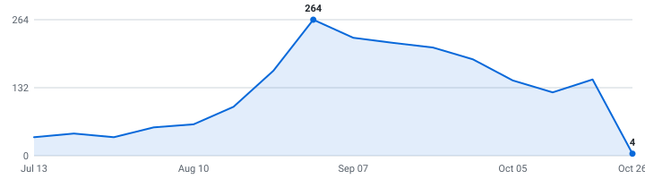

# 🎓 Summer 2027 Tech Internships

**A self-updating engine that tracks tech internships so you don't have to.**

&nbsp;&nbsp;&nbsp;

### 1199 open roles (616 listed below) · 124 new this week

4,811 employers tracked · data as of Oct 23, 2026 at 10:19 UTC

_870 have a cycle the employer stated · 329 are recent postings whose cycle isn't stated (listed separately, never mixed in)._

**[🖥️ Live dashboard](https://zshah101.github.io/Automated-List-Of-Summer-2027-and-Fall-2026-Tech-Internships/)** · **[📡 RSS](https://zshah101.github.io/Automated-List-Of-Summer-2027-and-Fall-2026-Tech-Internships/feed.xml)** · **[⚙️ JSON API](https://zshah101.github.io/Automated-List-Of-Summer-2027-and-Fall-2026-Tech-Internships/api/jobs.json)** · **[✉️ Email alerts](https://zshah101.github.io/Automated-List-Of-Summer-2027-and-Fall-2026-Tech-Internships/#subscribe)**

> [!TIP]
> **⭐ Star this repo** to save it and get updates when new roles are added.

Instead of refreshing a dozen career pages by hand, it reads company hiring feeds directly and keeps one live list — newest roles on top, refreshed automatically throughout the day.

**🔔 New roles in your inbox:** [subscribe by email](https://zshah101.github.io/Automated-List-Of-Summer-2027-and-Fall-2026-Tech-Internships/#subscribe) - one email a day, only when new internships actually appeared, unsubscribe from any email in two clicks. (Prefer RSS-to-email? [Feedrabbit works too](https://feedrabbit.com/subscriptions/new?url=https%3A%2F%2Fraw.githubusercontent.com%2Fzshah101%2FAutomated-List-Of-Summer-2027-and-Fall-2026-Tech-Internships%2Fmain%2Fdocs%2Ffeed.xml).)

---

## What this is

This is an engine, not a hand-kept list. It polls company career feeds every 30 minutes, finds the internships, removes duplicates, and rebuilds this page on its own.

Every link comes straight from the source — so it's real and current, not a stale list someone forgot to update. Speed matters.

## What makes this different

| | |
|---|---|
| 📅 **[Drop Radar](#drop-radar)** | A forecast of **what's coming**. Each marquee company's typical opening window, replaced by the real drop date the moment the engine catches it live. Windows are estimates and labelled as such; only dates the engine saw itself are marked verified. |
| 🛂 **Visa intel, computed** | 🇺🇸 / 🛂 flags detected automatically from every job description, plus ✓ for employers with a real H-1B track record (USCIS data, FY2022-23 — a history, not a promise). The big lists crowdsource this by hand; here it's code. Most postings say nothing either way, and those show as unknown rather than guessed. |
| 📆 **A real date on nearly every role** | Taken from the job portal itself wherever the portal states one, so newest-first actually means newest. The exact coverage figure is printed at the bottom of this page every run. |
| 🧰 **Skill tags + pay, extracted** | Every posting's text is scanned for the stack it wants (Python, C++, PyTorch, …) and the pay it states — searchable on the [dashboard](https://zshah101.github.io/Automated-List-Of-Summer-2027-and-Fall-2026-Tech-Internships/), and included in the CSV and API. |
| 🔔 **Alerts your way** | [Email digests](https://zshah101.github.io/Automated-List-Of-Summer-2027-and-Fall-2026-Tech-Internships/#subscribe) or [RSS](https://zshah101.github.io/Automated-List-Of-Summer-2027-and-Fall-2026-Tech-Internships/feed.xml) — point any reader, or a Slack/Discord RSS integration, at it. Plus a [live dashboard](https://zshah101.github.io/Automated-List-Of-Summer-2027-and-Fall-2026-Tech-Internships/) with search, filters, and a saved-roles list that never leaves your browser. |
| ⚙️ **An engine, not a spreadsheet** | 5,101 job-board endpoints (4,811 distinct employers; some run more than one board) polled every 30 minutes across 12 ATS platforms. Full source and tests in this repo. |

## Scope

| | |
|---|---|
| **Roles** | Software Engineering, Data Science & Machine Learning (and closely related technical internships) |
| **Region** | United States |
| **Cycles** | Summer 2027 and Fall 2026 |

## About

I'm an international student studying in the United States, so I built this for the search I'm doing myself. The list is US roles only for now — that's where I'm searching.

Use it to spot roles early and apply before they fill up. Being first genuinely helps.

## Where this is going

I'm building this in the open and adding to it as it grows.

**Recently shipped:** email alerts · the Drop Radar · auto-detected sponsorship flags · the live dashboard

**Next up:** personalized alerts (pick your categories) · per-company hiring pages · a ghost-posting detector

If it helps you, a star means a lot and tells me to keep going.

## How to use

<b>Reading the table — flags, dates, and the cycle split</b> (click to expand)

- Roles are grouped by cycle below - **newest posting on top, oldest at the bottom.**
- A cycle section holds only roles whose **employer stated that cycle** - in the title, or in the posting's own text. Postings that name no cycle anywhere are in *Recently posted — cycle not stated* further down, with **no cycle guessed for them**. Same quality bar, different amount of evidence.
- **Apply** is the third column, right after the role, so the link is on screen even when the table is wider than your window.
- The **Posted** column is the date the company published the role.
- **_(3 openings)_ after a role title** = the employer has that many separate live requisitions for the same job, in the same place, for the same cycle. They're all real and each takes its own application, so they're linked individually (**Apply**, then **#2**, **#3**) instead of repeating the row. Counts still count requisitions, and the CSV export is never grouped.
- **🆁 after a company name** = **this role is remote** — the posting's own location or title says so. It marks the role on that row, not the whole company.
- **Flags after a role title:** 🇺🇸 = requires U.S. citizenship or a security clearance · 🛂 = the posting says it won't sponsor a work visa · 🆕 = spotted in the last 48 hours. Sponsorship flags are detected automatically from each job description - treat them as a strong hint and confirm on the posting.
- **✓ after a company name** = a real H-1B track record: USCIS approved 10+ petitions for that employer in FY2022–2023 (matched automatically against the official [H-1B Employer Data Hub](https://www.uscis.gov/tools/reports-and-studies/h-1b-employer-data-hub)). No ✓ doesn't mean they won't sponsor - it means we can't prove they have.
- Track your applications with [`data/internships.csv`](data/internships.csv) (opens in Excel / Google Sheets).
- Missing a company? Adding one takes a single line, see [CONTRIBUTING.md](CONTRIBUTING.md).

---

## Summer 2027  (300 employer-stated)

| Company | Role | Apply | Location | Skills | Posted |
|---|---|---|---|---|---|
| Skydio ✓ | Frontend Software Engineer Intern - Summer 2027 🆕 | [Apply](https://jobs.ashbyhq.com/skydio/89bb6fee-3cd2-4e0b-a1c2-c73de8c1f9bd) | San Mateo, California, United States | TypeScript, React, GraphQL | Oct 22, 2026 |
| CVS Health | Innovation & Technology Internship - Data Science - Summer 2027 (Graduate) 🛂 🆕 | [Apply](https://cvshealth.wd1.myworkdayjobs.com/CVS_Health_Careers/job/NY---New-York/Innovation---Technology-Internship---Data-Science---Summer-2027--Graduate-_R1081038) | NY - New York | Python, SQL, scikit-learn | Oct 22, 2026 |
| CVS Health | Innovation & Technology Internship - Data Science - Summer 2027 (Undergrad​uate) 🛂 🆕 | [Apply](https://cvshealth.wd1.myworkdayjobs.com/CVS_Health_Careers/job/NY---New-York/Innovation---Technology-Internship---Data-Science---Summer-2027--Undergraduate-_R1081067) | NY - New York | Python, SQL, scikit-learn | Oct 22, 2026 |
| CVS Health | Innovation & Technology Internship - Software Engineering: Data & Intelligence Summer 2027 Graduate 🛂 🆕 | [Apply](https://cvshealth.wd1.myworkdayjobs.com/CVS_Health_Careers/job/NY---New-York/Innovation---Technology-Internship--Software-Engineering--Data---Intelligence-Summer-2027-Graduate_R1081128) | NY - New York | Python, Java, JavaScript, SQL | Oct 22, 2026 |
| WSP | Transporta​tion Data Analyst Intern - Summer 2027 🆕 | [Apply](https://emit.fa.ca3.oraclecloud.com/hcmUI/CandidateExperience/en/sites/CX_2001/job/97952) | Seattle, WA, United States | Python, Git | Oct 22, 2026 |
| Allstate Insurance Company ✓ 🆁 | Arity - Data Analytics Engineer Intern 🛂 🆕 | [Apply](https://allstate.wd5.myworkdayjobs.com/sourcing_event/job/USA---IL-Remote/Arity---Data-Analytics-Engineer-Intern_R36286) | USA - IL (Remote) | Python, SQL, Bash, TensorFlow | Oct 22, 2026 |
| Allstate Insurance Company ✓ 🆁 | Arity - Data Science Intern (Core Telematics) 🛂 🆕 | [Apply](https://allstate.wd5.myworkdayjobs.com/sourcing_event/job/USA---IL-Remote/Arity---Data-Science-Intern--Core-Telematics-_R36285) | USA - IL (Remote) | Python, SQL, TensorFlow, scikit-learn | Oct 22, 2026 |
| Allstate Insurance Company ✓ 🆁 | Arity - Software Engineer Intern 🛂 🆕 | [Apply](https://allstate.wd5.myworkdayjobs.com/sourcing_event/job/USA---NC-Remote/Arity---Software-Engineer-Intern_R36266) | USA - NC (Remote) | Python, Java, Go, Kotlin | Oct 22, 2026 |
| General Dynamics Information Technology ✓ | Financial Data Analyst Intern (Seasonal) 🇺🇸 🆕 | [Apply](https://gdit.wd5.myworkdayjobs.com/gdit_earlytalent/job/USA-VA-Falls-Church/Financial-Data-Analyst-Intern--Seasonal-_RQ230761) | USA VA Falls Church | Python, SQL | Oct 22, 2026 |
| Northrop Grumman | 2027 Systems Engineering Internship (AI Experience) - Dulles VA 🇺🇸 🆕 | [Apply](https://ngc.wd1.myworkdayjobs.com/Northrop_Grumman_External_Site/job/United-States-Virginia-Dulles/XMLNAME-2027-Systems-Engineering-Internship--AI-Experience----Dulles-VA_R10257423) | United States-Virginia-Dulles | No skills listed | Oct 22, 2026 |
| Sierra Nevada Corporation | Systems Security Engineer Intern - Summer 2027 (For SNC Summer 2026 Interns Only) 🇺🇸 🆕 | [Apply](https://snc.wd1.myworkdayjobs.com/snc_external_career_site/job/Hagerstown-MD/Systems-Security-Engineer-Intern---Summer-2027--For-SNC-Summer-2026-Interns-Only-_R0030540) | Hagerstown, MD | No skills listed | Oct 22, 2026 |
| STR | Data Analyst Intern - Summer 2027 🇺🇸 🆕 | [Apply](https://job-boards.greenhouse.io/systemstechnologyresearch/jobs/4723980006) | Arlington, VA | SQL | Oct 22, 2026 |
| Infinite​Quant | Quantitative Researcher - Internship - Summer 2027 🆕 | [Apply](https://jobs.smartrecruiters.com/InfiniteQuant/744000157170821) | New York, NY, United States | Python, C++, Pandas | Oct 22, 2026 |
| Nissan | Cyber Security Intern - Summer 2027 - Smyrna, TN 🛂 🆕 | [Apply](https://alliance.wd3.myworkdayjobs.com/nissanjobs/job/Smyrna-Tennessee---United-States-of-America/Cyber-Security-Intern---Summer-2027---Smyrna--TN_R00214879) | Smyrna +1 more | No skills listed | Oct 22, 2026 |
| Northrop Grumman | 2027 Cyber Software Engineer Intern - San Antonio TX 🇺🇸 🆕 | [Apply](https://ngc.wd1.myworkdayjobs.com/Northrop_Grumman_External_Site/job/United-States-Texas-San-Antonio/XMLNAME-2027-Cyber-Software-Engineer-Intern---San-Antonio-TX_R10257311) | United States-Texas-San Antonio | Python, Java, C++, C# | Oct 22, 2026 |
| Global​Foundries | Software Engineering Intern, Cloud Platform (Summer 2027) 🆕 | [Apply](https://globalfoundries.wd1.myworkdayjobs.com/External/job/USA---California---Santa-Clara/Software-Engineering-Intern--Cloud-Platform--Summer-2027-_JR-2604034) | USA - California - Santa Clara | No skills listed | Oct 21, 2026 |
| American Family Insurance Group | Summer 2027 Intern - Data Engineer 🆕 | [Apply](https://amfam.wd1.myworkdayjobs.com/Careers/job/WI-Madison/Summer-2027-Intern---Data-Engineer_R39675) | WI Madison | Python, SQL, AWS, GCP | Oct 21, 2026 |
| Sierra Space | Summer 2027 Flight Software Engineer Intern 🇺🇸 🆕 | [Apply](https://sierraspace.wd1.myworkdayjobs.com/Sierra_Space_External_Career_Site/job/Louisville-CO/Summer-2027-Flight-Software-Engineer-Intern_R26456) | Louisville, CO | No skills listed | Oct 21, 2026 |
| DP World | Information Security Intern 🛂 🆕 | [Apply](https://ehpv.fa.em2.oraclecloud.com/hcmUI/CandidateExperience/en/sites/CX_1/job/27404) | Charlotte, NC, United States | Linux | Oct 21, 2026 |
| The Aerospace Corporation | 2027 Embedded Software Engineering Grad Intern 🇺🇸 🆕 | [Apply](https://aero.wd5.myworkdayjobs.com/external/job/El-Segundo-CA/XMLNAME-2027-Embedded-Software-Engineering-Grad-Intern_R016950) | El Segundo, CA | Python, C++, TensorFlow, CUDA | Oct 21, 2026 |
| The Aerospace Corporation | 2027 Embedded Software Engineering Undergrad Intern 🇺🇸 🆕 | [Apply](https://aero.wd5.myworkdayjobs.com/external/job/El-Segundo-CA/XMLNAME-2027-Embedded-Software-Engineering-Undergrad-Intern_R016949) | El Segundo, CA | Python, C++, TensorFlow, CUDA | Oct 21, 2026 |
| Duke Energy | Nuclear Cybersecur​ity 2027 Summer Internship 🇺🇸 🆕 | [Apply](https://dukeenergy.wd1.myworkdayjobs.com/search/job/Hartsville-SC/Nuclear-Cybersecurity-2027-Summer-Internship_R42099) | Hartsville, SC | No skills listed | Oct 21, 2026 |
| Northrop Grumman | 2027 Software Engineering Intern - Roy UT 🇺🇸 🆕 | [Apply](https://ngc.wd1.myworkdayjobs.com/Northrop_Grumman_External_Site/job/United-States-Utah-Roy/XMLNAME-2027-Software-Engineering-Intern---Roy-UT_R10257053) | United States-Utah-Roy | No skills listed | Oct 21, 2026 |
| Smith+Nephew ✓ | Intern Computer Vision Software Engineering 🆕 | [Apply](https://smithnephew.wd5.myworkdayjobs.com/External/job/Andover-MA/Intern-Computer-Vision-Software-Engineering_R92964) | Andover, MA | Computer Vision, Python, C++, MATLAB | Oct 21, 2026 |
| Smith+Nephew ✓ | Intern Agentic AI Software Engineering | [Apply](https://smithnephew.wd5.myworkdayjobs.com/External/job/Andover-MA/Intern-Agentic-AI-Software-Engineering_R92953) | Andover, MA | Python, LLMs | Oct 21, 2026 |
| Smith+Nephew ✓ | Intern Embedded Software Engineering | [Apply](https://smithnephew.wd5.myworkdayjobs.com/External/job/Andover-MA/Intern-Embedded-Software-Engineering_R92952) | Andover, MA | C++, Computer Vision | Oct 21, 2026 |
| NVIDIA ✓ | Systems Software Intern, Aerial PHY- Summer 2027 | [Apply](https://nvidia.wd5.myworkdayjobs.com/NVIDIAExternalCareerSite/job/US-CA-Santa-Clara/Systems-Software-Intern--Aerial-PHY--Summer-2027_JR2026530) | US, CA, Santa Clara | Python, C++, MATLAB, CUDA | Oct 20, 2026 |
| Salesforce ✓ | Summer 2027 Intern - AI Research | [Apply](https://salesforce.wd12.myworkdayjobs.com/External_Career_Site/job/California---Palo-Alto/Summer-2027-Intern---AI-Research_JR365111-1) | California - Palo Alto | Python, PyTorch, LLMs, Computer Vision | Oct 20, 2026 |
| Anduril | 2027 Finance Data Analyst Intern | [Apply](https://boards.greenhouse.io/andurilindustries/jobs/5269977007?gh_jid=5269977007) | Costa Mesa, California, United States | Python, SQL, LLMs, Computer Vision | Oct 20, 2026 |
| Skydio ✓ | Mobile Software Engineer Intern - Summer 2027 | [Apply](https://jobs.ashbyhq.com/skydio/8a237302-3fe8-4403-b32b-7690f333ba52) | San Mateo, California, United States | Python, C++, Kotlin, Linux | Oct 20, 2026 |
| Integrate | Software Engineering Intern (Summer 2027) 🆕 | [Apply](https://jobs.ashbyhq.com/integrate/7681f59b-70c0-414b-96d9-ae8925cc2ed3) | Seattle, WA | Python, Rust, TypeScript, JavaScript | Oct 20, 2026 |
| Applied Materials ✓ | 2027 Summer Intern, Software Engineer, Bachelors Degree (Santa Clara) | [Apply](https://amat.wd1.myworkdayjobs.com/External/job/Santa-ClaraCA/XMLNAME-2027-Summer-Intern--Software-Engineer--Bachelors-Degree--Santa-Clara-_R2630672) | Santa Clara,CA | C++, C# | Oct 20, 2026 |
| Uber | 2027 Software Engineering Intern, US | [Apply](https://iaziqy.fa.ocs.oraclecloud.com/hcmUI/CandidateExperience/en/sites/CX_1/job/303922) | San Francisco +8 more | Python, Java, C++, Ruby | Oct 20, 2026 |
| LinkedIn ✓ | Software Engineer Intern, Undergradu​ate - Summer 2027 (Mountain View, CA) | [Apply](https://jobs.smartrecruiters.com/LinkedIn3/744000156616169) | Mountain View +2 more | Python, Java, C++, C# | Oct 20, 2026 |
| Toyota | 2027 TFS Data Science Internship | [Apply](https://toyota.wd503.myworkdayjobs.com/tmna/job/Plano-Texas/XMLNAME-2027-TFS-Data-Science-Internship_10338545-1) | Plano, Texas | Python, SQL, scikit-learn, Pandas | Oct 20, 2026 |
| TruStage 🆁 | Information Technology - Development and Infrastruc​ture Internship (hybrid) | [Apply](https://trustage.wd1.myworkdayjobs.com/TruStage/job/Wisconsin---Remote/Enterprise-Information---Technology-Internship--Hybrid-_R-012155) | Wisconsin - Remote | C#, JavaScript, React, Angular | Oct 20, 2026 |
| Philips | Intern – R&D Front-End Innovation Intern - Oral Healthcare – Bothell, WA – Summer 2027 | [Apply](https://philips.wd3.myworkdayjobs.com/jobs-and-careers/job/Bothell-Washington-United-States/Intern---R-D-Front-End-Innovation-Intern---Oral-Healthcare---Bothell--WA---Summer-2027_593146) | Bothell, Washington, United States | No skills listed | Oct 20, 2026 |
| Nissan | AI Agent Architect Intern - Summer 2027 - Farmington Hills, MI 🛂 | [Apply](https://alliance.wd3.myworkdayjobs.com/nissanjobs/job/Farmington-Hills-Michigan---United-States-of-America/AI-Agent-Architect---Summer-2027---Farmington-Hills--MI_R00214218) | Farmington Hills +1 more | Python, SQL, LLMs, AWS | Oct 20, 2026 |
| Verizon Communicat​ions | Basking Ridge, NJ: VTeamer for a Day: Verizon Consumer Group: Data Science Summer 2027 Internship | [Apply](https://verizon.wd12.myworkdayjobs.com/verizon-careers/job/Basking-Ridge-New-Jersey/Basking-Ridge--NJ--VTeamer-for-a-Day--Verizon-Consumer-Group--Data-Science-Summer-2027-Internship_R-1102417) | Basking Ridge, New Jersey | LLMs, Tableau | Oct 20, 2026 |
| Verizon Communicat​ions | Verizon Consumer Group: Data Science Summer 2027 Internship | [Apply](https://verizon.wd12.myworkdayjobs.com/verizon-careers/job/Basking-Ridge-New-Jersey/Verizon-Consumer-Group--Data-Science-Summer-2027-Internship_R-1102419) | Basking Ridge, New Jersey | LLMs, Tableau | Oct 20, 2026 |
| Scale AI ✓ | Machine Learning Research Intern (Summer 2027) | [Apply](https://job-boards.greenhouse.io/scaleai/jobs/4735665005) | New York, NY; San Francisco, CA | Python, JavaScript, LLMs | Oct 19, 2026 |
| Amplify 🆁 | Summer 2027: Software Engineering Intern | [Apply](https://jobs.ashbyhq.com/amplify/855d22a3-f15e-49f6-854c-29e505653efa) | Remote - United States | Python, Java, TypeScript, JavaScript | Oct 19, 2026 |
| Amplify 🆁 | Summer 2027: AI Scientist Intern | [Apply](https://jobs.ashbyhq.com/amplify/bb45b7f6-dd7e-40e5-84e6-52e21650a7b8) | Remote - United States | Python, SQL, LLMs, AWS | Oct 19, 2026 |
| Patreon ✓ | Software Engineering Intern - Summer 2027 | [Apply](https://jobs.ashbyhq.com/patreon/cefe07ab-ba4f-48cc-86b9-a88b1859a95c) | New York | Python, TypeScript, Swift, Kotlin | Oct 19, 2026 |
| Nissan | AI Autonomous Driving Verification & Validation Intern - Summer 2027 - Santa Clara, CA 🛂 | [Apply](https://alliance.wd3.myworkdayjobs.com/nissanjobs/job/Santa-Clara-California---United-States-of-America/AI-Autonomous-Driving-Verification---Validation-Intern---Summer-2027---Santa-Clara--CA_R00214263) | Santa Clara +1 more | Python, PyTorch, TensorFlow | Oct 19, 2026 |
| Global​Foundries | AI/ML Systems Engineering Intern (Summer 2027) | [Apply](https://globalfoundries.wd1.myworkdayjobs.com/External/job/USA---Texas---Richardson/AI-ML-Systems-Engineering-Intern--Summer-2027-_JR-2604051) | USA - Texas - Richardson | Python, PyTorch, TensorFlow, Pandas | Oct 19, 2026 |
| Highmark Health ✓ | Summer 2027 Data Analyst Undergradu​ate Intern 🛂 | [Apply](https://highmarkhealth.wd1.myworkdayjobs.com/highmark/job/Pittsburgh-PA-15222-FAP-5th-Avenue-Place/Summer-2027-Data-Analyst-Undergraduate-Intern_J288017) | Pittsburgh PA +3 more | No skills listed | Oct 19, 2026 |
| The Toro Company | Cloud Software Development Intern - The Toro Company 🛂 | [Apply](https://ttc.wd1.myworkdayjobs.com/Toro_External_Careers/job/Frederick-CO/Cloud-Software-Development-Intern---The-Toro-Company_JR17498) | Frederick, CO | No skills listed | Oct 19, 2026 |
| Zebra Technologies ✓ | 2027 Summer Internship (US) - Software Engineer 🛂 | [Apply](https://zebra.wd501.myworkdayjobs.com/Zebra_careers/job/Holtsville-New-York/XMLNAME-2027-Summer-Internship--US----Software-Engineer_JR103625) | Holtsville, New York | Python, Java, JavaScript, LLMs | Oct 19, 2026 |
| Graviton | Quantitative Researcher - 2027 Summer Internship | [Apply](https://job-boards.greenhouse.io/gravitonresearchcapital/jobs/8899673002) | Amsterdam +7 more | Python, C++ | Oct 19, 2026 |
| Inversion Space | AI & Internal Tools Software Engineer - Summer Internship 2027 🇺🇸 | [Apply](https://job-boards.greenhouse.io/inversionspace/jobs/4745076005) | Playa Vista, California, United States | Python, Rust, TypeScript, JavaScript | Oct 19, 2026 |
| Inversion Space | Vehicle Software Engineer - Summer Internship 2027 🇺🇸 | [Apply](https://job-boards.greenhouse.io/inversionspace/jobs/4745083005) | Playa Vista, California, United States | Python, C++, Rust, Linux | Oct 19, 2026 |
| RTX | Software Engineering Intern (Summer 2027) 🇺🇸 | [Apply](https://globalhr.wd5.myworkdayjobs.com/rec_rtx_ext_gateway/job/US-IA-CEDAR-RAPIDS-121--350-Collins-Rd-NE--BLDG-121/Software-Engineering-Intern--Summer-2027-_01880499) | US-IA-CEDAR RAPIDS-121 ~ 350 Collins Rd… | Python, C++, Rust, Linux | Oct 19, 2026 |
| Marvell | AI Data Science Intern, MS - Summer 2027 | [Apply](https://marvell.wd1.myworkdayjobs.com/MarvellCareers/job/Santa-Clara-CA/AI-Data-Science-Intern--MS---Summer-2027_2603846-1) | Santa Clara, CA | Python, SQL, scikit-learn, Pandas | Oct 19, 2026 |
| Johnson & Johnson | Quality Data Science Co-Op , Summer 2027 🛂 | [Apply](https://jj.wd5.myworkdayjobs.com/JJ/job/Cincinnati-Ohio-United-States-of-America/Quality-Data-Science-Co-Op---Summer-2027_R-103629) | Cincinnati +2 more | Python | Oct 19, 2026 |
| Pattern | AI Automation Engineer Intern 🆕 | [Apply](https://jobs.lever.co/pattern/48945dce-b5ef-43cd-9d85-f8b26ce5b43e) | Lehi, UT, US | Python, Java, PyTorch, TensorFlow | Oct 16, 2026 |
| Pattern | AI Infrastruc​ture Engineer Intern 🆕 | [Apply](https://jobs.lever.co/pattern/5c0c1963-87c5-48d7-8da9-0c79121fe443) | Lehi, UT, US | Python, Java, TypeScript, LLMs | Oct 16, 2026 |
| Ryan | Summer 2027 Intern, Software Engineering | [Apply](https://ryan.wd1.myworkdayjobs.com/RyanCareers/job/Plano/Summer-2027-Intern--Software-Engineering_R0020843-1) | Plano TX | Python, C#, TypeScript, React | Oct 16, 2026 |
| General Dynamics Information Technology ✓ | Summer 2027 AI and Estimation Intern 🇺🇸 | [Apply](https://gdit.wd5.myworkdayjobs.com/gdit_earlytalent/job/USA-VA-Falls-Church/Technical-Intern---AI-and-Estimation_RQ230646) | USA VA Falls Church | Python, LLMs | Oct 16, 2026 |
| Ryan | Summer 2027 Intern, Software Development | [Apply](https://ryan.wd1.myworkdayjobs.com/RyanCareers/job/Plano/Summer-2027-Intern--Software-Development_R0020822-1) | Plano TX | Python, C#, TypeScript, React | Oct 16, 2026 |
| Mastercard | Platform Engineering Intern, Summer 2027 – St. Louis, MO, US | [Apply](https://mastercard.wd1.myworkdayjobs.com/Campus/job/OFallon-Missouri/Platform-Engineering-Intern--Summer-2027---St-Louis--MO--US_R-284880) | O'Fallon, Missouri | Java, AWS, GCP, Azure | Oct 16, 2026 |
| ICF ✓ | 2027 Summer Intern, Cloud Engineer (AWS/Azure) (Reston, VA) 🛂 | [Apply](https://icf.wd5.myworkdayjobs.com/ICFExternal_Career_Site/job/Reston-VA/XMLNAME-2027-Summer-Intern--Cloud-Engineer--AWS-Azure---Reston--VA-_R2603554) | Reston, VA | AWS, Azure, Terraform, Git | Oct 16, 2026 |
| Leidos ✓ 🆁 | Cloud Engineering Intern 🇺🇸 | [Apply](https://leidos.wd5.myworkdayjobs.com/External/job/6314-RemoteTeleworker-US/Cloud-Engineering-Intern_R-00194668) | 6314 Remote/Teleworker US | Azure | Oct 16, 2026 |
| Centene 🆁 | AI Software Developer Intern (Undergrad​uate - Summer 2027) | [Apply](https://centene.wd5.myworkdayjobs.com/Centene_External/job/Remote-MO/AI-Software-Developer-Intern--Undergraduate---Summer-2027-_1667710) | Remote-MO | No skills listed | Oct 15, 2026 |
| Inversion Space | Avionics Embedded Software Engineer - Summer Internship 2027 🇺🇸 | [Apply](https://job-boards.greenhouse.io/inversionspace/jobs/4744391005) | Playa Vista, California, United States | Python, C++, Linux, Git | Oct 15, 2026 |
| Lawrence Livermore National Laboratory (LLNL) | Critical Infrastruc​ture Analysis Undergradu​ate Intern - Cyber and Critical Infrastruc​ture Summer Institute - Summer 2027 🇺🇸 | [Apply](https://jobs.smartrecruiters.com/LLNL/3743990016165496) | Livermore, CA, United States | No skills listed | Oct 15, 2026 |
| Lawrence Livermore National Laboratory (LLNL) | Power Systems Graduate Intern - Cyber and Critical Infrastruc​ture Summer Institute - Summer 2027 🇺🇸 | [Apply](https://jobs.smartrecruiters.com/LLNL/3743990016165506) | Livermore, CA, United States | Python, C++, MATLAB | Oct 15, 2026 |
| Lawrence Livermore National Laboratory (LLNL) | Cybersecur​ity Graduate Intern - Cyber and Critical Infrastruc​ture Summer Institute - Summer 2027 🇺🇸 | [Apply](https://jobs.smartrecruiters.com/LLNL/3743990016165586) | Livermore, CA, United States | Python, Java, C++, MATLAB | Oct 15, 2026 |
| T-Mobile ✓ | Summer 2027 Software Engineering Intern | [Apply](https://tmobile.wd1.myworkdayjobs.com/External/job/Bellevue-Washington/Summer-2027-Software-Engineering-Intern_REQ368322) | Bellevue, Washington | Python, Java, C++, JavaScript | Oct 15, 2026 |
| General Matter | Summer 2027 Internship - Information Security Engineer | [Apply](https://job-boards.greenhouse.io/generalmatter/jobs/5448019008) | Los Angeles, CA | Python, C++, Rust, TypeScript | Oct 15, 2026 |
| General Motors ✓ | 2027 Summer Intern,  Data Scaling, Embodied AI (Masters) | [Apply](https://generalmotors.wd5.myworkdayjobs.com/Careers_GM/job/Sunnyvale-California-United-States-of-America/XMLNAME-2027-Summer-Intern---Data-Scaling--Embodied-AI--Masters-_JR-202622540) | Sunnyvale +2 more | Python, C++, SQL, PyTorch | Oct 15, 2026 |
| General Motors ✓ | 2027 Summer Intern, AI Research, Embodied AI (Masters) | [Apply](https://generalmotors.wd5.myworkdayjobs.com/Careers_GM/job/Sunnyvale-California-United-States-of-America/XMLNAME-2027-Summer-Intern--AI-Research--Embodied-AI--Masters-_JR-202622535) | Sunnyvale +2 more | Python, C++, PyTorch, TensorFlow | Oct 15, 2026 |
| General Motors ✓ | 2027 Summer Intern, Onboard Autonomy, Embodied AI (Masters) | [Apply](https://generalmotors.wd5.myworkdayjobs.com/Careers_GM/job/Sunnyvale-California-United-States-of-America/XMLNAME-2027-Summer-Intern--Onboard-Autonomy--Embodied-AI--Masters-_JR-202622543) | Sunnyvale +2 more | Python, C++, PyTorch, TensorFlow | Oct 15, 2026 |
| Sierra Nevada Corporation | Software Engineer Intern - Summer 2027 (For SNC Summer 2026 Interns Only) | [Apply](https://snc.wd1.myworkdayjobs.com/snc_external_career_site/job/Lone-Tree-CO/Software-Engineer-Intern---Summer-2027--For-SNC-Summer-2026-Interns-Only-_R0031098) | Lone Tree, CO | MATLAB | Oct 15, 2026 |
| Muon Space | Ground Software Engineering Intern (Summer 2027) | [Apply](https://job-boards.greenhouse.io/muonspace/jobs/5266679007) | San Jose, CA | Python, C++, Rust | Oct 15, 2026 |
| Pattern | Data Science Intern 🆕 | [Apply](https://jobs.lever.co/pattern/ad978732-7171-473d-9400-0a6fc9e23cf7) | Lehi, UT, US | No skills listed | Oct 14, 2026 |
| Howden | Underwriting Intern, Cyber | [Apply](https://hyperiongrp.wd3.myworkdayjobs.com/Hyperion_External/job/New-York--1350-Avenue-Of-The-Americas/Underwriting-Intern_R0019772-1) | New York – 1350 Avenue Of The Americas | No skills listed | Oct 14, 2026 |
| ICF ✓ | 2027 Summer Intern, Software Engineer (Reston, VA) 🇺🇸 | [Apply](https://icf.wd5.myworkdayjobs.com/ICFExternal_Career_Site/job/Reston-VA/XMLNAME-2027-Summer-Intern--Software-Engineer--Reston--VA-_R2603522) | Reston, VA | Python, Java, C++, JavaScript | Oct 14, 2026 |
| National Life | Data Science Intern – Summer 2027 🛂 | [Apply](https://job-boards.greenhouse.io/nationallifeinsurancecompany/jobs/4449670009) | Addison, TX; Montpelier, VT | Python, SQL, PyTorch, TensorFlow | Oct 14, 2026 |
| LSEG | Intern - Software Engineer | [Apply](https://lseg.wd3.myworkdayjobs.com/Graduate_Careers/job/New-York-City-United-States/Intern---Software-Engineer_R0124266-1) | New York City, United States | Python, AWS, Linux | Oct 14, 2026 |
| QTS | Summer 2027 Internship: Information Security Operations Analyst 🇺🇸 | [Apply](https://qtsdatacenters.wd5.myworkdayjobs.com/qts/job/US-GA-Atlanta-Suwanee-1-DC1/Summer-2027-Internship--Information-Security-Operations-Analyst_R2026-2273) | US GA Atlanta Suwanee 1 DC1 | Python, Java, Tableau | Oct 14, 2026 |
| Point72 ✓ | 2027 Summer Internship – Software Engineer | [Apply](https://boards.greenhouse.io/point72/jobs/8885733002?gh_jid=8885733002) | New York, NY | Python, Java, C++, Git | Oct 14, 2026 |
| JPMorgan​Chase ✓ | 2027 AI Research Associate Program - Internship | [Apply](https://jpmc.fa.oraclecloud.com/hcmUI/CandidateExperience/en/sites/CX_1/job/210800354) | New York, NY, United States | Python, PyTorch, TensorFlow, LLMs | Oct 14, 2026 |
| CACI | Software Engineering Intern - Summer 2027 | [Apply](https://caci.wd1.myworkdayjobs.com/external/job/Florham-Park-NJ-US/Software-Engineering-Intern---Summer-2027_332543) | Florham Park, NJ, US | No skills listed | Oct 14, 2026 |
| Anduril | 2027 Firmware Engineer Intern | [Apply](https://boards.greenhouse.io/andurilindustries/jobs/5265158007?gh_jid=5265158007) | Costa Mesa, California, United States | Computer Vision | Oct 13, 2026 |
| Skydio ✓ | Software Engineer Intern - Summer 2027 | [Apply](https://jobs.ashbyhq.com/skydio/79fdda46-4ff5-42c7-b208-55f2084cdb8c) | San Mateo, California, United States | Python, C++, Go, TypeScript | Oct 13, 2026 |
| Netflix ✓ | Software Engineer Intern - Summer 2027 | [Apply](https://explore.jobs.netflix.net/careers/job/790318904468) | Los Gatos +2 more | No skills listed | Oct 13, 2026 |
| Rhombus | Software Engineering Intern - Summer 2027 | [Apply](https://jobs.lever.co/rhombus-systems/59e7a5f3-b457-491d-af08-b629ad35e380) | Sacramento, CA | No skills listed | Oct 13, 2026 |
| Field AI | Robotics Research, Embodied AI Intern (Spring & Summer 2027) | [Apply](https://jobs.lever.co/field-ai/ef35c537-b864-479f-9dbe-b30429ac7704) | Irvine, CA | Python, C++, ROS | Oct 13, 2026 |
| Watts Water | End User & Infrastruc​ture Support Intern, Summer 2027 | [Apply](https://wattswater.wd5.myworkdayjobs.com/Intern-External/job/Andover-MA-Federal-Street/IT-Network-Intern--Summer-2027_10017567) | Andover, MA Federal Street | No skills listed | Oct 13, 2026 |
| ADT ✓ | Data, Analytics & AI Internship 🛂 | [Apply](https://fa-erqb-saasfaprod1.fa.ocs.oraclecloud.com/hcmUI/CandidateExperience/en/sites/CX_1/job/3022387) | Boca Raton, FL, United States | Python, SQL, Tableau | Oct 13, 2026 |
| Draper | Classified Cybersecur​ity/IT Internship (Summer 2027) 🇺🇸 | [Apply](https://draper.wd5.myworkdayjobs.com/Draper_Careers/job/Cambridge-MA/Classified-Cybersecurity-IT-Internship--Summer-2027-_JR003021) | Cambridge, MA | No skills listed | Oct 13, 2026 |
| Jain Global | Quantitative Developer Intern (Summer 2027 - New York) | [Apply](https://jainglobal.wd5.myworkdayjobs.com/ExternalSite/job/New-York-New-York/Quantitative-Developer-Intern--Summer-2027---New-York-_JR100608) | New York, New York | Python, C++ | Oct 13, 2026 |
| Stantec | Bridge Design Intern - Infrastruc​ture (Summer 2027) | [Apply](https://hdhl.fa.us6.oraclecloud.com/hcmUI/CandidateExperience/en/sites/CX_1/job/1008240) | Columbia, SC, United States | No skills listed | Oct 12, 2026 |
| American Family Insurance Group | Summer 2027 Data Analyst Intern - Agency Performance, Insights and Operations | [Apply](https://amfam.wd1.myworkdayjobs.com/AmFamGroupInternCareers/job/WI-Madison/Summer-2027-Data-Analyst-Intern---Agency-Performance--Insights-and-Operations_R39513) | WI Madison | SQL | Oct 12, 2026 |
| CapTech Consulting | Consulting Internship: Software Engineering (Summer 2027) 🛂 | [Apply](https://jobs.smartrecruiters.com/CapTechConsulting/744000155019115) | Richmond, VA, United States | Java, C++, C#, JavaScript | Oct 12, 2026 |
| AtkinsRéalis | Software Developer Intern - Summer 2027 | [Apply](https://slihrms.wd3.myworkdayjobs.com/careers/job/USCODenver/Software-Developer-Intern---Summer-2027_R-161580-1) | US.CO.Denver | C#, TypeScript, JavaScript, SQL | Oct 12, 2026 |
| Global​Foundries | Strategic Pricing & AI Analytics Intern (Summer 2027) | [Apply](https://globalfoundries.wd1.myworkdayjobs.com/External/job/USA---Texas---Austin/Strategic-Pricing---AI-Analytics-Intern--Summer-2027-_JR-2605139) | USA - Texas - Austin | LLMs | Oct 11, 2026 |
| Cmu | AI Security Research Intern – Summer 2027 🛂 | [Apply](https://cmu.wd115.myworkdayjobs.com/sei/job/Pittsburgh-PA/AI-Security-Research-Intern---Summer-2027_2025199-1) | Pittsburgh, PA | Python, PyTorch, TensorFlow, LLMs | Oct 09, 2026 |
| Cmu | AI Security Software Engineer Intern – Summer 2027 🛂 | [Apply](https://cmu.wd115.myworkdayjobs.com/sei/job/Pittsburgh-PA/AI-Security-Software-Engineer-Intern---Summer-2027_2025200-1) | Pittsburgh, PA | Python, PyTorch, TensorFlow, Computer Vision | Oct 09, 2026 |
| Workday ✓ | Cybersecur​ity Engineer Intern 🛂 | [Apply](https://workday.wd5.myworkdayjobs.com/Workday_Early_Career/job/USA-CA-Pleasanton/Cybersecurity-Engineer-Intern_JR-0110809) | USA, CA, Pleasanton | Python, Java, TypeScript, JavaScript | Oct 09, 2026 |
| Workday ✓ | Machine Learning Engineer Intern 🛂 | [Apply](https://workday.wd5.myworkdayjobs.com/Workday_Early_Career/job/USA-CA-Pleasanton/Machine-Learning-Engineer-Intern_JR-0110812) | USA, CA, Pleasanton | Python, Pandas, LLMs, AWS | Oct 09, 2026 |
| Workday ✓ | Software Application Development Engineer Intern 🛂 | [Apply](https://workday.wd5.myworkdayjobs.com/Workday_Early_Career/job/USA-CA-Pleasanton/Software-Application-Development-Engineer-Intern_JR-0110811) | USA, CA, Pleasanton | Python, Java, C++, JavaScript | Oct 09, 2026 |
| Itron ✓ | Intern - HR AI Data Science (Summer 2027) | [Apply](https://itron.wd5.myworkdayjobs.com/Itron/job/United-States-of-America-Texas-Austin/Intern---HR-AI-Data-Science--Summer-2027-_JR103034-1) | United States of America, Texas, Austin | Python, Tableau | Oct 09, 2026 |
| Alcon | Clinical Data Science Intern 🛂 | [Apply](https://alcon.wd5.myworkdayjobs.com/careers_alcon/job/Fort-Worth-Texas/Clinical-Data-Science-Intern_R-2026-50204) | Fort Worth, Texas | Python | Oct 09, 2026 |
| GCM Grosvenor | 2027 Software Engineering Summer Intern | [Apply](https://job-boards.greenhouse.io/gcmgrosvenor/jobs/8015792003) | Chicago, Illinois, United States | Python, Java, C++, C# | Oct 09, 2026 |
| DoorDash ✓ | Software Engineer, Intern - Labs (Summer 2027) | [Apply](https://job-boards.greenhouse.io/doordashusa/jobs/8263774) | San Francisco, CA; Sunnyvale, CA | Python, Java, SQL, Kotlin | Oct 08, 2026 |
| IMC Trading ✓ | Machine Learning Engineer Intern - Summer 2027 | [Apply](https://job-boards.eu.greenhouse.io/imc/jobs/4962456101) | New York, United States | Python, C++ | Oct 08, 2026 |
| Viget | Software Developer Intern (2027) 🛂 | [Apply](https://jobs.lever.co/viget/b18cc87d-fca2-485a-a0f2-ad6197db63f2) | Boulder, CO | Python, JavaScript, Ruby, React | Oct 08, 2026 |
| Jones Lang LaSalle (JLL) | AI Intern Summer 2027 Internship - Los Angeles, CA 🛂 | [Apply](https://jll.wd1.myworkdayjobs.com/jllcareers/job/Los-Angeles-CA/AI-Intern-Summer-2027-Internship---Los-Angeles--CA_REQ539393) | Los Angeles, CA | Python, SQL, Pandas, LLMs | Oct 08, 2026 |
| Modernizing Medicine | Software Engineering Intern | [Apply](https://modmed.wd501.myworkdayjobs.com/ModMed12/job/Boca-Raton-FL/Software-Engineering-Intern_R5148) | Boca Raton, FL | Python, Java, C#, Go | Oct 08, 2026 |
| Moog | Intern, Computer Science | [Apply](https://moog.wd5.myworkdayjobs.com/moog_external_career_site/job/Torrance-CA/Intern--Computer-Science_R-26-19819) | Torrance, CA | No skills listed | Oct 08, 2026 |
| Rugged Robotics | Robotic Software Intern/Co-op (Spring or Summer 2027) | [Apply](https://job-boards.greenhouse.io/ruggedrobotics/jobs/4730908005) | Houston, TX | Python, C++ | Oct 08, 2026 |
| Stantec | Civil/Transporta​tion Engineering Intern - Infrastruc​ture (Summer 2027) | [Apply](https://hdhl.fa.us6.oraclecloud.com/hcmUI/CandidateExperience/en/sites/CX_1/job/1008210) | Charleston +5 more | No skills listed | Oct 08, 2026 |
| Amazon ✓ | Software Development Engineer (Embedded Systems) Intern, Amazon Leo - Summer 2027 (USA) 🇺🇸 | [Apply](https://www.amazon.jobs/en/jobs/10571374/software-development-engineer-embedded-systems-intern-amazon-leo-summer-2027-usa) | Redmond, Washington, USA | Python, Java, C++, C# | Oct 07, 2026 |
| Apple Bank | 2027 Summer Intern- Information Security 🛂 | [Apply](https://applebank.wd5.myworkdayjobs.com/applebankcareers/job/New-York-NY/XMLNAME-2027-Summer-Intern--Information-Security_2026-1416) | New York, NY | No skills listed | Oct 07, 2026 |
| Motorola | Software Engineer - Summer 2027 Internship | [Apply](https://motorolasolutions.wd5.myworkdayjobs.com/Careers/job/Westminster-CO/Software-Engineer---Summer-2027-Internship_R68997) | Westminster, CO | C#, SQL, Angular | Oct 07, 2026 |
| Motorola | GenAI & Machine Learning - 2027 Summer Internship (Chicago Hybrid) 🛂 | [Apply](https://motorolasolutions.wd5.myworkdayjobs.com/Careers/job/Chicago-IL/GenAI---Machine-Learning---2027-Summer-Internship--Chicago-Hybrid-_R68929) | Chicago, IL | LLMs, Python, scikit-learn, Pandas | Oct 07, 2026 |
| State Affairs | Software Engineer Intern (Summer 2027) | [Apply](https://job-boards.greenhouse.io/stateaffairs/jobs/4437430009) | Washington, DC | TypeScript, SQL, LLMs, React | Oct 07, 2026 |
| RTX | Software Engineering Co-op (Spring/Summer 2027) 🆕 _(3 openings)_ | [Apply](https://globalhr.wd5.myworkdayjobs.com/rec_rtx_ext_gateway/job/US-IA-CEDAR-RAPIDS-130--5350-C-Ave-NE--BLDG-130/Software-Engineering-Co-op--Spring-Summer-2027-_01879726) [#2](https://globalhr.wd5.myworkdayjobs.com/rec_rtx_ext_gateway/job/US-IA-CEDAR-RAPIDS-130--5350-C-Ave-NE--BLDG-130/Software-Engineering-Co-op--Spring-Summer-2027-_01881996) [#3](https://globalhr.wd5.myworkdayjobs.com/rec_rtx_ext_gateway/job/US-IA-CEDAR-RAPIDS-130--5350-C-Ave-NE--BLDG-130/Software-Engineering-Co-op--Spring-Summer-2027-_01882134) | US-IA-CEDAR RAPIDS-130 ~ 5350 C Ave NE… | C++, Linux | Oct 07, 2026 |
| RTX | Software Engineering Co-op (Summer/Fall 2027) 🆕 _(4 openings)_ | [Apply](https://globalhr.wd5.myworkdayjobs.com/rec_rtx_ext_gateway/job/US-IA-CEDAR-RAPIDS-130--5350-C-Ave-NE--BLDG-130/Software-Engineering-Co-op--Summer-Fall-2027-_01879738) [#2](https://globalhr.wd5.myworkdayjobs.com/rec_rtx_ext_gateway/job/US-IA-CEDAR-RAPIDS-130--5350-C-Ave-NE--BLDG-130/Software-Engineering-Co-op--Summer-Fall-2027-_01882414) [#3](https://globalhr.wd5.myworkdayjobs.com/rec_rtx_ext_gateway/job/US-IA-CEDAR-RAPIDS-130--5350-C-Ave-NE--BLDG-130/Software-Engineering-Co-op--Summer---Fall-2027-_01881368) [#4](https://globalhr.wd5.myworkdayjobs.com/rec_rtx_ext_gateway/job/US-IA-CEDAR-RAPIDS-130--5350-C-Ave-NE--BLDG-130/Software-Engineering-Co-op--Summer-Fall-2027-_01882137) | US-IA-CEDAR RAPIDS-130 ~ 5350 C Ave NE… | C++, Linux | Oct 07, 2026 |
| Sigma Computing ✓ | Software Engineering Intern (Summer 2027) 🛂 | [Apply](https://job-boards.greenhouse.io/sigmacomputing/jobs/8001295003) | New York, NY | Python, Java, JavaScript, SQL | Oct 06, 2026 |
| Highmark Health ✓ | Summer 2027 Artificial Intelligence (Operations) Undergradu​ate Intern 🛂 | [Apply](https://highmarkhealth.wd1.myworkdayjobs.com/highmark/job/Pittsburgh-PA-15222-FAP-5th-Avenue-Place/Summer-2027-Artificial-Intelligence--Operations--Undergraduate-Intern_J287476) | Pittsburgh PA +3 more | No skills listed | Oct 06, 2026 |
| ABB ✓ | AI Engineering, Business Systems Intern- Summer 2027 🛂 | [Apply](https://abb.wd3.myworkdayjobs.com/external_career_page/job/USA-NC-Cary/AI-Engineering--Business-Systems-Intern--Summer-2027_JR00048714) | USA, NC, Cary | Python, SQL, LLMs, Git | Oct 06, 2026 |
| ABB ✓ | AI Engineering, ERP Intern- Summer 2027 🛂 | [Apply](https://abb.wd3.myworkdayjobs.com/external_career_page/job/USA-NC-Cary/AI-Engineering--ERP-Intern--Summer-2027_JR00048711) | USA, NC, Cary | Python, SQL, LLMs, Git | Oct 06, 2026 |
| Dmainc | Cybersecur​ity Intern - Summer 2027 | [Apply](https://dmainc.wd5.myworkdayjobs.com/dma/job/Fort-Wayne-IN/Cybersecurity-Intern---Summer-2027_REQ742) | Fort Wayne, IN | No skills listed | Oct 06, 2026 |
| Jabil ✓ | AI Transforma​tion Intern | [Apply](https://jabil.wd5.myworkdayjobs.com/Jabil_Careers/job/Austin-TX/AI-Transformation-Intern_J2466044) | Austin, TX | LLMs | Oct 06, 2026 |
| Leidos ✓ | Data Science Intern 🇺🇸 | [Apply](https://leidos.wd5.myworkdayjobs.com/External/job/Arlington-VA/Data-Science-Intern_R-00193937) | Arlington, VA | Python, Java, C++, PyTorch | Oct 06, 2026 |
| Leidos ✓ | Software Engineer Intern 🇺🇸 | [Apply](https://leidos.wd5.myworkdayjobs.com/External/job/Arlington-VA/Software-Engineer-Intern_R-00193933) | Arlington, VA | Python, Java, C++, Rust | Oct 06, 2026 |
| Courier Health | Software Engineering Intern (Summer 2027) | [Apply](https://job-boards.greenhouse.io/courierhealth/jobs/5258913007) | New York, New York, United States | TypeScript, React, GraphQL, AWS | Oct 06, 2026 |
| MEMX | Information Security Intern, Summer 2027 (Hybrid, NYC) | [Apply](https://job-boards.greenhouse.io/memx/jobs/5445236008) | United States | AWS, Azure | Oct 06, 2026 |
| Pure Storage ✓ | Software Engineer Intern (Summer 2027) | [Apply](https://job-boards.greenhouse.io/purestorage/jobs/8249749) | Santa Clara, California | C++ | Oct 06, 2026 |
| CACI | Cyber Analyst Intern - Summer 2027 | [Apply](https://caci.wd1.myworkdayjobs.com/external/job/Ashburn-VA-US/Cyber-Analyst-Intern---Summer-2027_333161) | Ashburn, VA, US | Linux | Oct 06, 2026 |
| Hudson River Trading ✓ | Data Scientist Intern - 2027 | [Apply](https://www.hudsonrivertrading.com/careers/job/?gh_jid=8257369) | London +4 more | Python, Pandas | Oct 05, 2026 |
| Midland States Bank | Intern - IT Infrastruc​ture | [Apply](https://midlandsb.wd1.myworkdayjobs.com/msbcareers/job/Effingham-IL/Intern---IT-Infrastructure_JR1471) | Effingham, IL | Python | Oct 05, 2026 |
| Stantec | Civil Engineering Internship - Infrastruc​ture (Summer 2027) | [Apply](https://hdhl.fa.us6.oraclecloud.com/hcmUI/CandidateExperience/en/sites/CX_1/job/1008180) | Okemos, MI, United States | No skills listed | Oct 05, 2026 |
| Jain Global | Data Engineer Intern | [Apply](https://jainglobal.wd5.myworkdayjobs.com/ExternalSite/job/New-York-New-York/Data-Engineer-Intern_JR100605-1) | New York, New York | Python, SQL, React | Oct 05, 2026 |
| LexisNexis Risk Solutions ✓ | Data Science Intern | [Apply](https://relx.wd3.myworkdayjobs.com/RiskSolutions/job/Alpharetta-GA-Alderman/Data-Science-Intern_R118955) | Alpharetta, GA (Alderman) | Python, SQL, LLMs, Computer Vision | Oct 05, 2026 |
| CACI | Software Development Intern - Summer 2027 🇺🇸 | [Apply](https://caci.wd1.myworkdayjobs.com/external/job/Oklahoma-City-OK-US/Software-Development-Intern---Summer-2027_333085) | Oklahoma City, OK, US | Java, C++, C#, JavaScript | Oct 05, 2026 |
| Jain Global | Quant Research Intern, Systematic Trading | [Apply](https://jainglobal.wd5.myworkdayjobs.com/ExternalSite/job/New-York-New-York/Quant-Research-Intern--Systematic-Trading_JR100603-1) | New York, New York | Python | Oct 05, 2026 |
| Amazon ✓ | Software Development Engineer Intern (Embedded Systems) - Summer 2027 (USA) | [Apply](https://www.amazon.jobs/en/jobs/10567914/software-development-engineer-intern-embedded-systems-summer-2027-usa) | Seattle, Washington, USA | Python, Java, C++, C# | Oct 02, 2026 |
| Affirm ✓ | Software Engineer (Machine Learning) Intern (Summer 2027) | [Apply](https://job-boards.greenhouse.io/affirm/jobs/8008645003) | San Francisco, California, United States | Python, Java, C++, JavaScript | Oct 02, 2026 |
| Affirm ✓ | Software Engineer Intern (Summer 2027) | [Apply](https://job-boards.greenhouse.io/affirm/jobs/8011590003) | San Francisco, California, United States | Python, Java, C++, JavaScript | Oct 02, 2026 |
| Harvey | Software Engineering Intern (Summer 2027) | [Apply](https://jobs.ashbyhq.com/harvey/06d64648-b84b-48ae-94a2-d9c06dfdcb5d) | New York | Python, Java, TypeScript, JavaScript | Oct 02, 2026 |
| HNTB ✓ | Intern - AI Business Process Developer (Summer 2027) 🛂 | [Apply](https://hntb.wd5.myworkdayjobs.com/hntb_careers/job/Austin-TX/Intern---AI-Business-Process-Developer--Summer-2027-_R-31865-1) | Austin, TX | Python, C#, SQL | Oct 02, 2026 |
| Arc | Software Engineering Intern | [Apply](https://job-boards.greenhouse.io/arcboatcompany/jobs/5442881008) | Torrance, CA | Python, TypeScript, AWS, Git | Oct 02, 2026 |
| xAI | Summer 2027 Software Engineering Internship/Co-op | [Apply](https://job-boards.greenhouse.io/xai/jobs/5255111007) | Palo Alto, CA | Python, Java, C++, C# | Oct 02, 2026 |
| Nelnet | Intern - IT Software Engineer .NET (Summer 2027) | [Apply](https://nelnet.wd1.myworkdayjobs.com/MyNelnet/job/Lincoln-NE/Intern---IT-Software-Engineer-NET--Summer-2027-_R23198) | Lincoln, NE | Angular | Oct 02, 2026 |
| Major League Baseball | Intern, Data Science | [Apply](https://sterlingmets.wd5.myworkdayjobs.com/Mets/job/Citi-Field--Queens-New-York/Intern--Data-Science_R1508) | Citi Field – Queens, New York | Python | Oct 02, 2026 |
| Bedrock Robotics | 2027 Internship Behavior ML Engineer, Learned Manipulation Policies | [Apply](https://jobs.ashbyhq.com/bedrock-robotics/96a6423e-7439-4cb4-9109-117b14e47f7c) | San Francisco, CA | Python, PyTorch | Oct 02, 2026 |
| Vanguard | College to Corporate IT Internship-Risk & Security Engineer (PA) | [Apply](https://vanguard.wd5.myworkdayjobs.com/vanguard_external/job/Malvern-PA/College-to-Corporate-IT-Internship-Risk---Security-Engineer--PA-_182784) | Malvern, PA | No skills listed | Oct 02, 2026 |
| Pinterest ✓ 🆁 | Software Engineer Intern 2027 (USA) | [Apply](https://www.pinterestcareers.com/jobs/?gh_jid=7838577) | San Francisco, CA, US; Remote, US | Python, Java, C++, TypeScript | Oct 01, 2026 |
| Pinterest ✓ | Master's Machine Learning Internship 2027 (USA) | [Apply](https://www.pinterestcareers.com/jobs/?gh_jid=8138090) | San Francisco +11 more | Python, Java, C++, PyTorch | Oct 01, 2026 |
| Pinterest ✓ | Master's Data Science Internship 2027 (USA) | [Apply](https://www.pinterestcareers.com/jobs/?gh_jid=8138097) | San Francisco +11 more | Python, SQL | Oct 01, 2026 |
| Walleye Capital | Special Projects Developer Intern (Summer 2027) | [Apply](https://job-boards.greenhouse.io/walleyecapital-external-students/jobs/4716166006) | New York, New York | Python, SQL, LLMs | Oct 01, 2026 |
| Datacor 🆁 | Summer 2027 AI Engineer Intern | [Apply](https://job-boards.greenhouse.io/datacor/jobs/5242412007) | Remote, US | Python, Java, C++, LLMs | Oct 01, 2026 |
| ATC | Intern - Cyber Security Summer 2027 | [Apply](https://atcllc.wd5.myworkdayjobs.com/atcllc/job/Pewaukee-WI/Intern---Cyber-Security-Summer-2027_R0003307) | Pewaukee, WI | No skills listed | Oct 01, 2026 |
| CoStar Group | Embedded Software Engineering Intern 🛂 | [Apply](https://costar.wd1.myworkdayjobs.com/Costar_Campus/job/Sunnyvale-US/Embedded-Software-Engineering-Intern_R39950) | Sunnyvale (US) | Python, C++, MATLAB, PyTorch | Oct 01, 2026 |
| The Federal Reserve System | Summer 2027 Intern-Cloud Engineering 🛂 | [Apply](https://rb.wd5.myworkdayjobs.com/FRS/job/Chicago-IL/Summer-2027-Intern-Cloud-Engineering_R-0000033614) | Chicago, IL | No skills listed | Oct 01, 2026 |
| The Federal Reserve System | Summer 2027 Intern-Computer Science and Software Engineering 🛂 | [Apply](https://rb.wd5.myworkdayjobs.com/FRS/job/Chicago-IL/Summer-2027-Intern-Computer-Science-and-Software-Engineering_R-0000033637) | Chicago, IL | No skills listed | Oct 01, 2026 |
| The Federal Reserve System | Summer 2027 Intern-Cybersecur​ity and Information Security 🛂 | [Apply](https://rb.wd5.myworkdayjobs.com/FRS/job/Chicago-IL/Summer-2027-Intern-Cybersecurity-and-Information-Security_R-0000033612-1) | Chicago, IL | No skills listed | Oct 01, 2026 |
| Varda Space | Cybersecur​ity Internship - Summer 2027 🇺🇸 | [Apply](https://job-boards.greenhouse.io/vardaspace/jobs/8005821003) | El Segundo, California, United States | Python, Bash | Oct 01, 2026 |
| Varda Space | Flight Software Internship - Summer 2027 🇺🇸 | [Apply](https://job-boards.greenhouse.io/vardaspace/jobs/8010159003) | El Segundo, California, United States | C++, Linux | Oct 01, 2026 |
| Amazon ✓ | 2027 Frontier AI & Robotics Internship (Undergrad​uate) - United States, Frontier AI & Robotics, Frontier AI & Robotics 🆕 | [Apply](https://www.amazon.jobs/en/jobs/10564599/2027-frontier-ai-robotics-internship-undergraduate-united-states-frontier-ai-robotics-frontier-ai-robotics) | San Francisco, California, USA | Python, C++, PyTorch, LLMs | Sep 30, 2026 |
| Allen Control Systems | Android Developer Intern, 2027 | [Apply](https://jobs.ashbyhq.com/allen-control-systems/1cd2b432-9a01-4ae0-8eb2-6ebd9c278b94) | Austin, TX | Kotlin, Computer Vision | Sep 30, 2026 |
| Muon Space | Flight Software Engineering Intern (Summer 2027) | [Apply](https://job-boards.greenhouse.io/muonspace/jobs/5247725007) | San Jose, CA | Python, C++ | Sep 30, 2026 |
| Dandy | Summer 2027 Internship - Software Engineering Intern | [Apply](https://jobs.ashbyhq.com/dandy/d43558e9-8e51-4980-b00d-39275063f099) | USA - New York NY | TypeScript, React, GraphQL | Sep 30, 2026 |
| AMCA | Software Engineering Internship (Summer 2027) | [Apply](https://job-boards.greenhouse.io/amca/jobs/4425120009) | El Segundo, CA | Python, TypeScript, SQL, React | Sep 29, 2026 |
| Muon Space | GNC Software Engineering Intern (Summer 2027) | [Apply](https://job-boards.greenhouse.io/muonspace/jobs/5252680007) | Mountain View, CA | Python, C++ | Sep 29, 2026 |
| Itron ✓ | Intern - Data Science, Distributed Intelligence | [Apply](https://itron.wd5.myworkdayjobs.com/Early_Careers/job/United-States-of-America-Washington-Liberty-Lake/Intern---Data-Science--Distributed-Intelligence_JR102942-2) | United States of America +2 more | Python, SQL, AWS, Azure | Sep 29, 2026 |
| ICF ✓ | 2027 Summer Intern, AI Engineer (Reston, VA) 🇺🇸 _(3 openings)_ | [Apply](https://icf.wd5.myworkdayjobs.com/ICFExternal_Career_Site/job/Reston-VA/XMLNAME-2027-Summer-Intern--AI-Engineer--Reston--VA-_R2603312-1) [#2](https://icf.wd5.myworkdayjobs.com/ICFExternal_Career_Site/job/Reston-VA/XMLNAME-2027-Summer-Intern--AI-Engineer--Reston--VA-_R2603518) [#3](https://icf.wd5.myworkdayjobs.com/ICFExternal_Career_Site/job/Reston-VA/XMLNAME-2027-Summer-Intern--AI-Engineer--Reston--VA-_R2603521) | Reston, VA | Python, Java, C++, JavaScript | Sep 29, 2026 |
| Enova | Software Engineer Internship Summer 2027 (Hybrid) 🛂 | [Apply](https://job-boards.greenhouse.io/enova/jobs/8239619) | Chicago, IL | Go, Ruby | Sep 29, 2026 |
| National Life | Digital & AI Experience Intern – Summer 2027 🛂 | [Apply](https://job-boards.greenhouse.io/nationallifeinsurancecompany/jobs/4403876009) | Addison, TX; Montpelier, VT | LLMs | Sep 29, 2026 |
| Marvell | AI-Native Development Platform Engineer Intern, MS - Summer 2027 | [Apply](https://marvell.wd1.myworkdayjobs.com/MarvellCareers/job/Santa-Clara-CA/AI-Native-Development-Platform-Engineer-Intern--MS---Summer-2027_2603848-1) | Santa Clara, CA | Python, Java, C#, TypeScript | Sep 29, 2026 |
| Q2 | 2027 Summer Internship - Data Science 🛂 | [Apply](https://q2ebanking.wd5.myworkdayjobs.com/Q2/job/Cary-North-Carolina/XMLNAME-2027-Summer-Internship---Data-Science_REQ-12799) | Cary, North Carolina | Python, SQL, Git | Sep 29, 2026 |
| Q2 | 2027 Summer Internship - Machine Learning Engineer 🛂 | [Apply](https://q2ebanking.wd5.myworkdayjobs.com/Q2/job/Cary-North-Carolina/XMLNAME-2027-Summer-Internship---Machine-Learning-Engineer_REQ-12800) | Cary, North Carolina | Python, Java, PyTorch, TensorFlow | Sep 29, 2026 |
| Q2 | 2027 Summer Internship - Software Engineer 🛂 | [Apply](https://q2ebanking.wd5.myworkdayjobs.com/Q2/job/Cary-North-Carolina/XMLNAME-2027-Summer-Internship---Software-Engineer_REQ-12798) | Cary, North Carolina | Python, C#, JavaScript, SQL | Sep 29, 2026 |
| Hermeus | Flight Software Engineering Intern (Simulation/Hardware-In-The-Loop) - Spring & Summer 2027 🇺🇸 | [Apply](https://jobs.lever.co/hermeus/78008094-ca81-4a0c-9a18-93b30f932acd) | Los Angeles, CA | Python, C++, MATLAB, Linux | Sep 29, 2026 |
| Verizon Communicat​ions | Irving V Teamer for a Day: Verizon Data Science Summer 2027 Internship | [Apply](https://verizon.wd12.myworkdayjobs.com/verizon-careers/job/Irving-Texas/Irving-V-Teamer-for-a-Day--Verizon-Data-Science-Summer-2027-Internship_R-1101386) | Irving, Texas | LLMs | Sep 29, 2026 |
| The Aerospace Corporation | 2027 Software Tools and Assurance Engineering Grad Intern 🇺🇸 | [Apply](https://aero.wd5.myworkdayjobs.com/external/job/El-Segundo-CA/XMLNAME-2027-Software-Tools-and-Assurance-Engineering-Grad-Intern_R016753) | El Segundo, CA | Python, Java, C++ | Sep 28, 2026 |
| Cencora | AI Intern 🛂 | [Apply](https://myhrabc.wd5.myworkdayjobs.com/Global/job/Conshohocken-PA/AI-Intern_R2613670) | Conshohock​en, PA | No skills listed | Sep 28, 2026 |
| Formlabsin​ternships | Desktop Software Intern (Summer 2027) | [Apply](https://job-boards.greenhouse.io/formlabsinternships/jobs/8223362) | Somerville, MA | C++ | Sep 28, 2026 |
| GM financial | Intern - Cybersecur​ity 🛂 | [Apply](https://fa-exvu-saasfaprod1.fa.ocs.oraclecloud.com/hcmUI/CandidateExperience/en/sites/CX_1/job/260805) | Irving, TX, United States | No skills listed | Sep 28, 2026 |
| GM financial | Intern - Cybersecur​ity | [Apply](https://fa-exvu-saasfaprod1.fa.ocs.oraclecloud.com/hcmUI/CandidateExperience/en/sites/CX_1/job/260836) | Arlington, TX, United States | No skills listed | Sep 28, 2026 |
| Cencora | IT Software Development Intern 🛂 | [Apply](https://myhrabc.wd5.myworkdayjobs.com/Global/job/Conshohocken-PA/IT-Software-Development-Intern_R2614039) | Conshohock​en, PA | Java, C++, JavaScript, React | Sep 28, 2026 |
| Cencora | IT Software Intern 🛂 | [Apply](https://myhrabc.wd5.myworkdayjobs.com/Global/job/Conshohocken-PA/IT-Software-Intern_R2614031) | Conshohock​en, PA | Java, C++, JavaScript, React | Sep 28, 2026 |
| Veterans United 🆁 | Intern - Software Engineer - Summer 2027 | [Apply](https://veteransunited.wd1.myworkdayjobs.com/VUHL/job/Remote-MO/Intern---Software-Engineer---Summer-2027_R6249) | Remote MO | No skills listed | Sep 28, 2026 |
| Philips | Intern – Embedded Systems Test Automation Engineer – Bothell, WA – Summer 2027 | [Apply](https://philips.wd3.myworkdayjobs.com/jobs-and-careers/job/Bothell-Washington-United-States/Intern---Embedded-Systems-Test-Automation-Engineer---Bothell--WA---Summer-2027_592074) | Bothell, Washington, United States | Python, C++ | Sep 28, 2026 |
| General Dynamics Information Technology ✓ | GDIT Summer Internship Program – Summer 2027 AI/ML Data Science and Engineering Internship 🇺🇸 | [Apply](https://gdit.wd5.myworkdayjobs.com/gdit_earlytalent/job/USA-LA-Bossier-City/GDIT-Summer-Internship-Program---Summer-2027-AI-ML-Data-Science-and-Engineering-Internship_RQ228936) | USA LA Bossier City | Python, SQL, LLMs | Sep 26, 2026 |
| Mach Industries | Summer 2027 Engineering Internship, Software/GNC 🛂 | [Apply](https://job-boards.greenhouse.io/machindustries/jobs/4420626009) | Huntington Beach +5 more | No skills listed | Sep 25, 2026 |
| American Family Insurance Group | Summer 2027 Intern - Application Billing Center Developer | [Apply](https://amfam.wd1.myworkdayjobs.com/AmFamGroupInternCareers/job/WI-Madison/Intern---Application-Billing-Center-Developer_R39407) | WI Madison | No skills listed | Sep 25, 2026 |
| Zurn Elkay Water Solutions | Embedded Firmware Intern (Summer 2027) | [Apply](https://elkay.wd1.myworkdayjobs.com/Elkay_External/job/Milwaukee-WI/Embedded-Firmware-Intern--Summer-2027-_REQ-020150-1) | Milwaukee, WI | C++ | Sep 25, 2026 |
| Zurn Elkay Water Solutions | Embedded Hardware Intern (Summer 2027) | [Apply](https://elkay.wd1.myworkdayjobs.com/Elkay_External/job/Milwaukee-WI/Embedded-Hardware-Intern--Summer-2027-_REQ-020151) | Milwaukee, WI | No skills listed | Sep 25, 2026 |
| Zurn Elkay Water Solutions | IT Infrastruc​ture & AI Enablement Intern (Summer 2027) _(2 openings)_ | [Apply](https://elkay.wd1.myworkdayjobs.com/Elkay_External/job/Milwaukee-WI/IT-Infrastructure-Intern--Summer-2027-_REQ-020160) [#2](https://elkay.wd1.myworkdayjobs.com/Elkay_External/job/Milwaukee-WI/IT-Infrastructure-Intern--Summer-2027-_REQ-020162) | Milwaukee, WI | No skills listed | Sep 25, 2026 |
| AbbVie ✓ | 2027 Business Technology Solutions Intern - Cybersecur​ity (Undergrad​uate) | [Apply](https://jobs.smartrecruiters.com/AbbVie/3743990015679246) | North Chicago +2 more | Python, Java, C#, JavaScript | Sep 25, 2026 |
| AbbVie ✓ | 2027 Business Technology Solutions Intern - Cloud Engineering (Undergrad​uate) | [Apply](https://jobs.smartrecruiters.com/AbbVie/3743990015679346) | North Chicago +2 more | HTML/CSS, AWS, GCP, Azure | Sep 25, 2026 |
| AbbVie ✓ | 2027 Business Technology Solutions Intern - Data & Software Engineering (Undergrad​uate) | [Apply](https://jobs.smartrecruiters.com/AbbVie/3743990015679386) | North Chicago +2 more | Python, Java, TypeScript, JavaScript | Sep 25, 2026 |
| Motorola | Software Engineering Intern - Summer 2027 🇺🇸 | [Apply](https://motorolasolutions.wd5.myworkdayjobs.com/Careers/job/Plantation-FL/Software-Engineering-Intern---Summer-2027_R69136) | Plantation, FL | Java, C++, C#, SQL | Sep 24, 2026 |
| Voloridge | Quantitative Trading Intern 2027 | [Apply](https://job-boards.greenhouse.io/voloridgeinvestmentmanagement/jobs/4405530009) | Jupiter, FL | Python, SQL | Sep 24, 2026 |
| ABB ✓ | IS Common Infrastruc​ture Intern- Summer 2027 🛂 | [Apply](https://abb.wd3.myworkdayjobs.com/external_career_page/job/USA-NC-Cary/IS-Common-Infrastructure-Intern--Summer-2027_JR00047125) | USA, NC, Cary | No skills listed | Sep 24, 2026 |
| C.H. Robinson | Cyber Security Internship 2027 | [Apply](https://chrobinson.wd5.myworkdayjobs.com/CHRobinson/job/Eden-Prairie-MN-United-States-of-America/Security-Internship-2027_R49322) | Eden Prairie +1 more | No skills listed | Sep 24, 2026 |
| Figma ✓ | Data Engineer Intern (2027) | [Apply](https://boards.greenhouse.io/figma/jobs/6178851004?gh_jid=6178851004) | San Francisco, CA • New York, NY | Python, SQL | Sep 23, 2026 |
| DoorDash ✓ | Machine Learning Intern (Masters) - Summer 2027 | [Apply](https://job-boards.greenhouse.io/doordashusa/jobs/8204111) | San Francisco +7 more | Python, Java, C++, Go | Sep 23, 2026 |
| Klaviyo ✓ | AI Engineer Intern (Summer 2027) | [Apply](https://job-boards.greenhouse.io/klaviyocampus/jobs/8003260003) | Boston, MA | No skills listed | Sep 23, 2026 |
| Klaviyo ✓ | Machine Learning Engineer Internship-Summer 2027 | [Apply](https://job-boards.greenhouse.io/klaviyocampus/jobs/7999274003) | Palo Alto, CA | Python, PyTorch, LLMs | Sep 23, 2026 |
| Insulet Corporation ✓ | Intern, DevOps Engineer: June-August 2027 (Onsite) | [Apply](https://insulet.wd5.myworkdayjobs.com/insuletcareers/job/San-Diego-California/Intern--DevOps-Engineer--June-August-2027--Onsite-_REQ-2026-18202) | San Diego, California | Python, Bash, AWS, Linux | Sep 23, 2026 |
| Grow Therapy | Software Engineering Intern (Summer 2027) | [Apply](https://jobs.ashbyhq.com/grow-therapy/92bfe88a-4c23-48c8-8f7b-4959ab6cd8d8) | New York City | Python, TypeScript, React | Sep 22, 2026 |
| Astranis | Software Engineer Backend Intern (Summer 2027) 🇺🇸 | [Apply](https://job-boards.greenhouse.io/astranis/jobs/4705214006) | San Francisco, CA | Python, Kubernetes, PostgreSQL | Sep 22, 2026 |
| Astranis | Software Engineer - Enterprise Systems Intern (Summer 2027) 🇺🇸 | [Apply](https://job-boards.greenhouse.io/astranis/jobs/4705610006) | San Francisco, CA | Python, Kubernetes, PostgreSQL | Sep 22, 2026 |
| American Express ✓ | Campus Undergradu​ate Summer Internship Program - 2027 Software Engineer, Enterprise Technology Services- Salt Lake City, UT | [Apply](https://egug.fa.us2.oraclecloud.com/hcmUI/CandidateExperience/en/sites/CX_1/job/26014224) | Salt Lake City, UT, United States | Python, Java, C#, Go | Sep 22, 2026 |
| Formlabsin​ternships | Embedded Software Intern (Summer 2027) | [Apply](https://job-boards.greenhouse.io/formlabsinternships/jobs/8222268) | Somerville, MA | Python, C++, Linux | Sep 21, 2026 |
| Cowboy Space | Intern, Software Engineering, 2027 🇺🇸 | [Apply](https://jobs.ashbyhq.com/cowboyspace/56d1d7e4-fa7e-4c25-aa8b-6828447fc64a) | San Carlos, California | Python, C++, Verilog | Sep 21, 2026 |
| Bracco | Quality Analyst Intern (Software) | [Apply](https://bracco.wd103.myworkdayjobs.com/braccocareers/job/USA-Eden-Prairie-Minnesota-55344/Quality-Analyst-Intern--Software-_JR100314) | USA, Eden Prairie, Minnesota, 55344 | No skills listed | Sep 21, 2026 |
| Viking Global | Data Science Intern - Summer 2027 | [Apply](https://job-boards.greenhouse.io/vikingglobalinvestors/jobs/6202755004) | New York, NY | Python, SQL, LLMs, Tableau | Sep 21, 2026 |
| AutoZone ✓ | AutoZone 2027 Summer Internship – Data Science | [Apply](https://egud.fa.us2.oraclecloud.com/hcmUI/CandidateExperience/en/sites/CX_1/job/155461) | Memphis, TN, United States | Python, Java, SQL, Tableau | Sep 21, 2026 |
| Thrivent 🆁 | Associate Software Engineer - Junior Intern Summer 2027 🛂 | [Apply](https://thrivent.wd5.myworkdayjobs.com/external/job/Remote-Minnesota/Associate-Software-Engineer---Junior-Intern-Summer-2027_REQ-48334) | Remote-Minnesota | JavaScript, HTML/CSS | Sep 18, 2026 |
| Thrivent 🆁 | Associate Software Engineer - Sophomore Intern Summer 2027 🛂 | [Apply](https://thrivent.wd5.myworkdayjobs.com/external/job/Remote-Minnesota/Associate-Software-Engineer---Sophomore-Intern-Summer-2027_REQ-48457) | Remote-Minnesota | JavaScript, HTML/CSS | Sep 18, 2026 |
| Veolia | SAP & ServiceNow AI Automation Intern 🛂 | [Apply](https://jobs.smartrecruiters.com/VeoliaEnvironnementSA/744000150460339) | Trevose, PA, United States (Hybrid) | No skills listed | Sep 18, 2026 |
| Centene 🆁 | Cybersecur​ity Summer 2027 Intern (Undergrad​uate) | [Apply](https://centene.wd5.myworkdayjobs.com/Centene_External/job/Remote-MO/Cybersecurity-Summer-2027-Intern--Undergraduate-_1660514) | Remote-MO | No skills listed | Sep 18, 2026 |
| Zekelman Industries | AI Intern | [Apply](https://zekelman.wd12.myworkdayjobs.com/Careers/job/Wheatland-PA---Council-Ave/AI-Intern_JR002752) | Wheatland, PA - Council Ave | No skills listed | Sep 17, 2026 |
| Church & Dwight | AI Developer Co-op - Graduate Program (9 Months) 🇺🇸 | [Apply](https://churchdwight.wd1.myworkdayjobs.com/chdcareers/job/USA-Ewing-NJ/AI-Developer-Co-op---Graduate-Program--9-Months-_R2026-15686) | USA, Ewing, NJ | Python, SQL, LLMs, AWS | Sep 17, 2026 |
| Honeywell | Data Science Co-Op - Spring/Summer 2027 🇺🇸 | [Apply](https://ibqbjb.fa.ocs.oraclecloud.com/hcmUI/CandidateExperience/en/sites/CX_1/job/157903) | Pittsford, NY, United States | Python, LLMs, AWS, Azure | Sep 17, 2026 |
| Honeywell | Software Engineer Co-Op - Spring/Summer 2027 🇺🇸 | [Apply](https://ibqbjb.fa.ocs.oraclecloud.com/hcmUI/CandidateExperience/en/sites/CX_1/job/158088) | Pittsford, NY, United States | No skills listed | Sep 17, 2026 |
| LabCorp | Intern – Network Infrastruc​ture & Automation Engineering 🛂 | [Apply](https://labcorp.wd1.myworkdayjobs.com/external/job/Durham-NC/Intern---Network-Infrastructure---Automation-Engineering_2632795) | Durham NC | Python, Linux, Git | Sep 17, 2026 |
| Marvell | SRAM Software Engineer Intern, BS - Summer 2027 | [Apply](https://marvell.wd1.myworkdayjobs.com/MarvellCareers/job/Burlington-VT/SRAM-Software-Engineer-Intern--BS---Summer-2027_2603760-1) | Burlington, VT | Python, Java, Bash, Linux | Sep 17, 2026 |
| GM financial | Intern - Software Development Engineer _(2 openings)_ | [Apply](https://fa-exvu-saasfaprod1.fa.ocs.oraclecloud.com/hcmUI/CandidateExperience/en/sites/CX_1/job/260795) [#2](https://fa-exvu-saasfaprod1.fa.ocs.oraclecloud.com/hcmUI/CandidateExperience/en/sites/CX_1/job/260943) | Arlington, TX, United States | LLMs | Sep 17, 2026 |
| Clarios ✓ | Data Science Intern (Summer 2027) 🛂 | [Apply](https://clarios.wd5.myworkdayjobs.com/clarioscareers/job/United-States-Wisconsin-Milwaukee/Data-Science-Intern--Summer-2027-_WD50211) | United States, Wisconsin, Milwaukee | Python, SQL, LLMs, Azure | Sep 17, 2026 |
| Avav | Summer 2027 Software Engineering Intern | [Apply](https://avav.wd1.myworkdayjobs.com/avav/job/Melbourne-FL/Summer-2027-Software-Engineering-Intern_8550) | Melbourne, FL | Python, Java, C++, Bash | Sep 16, 2026 |
| CoVar | Machine Learning Internship Summer 2027 | [Apply](https://job-boards.greenhouse.io/covar/jobs/5240360007) | Durham, NC | Python, PyTorch, Pandas, Computer Vision | Sep 16, 2026 |
| Nanopath | Software Development Co-op (Jan '27 Start) | [Apply](https://job-boards.greenhouse.io/nanopathinc/jobs/4732881005) | Cambridge, MA | No skills listed | Sep 16, 2026 |
| Waymo ✓ | 2027 Summer Intern, BS/MS, Software Engineering, Maneuvering Tech | [Apply](https://careers.withwaymo.com/jobs?gh_jid=8203200) | San Francisco, California | Python, C++, SQL | Sep 16, 2026 |
| Bass Pro Shops | Cybersecur​ity Intern Summer 2027 | [Apply](https://basspro.wd1.myworkdayjobs.com/careers/job/Springfield-MO-Bass-Pro-Shops-Base-Camp/Cybersecurity-Intern-Summer-2027_R267444) | Springfield +1 more | No skills listed | Sep 16, 2026 |
| Bass Pro Shops | IT Developer Intern Summer 2027 | [Apply](https://basspro.wd1.myworkdayjobs.com/careers/job/Springfield-MO-Bass-Pro-Shops-Base-Camp/IT-Developer-Intern-Summer-2027_R267441-1) | Springfield +1 more | No skills listed | Sep 16, 2026 |
| Rendezvous Robotics | Software Engineering Intern (Summer 2027) | [Apply](https://job-boards.greenhouse.io/rendezvousrobotics/jobs/4408590009) | Golden, CO | Python, C++, Linux | Sep 16, 2026 |
| AspenTech | Software Development Intern - Digital Grid Management - Summer 2027 | [Apply](https://aspentech.wd5.myworkdayjobs.com/aspentech/job/Medina-Minnesota/Software-Development-Intern---Digital-Grid-Management---Summer-2027_R9456) | Medina, Minnesota | Python, Java, C++, JavaScript | Sep 16, 2026 |
| Bedrock Robotics | 2027 Internship Software Engineer, Fleet Platform | [Apply](https://jobs.ashbyhq.com/bedrock-robotics/8927dd7e-a48d-49a2-92eb-09ec059432f4) | New York, NY | Python, C++, Rust, TypeScript | Sep 16, 2026 |
| Gecko Robotics | Full Stack Software Engineering Intern | [Apply](https://jobs.ashbyhq.com/gecko-robotics/01138338-ff3c-4982-8ba3-5401386bf082) | New York City | Python, TypeScript, JavaScript, LLMs | Sep 16, 2026 |
| Gecko Robotics | AI/Machine Learning Engineering Intern | [Apply](https://jobs.ashbyhq.com/gecko-robotics/c097505b-0a28-4a33-a917-268f463641e8) | New York City | Python, SQL, PyTorch, Pandas | Sep 16, 2026 |
| Cartesian | IAP Software Engineering Intern 2027 | [Apply](https://job-boards.greenhouse.io/cartesiansystems/jobs/4408204009) | Cambridge, MA | Python, TypeScript, Kotlin, PyTorch | Sep 16, 2026 |
| Relay | Software Engineering Intern (Device Team) - Summer 2027 | [Apply](https://job-boards.greenhouse.io/relaypro/jobs/8180836) | Raleigh, NC | Python, Java, C++, Rust | Sep 16, 2026 |
| Anduril | 2027 Flight Software Engineer Intern | [Apply](https://boards.greenhouse.io/andurilindustries/jobs/5239083007?gh_jid=5239083007) | Costa Mesa, California, United States | Python, MATLAB, Computer Vision | Sep 15, 2026 |
| RAVE Aerospace | Intern - Software Engineering (Summer 2027) | [Apply](https://apply.workable.com/raveaerospace/j/739753C003/) | Laramie, Wyoming, United States | Python, Java, C++ | Sep 15, 2026 |
| SingleStore ✓ | Software Engineer Intern- Helios- 2027 | [Apply](https://job-boards.greenhouse.io/singlestore/jobs/8205514) | United States | Go, TypeScript, JavaScript, SQL | Sep 15, 2026 |
| Johnson & Johnson | Software Engineering Intern - Robotics R&D 🛂 | [Apply](https://jj.wd5.myworkdayjobs.com/JJ/job/Santa-Clara-California-United-States-of-America/Software-Engineering-Intern---Robotics-R-D_R-099919) | Santa Clara +2 more | Python, C++, Computer Vision, Git | Sep 15, 2026 |
| Philips | Intern- AI Business Operations-Nashville, TN-Summer 2027 | [Apply](https://philips.wd3.myworkdayjobs.com/jobs-and-careers/job/Nashville-Tennessee-United-States/Intern--AI-Business-Operations-Nashville--TN-Summer-2027_590986) | Nashville, Tennessee, United States | Python | Sep 15, 2026 |
| NOV | Software Engineering Intern | [Apply](https://egay.fa.us6.oraclecloud.com/hcmUI/CandidateExperience/en/sites/CX_4001/job/44449) | Houston, TX, United States | Python, Java, C++, C# | Sep 15, 2026 |
| AspenTech | Data Science Intern - Summer 2027 - Bedford, MA | [Apply](https://aspentech.wd5.myworkdayjobs.com/aspentech/job/Bedford-Massachusetts/Data-Science-Intern---Summer-2027---Bedford--MA_R9459) | Bedford, Massachuse​tts | Python, C++, C#, LLMs | Sep 15, 2026 |
| CAI | Cybersecur​ity Analyst Intern | [Apply](https://cai.wd5.myworkdayjobs.com/computer_aid/job/California/Cybersecurity-Analyst-Intern_R8488) | California | Python, AWS, Azure, Linux | Sep 15, 2026 |
| Figma ✓ | Software Engineer Intern (Summer 2027) | [Apply](https://boards.greenhouse.io/figma/jobs/6143238004?gh_jid=6143238004) | San Francisco, CA • New York, NY | Python, Java, C++, JavaScript | Sep 14, 2026 |
| Figma ✓ | Data Science Intern (2027) | [Apply](https://boards.greenhouse.io/figma/jobs/6178857004?gh_jid=6178857004) | San Francisco, CA • New York, NY | Python, SQL | Sep 14, 2026 |
| DoorDash ✓ | Software Engineer, Intern (Summer 2027) - US | [Apply](https://job-boards.greenhouse.io/doordashusa/jobs/8171041) | New York +9 more | Python, Java, SQL, Kotlin | Sep 14, 2026 |
| Workshop | Software Engineer Intern (Summer 2027) | [Apply](https://job-boards.greenhouse.io/workshop/jobs/5237900007) | Omaha, Nebraska, United States | No skills listed | Sep 14, 2026 |
| Amgen ✓ 🆁 | Grad Intern – Digital Product – Technology, AI & Data (Summer 2027) | [Apply](https://amgen.wd1.myworkdayjobs.com/careers/job/United-States---Remote/Grad-Intern---Digital-Product---Amgen-s-Technology---Medical-Organizations--Summer-2027-_R-255744) | United States - Remote | Python, Java, SQL, Scala | Sep 14, 2026 |
| Amgen ✓ 🆁 | Undergrad Intern – Digital Product – Technology, AI & Data (Summer 2027) | [Apply](https://amgen.wd1.myworkdayjobs.com/careers/job/United-States---Remote/Undergrad-Intern---Digital-Product---Amgen-s-Technology---Medical-Organizations--Summer-2027-_R-255711) | United States - Remote | Python, Java, SQL, Scala | Sep 14, 2026 |
| Waymo ✓ | 2027 Summer Intern, BS/MS, Software Engineering, Commercial​ization | [Apply](https://careers.withwaymo.com/jobs?gh_jid=8198218) | Mountain View +5 more | C++ | Sep 14, 2026 |
| LabCorp | Intern - Software Developer 🛂 | [Apply](https://labcorp.wd1.myworkdayjobs.com/external/job/Durham-NC/Intern---Software-Developer_2632330) | Durham NC | No skills listed | Sep 14, 2026 |
| Brevan Howard | 2027 Summer Internship Program – AI & Quantitative Analyst, New York | [Apply](https://wd3.myworkdaysite.com/recruiting/brevanhoward/BH_ExternalCareers/job/New-York/XMLNAME-2027-Summer-Internship-Program---AI---Quantitative-Analyst--New-York_JR101602) | New York | Python, LLMs | Sep 14, 2026 |
| Clarios ✓ | People Analytics & AI Intern (Summer 2027) 🛂 | [Apply](https://clarios.wd5.myworkdayjobs.com/clarioscareers/job/United-States-Wisconsin-Milwaukee/People-Analytics---AI-Intern--Summer-2027-_WD50216) | United States, Wisconsin, Milwaukee | Python, SQL, Snowflake | Sep 14, 2026 |
| Oshkosh | Robotic Programming/Welding Intern (Summer 2027) | [Apply](https://oshkoshcorporation.wd5.myworkdayjobs.com/Oshkosh/job/McConnellsburg-Pennsylvania-United-States/Robotic-Programming-Welding-Intern--Summer-2027-_R49598) | Mc​Connellsburg +2 more | No skills listed | Sep 14, 2026 |
| AtkinsRéalis | Data Scientist Intern - Summer 2027 | [Apply](https://slihrms.wd3.myworkdayjobs.com/careers/job/USAZTempe/Data-Scientist-Intern---Summer-2027_R-161183-1) | US.AZ.Tempe | Python, SQL | Sep 14, 2026 |
| AtkinsRéalis | Water Infrastruc​ture Engineering Intern - Summer 2027 | [Apply](https://slihrms.wd3.myworkdayjobs.com/careers/job/USNVHenderson/Water-Infrastructure-Engineering-Intern---Summer-2027_R-160500-2) | US.NV.Hend​erson | No skills listed | Sep 14, 2026 |
| AI Intern to the CEO | Software Engineering Intern - SWE/ML (Summer 2027) | [Apply](https://jobs.ashbyhq.com/cyvl/8bfc4116-b0bb-47f8-bca1-7069a37db328) | Boston, Massachuse​tts | Python, SQL, PyTorch, Computer Vision | Sep 14, 2026 |
| CoStar Group | Security Engineer Intern - Arlington, VA 🛂 | [Apply](https://costar.wd1.myworkdayjobs.com/Costar_Campus/job/US-VA-Arlington/Security-Engineer-Intern---Arlington--VA_R39727) | US-VA Arlington | Python, Bash, Linux | Sep 14, 2026 |
| CoStar Group | Security Engineer Intern - Richmond, VA 🛂 | [Apply](https://costar.wd1.myworkdayjobs.com/Costar_Campus/job/US-VA-Richmond/Security-Engineer-Intern---Richmond--VA_R39726) | US-VA Richmond | Python, Bash, Linux | Sep 14, 2026 |
| Oshkosh | Software Engineer Intern - Summer 2027 | [Apply](https://oshkoshcorporation.wd5.myworkdayjobs.com/Oshkosh/job/Huntersville-North-Carolina-United-States/Software-Engineer-Intern---Summer-2027_R50321) | Huntersville +2 more | Python, C++, C#, JavaScript | Sep 14, 2026 |
| TD Bank | 2027 Summer Internship Program - Global Technology & Solutions - Data Analyst | [Apply](https://td.wd3.myworkdayjobs.com/TD_Bank_Careers/job/Mount-Laurel-New-Jersey/XMLNAME-2027-Summer-Internship-Program---Global-Technology---Solutions---Data-Analyst_R_1510800) | Mount Laurel, New Jersey | No skills listed | Sep 13, 2026 |
| TD Bank | 2027 Summer Internship Program - Global Technology & Solutions - Cloud/DevOps | [Apply](https://td.wd3.myworkdayjobs.com/TD_Bank_Careers/job/Mount-Laurel-New-Jersey/XMLNAME-2027-Summer-Internship-Program---Global-Technology---Solutions---Cloud-DevOps_R_1510799) | Mount Laurel, New Jersey | Terraform | Sep 13, 2026 |
| TD Bank | 2027 Summer Internship Program - Global Technology & Solutions - Cyber Security | [Apply](https://td.wd3.myworkdayjobs.com/TD_Bank_Careers/job/Mount-Laurel-New-Jersey/XMLNAME-2027-Summer-Internship-Program---Global-Technology---Solutions---Cyber-Security_R_1510795) | Mount Laurel, New Jersey | No skills listed | Sep 13, 2026 |
| AnaVation | Computer Science Internship Summer 2027 🇺🇸 | [Apply](https://jobs.lever.co/anavationllc/4a82ae00-30f0-410c-bf3c-f1cdd18739e7) | Chantilly, VA | Python, Java, Node.js, AWS | Sep 12, 2026 |
| Lyft ✓ | Software Engineer Intern, Backend (Summer 2027 - SF) | [Apply](https://app.careerpuck.com/job-board/lyft/job/8767726002?gh_jid=8767726002) | San Francisco, CA | No skills listed | Sep 11, 2026 |
| Lyft ✓ | Data Science Intern, Algorithms (Summer 2027 - SF/NYC) | [Apply](https://app.careerpuck.com/job-board/lyft/job/8796124002?gh_jid=8796124002) | New York, NY | Python, SQL, PyTorch, TensorFlow | Sep 11, 2026 |
| Megazone​Cloud | Software Engineer Co-op 2027 🛂 | [Apply](https://jobs.ashbyhq.com/megazone/e2889469-cf20-4227-bf24-2a6e885f8dca) | Rochester, NY | Python, Java, JavaScript, LLMs | Sep 11, 2026 |
| Megazone​Cloud | Data Engineer Co-op 2027 🛂 | [Apply](https://jobs.ashbyhq.com/megazone/fde09888-986f-4207-88fe-3ff5b921a1fa) | Rochester, NY | Python, SQL, LLMs, AWS | Sep 11, 2026 |
| Klaviyo ✓ | Software Engineer Intern (Summer 2027) 🛂 | [Apply](https://job-boards.greenhouse.io/klaviyocampus/jobs/7989364003) | Boston, MA | Python, TypeScript, React, Django | Sep 11, 2026 |
| Xcimer Energy | Summer 2027 Internship - Computatio​nal and Software Engineering 🇺🇸 | [Apply](https://jobs.lever.co/xcimer/fee9965c-8040-4614-8fd1-10bddfe3b911) | Denver, CO | No skills listed | Sep 11, 2026 |
| Booz Allen | University - Summer 2027, Software Engineer Intern 🇺🇸 | [Apply](https://bah.wd1.myworkdayjobs.com/bah_jobs/job/Fayetteville-NC/University---Summer-2027--Software-Engineer-Intern_R0249225) | Fayettevil​le, NC | Java, C++, Git | Sep 11, 2026 |
| Amgen ✓ 🆁 | Grad Intern – Data Engineer – Amgen’s Technology & Medical Organizati​ons (Summer 2027) | [Apply](https://amgen.wd1.myworkdayjobs.com/careers/job/United-States---Remote/Grad-Intern---Data-Engineer---Amgen-s-Technology---Medical-Organizations--Summer-2027-_R-255725) | United States - Remote | Python, Java, SQL, Scala | Sep 11, 2026 |
| Oshkosh | AI Intern | [Apply](https://oshkoshcorporation.wd5.myworkdayjobs.com/Oshkosh/job/Oshkosh-Wisconsin-United-States/AI-Intern_R50265) | Oshkosh, Wisconsin, United States | Python, C++, PyTorch, TensorFlow | Sep 11, 2026 |
| DV Trading | Quantitative Trading Intern - Summer 2027 (DV Equities) | [Apply](https://job-boards.greenhouse.io/dvtrading/jobs/4702083005) | New York | Python, C++ | Sep 11, 2026 |
| DV Trading | Quantitative Research Intern - Summer 2027 (DV Equities) | [Apply](https://job-boards.greenhouse.io/dvtrading/jobs/4733133005) | New York | Python, Pandas | Sep 11, 2026 |
| DV Trading | Software Developer Intern - Summer 2027 (DV Equities) | [Apply](https://job-boards.greenhouse.io/dvtrading/jobs/4733138005) | New York | Python, C++, Linux | Sep 11, 2026 |
| The Toro Company | Embedded Software Engineering Intern - The Toro Company 🛂 _(2 openings)_ | [Apply](https://ttc.wd1.myworkdayjobs.com/Toro_External_Careers/job/Bloomington-MN/Embedded-Software-Engineering-Intern---The-Toro-Company_JR17114) [#2](https://ttc.wd1.myworkdayjobs.com/Toro_External_Careers/job/Bloomington-MN/Embedded-Software-Engineering-Intern---The-Toro-Company_JR17125) | Bloomington, MN | C++, C# | Sep 11, 2026 |
| SEP | Software Engineering Intern (Summer 2027, In person) 🛂 | [Apply](https://jobs.lever.co/sep/4efbdbce-a753-41b5-8ed7-0661cd193178) | Westfield, IN | No skills listed | Sep 10, 2026 |
| Avav | Summer 2027 Embedded Software Engineering Intern | [Apply](https://avav.wd1.myworkdayjobs.com/avav/job/Simi-Valley-CA/Summer-2027-Embedded-Software-Engineering-Intern_8549) | Simi Valley, CA | Python, C++, Linux | Sep 10, 2026 |
| Bracco | Software Engineering Intern/ Co-op (R&D Sustaining) | [Apply](https://bracco.wd103.myworkdayjobs.com/braccocareers/job/USA-Eden-Prairie-Minnesota-55344/Software-Engineering-Intern--Co-op--R-D-Sustaining-_JR100327) | USA, Eden Prairie, Minnesota, 55344 | C++, C# | Sep 10, 2026 |
| Coinbase ✓ | Software Engineer Intern | [Apply](https://www.coinbase.com/careers/positions/8168315?gh_jid=8168315) | Hybrid - San Francisco, CA | LLMs | Sep 08, 2026 |
| Coinbase ✓ | Machine Learning Engineer Intern | [Apply](https://www.coinbase.com/careers/positions/8175441?gh_jid=8175441) | Hybrid - San Francisco, CA | Python, PyTorch, TensorFlow, LLMs | Sep 08, 2026 |
| Coinbase ✓ | Data Engineer Intern | [Apply](https://www.coinbase.com/careers/positions/8175459?gh_jid=8175459) | Hybrid - San Francisco, CA | Python, SQL, LLMs, AWS | Sep 08, 2026 |
| Datadog ✓ | Software Engineering Intern (Summer) | [Apply](https://careers.datadoghq.com/detail/8052118/?gh_jid=8052118) | Boston +5 more | Kubernetes | Sep 08, 2026 |
| Scale AI ✓ | Software Engineering Intern (Summer 2027) | [Apply](https://job-boards.greenhouse.io/scaleai/jobs/4730845005) | San Francisco, CA | Python, TypeScript, LLMs, React | Sep 04, 2026 |
| Notion | Software Engineer Intern (Summer 2027) | [Apply](https://jobs.ashbyhq.com/notion/3fba1c39-c5cb-47d7-9ad2-1cec4d7e9d0c) | San Francisco, California | Python, TypeScript, LLMs, React | Aug 14, 2026 |
| Roblox ✓ | [Summer 2027] Software Engineer Intern | [Apply](https://careers.roblox.com/jobs/8072713?gh_jid=8072713) | San Mateo, CA, United States | Python, Java, C++, C# | Aug 05, 2026 |
| Hudson River Trading ✓ | Algorithm Development (Quant Research & Trading) Internship – Summer 2027 | [Apply](https://www.hudsonrivertrading.com/careers/job/?gh_jid=7964062) | London +5 more | Python, C++, MATLAB, Pandas | Jul 13, 2026 |
| Hudson River Trading ✓ | Software Engineering Internship (C++ or Python) – Summer 2027 | [Apply](https://www.hudsonrivertrading.com/careers/job/?gh_jid=8052083) | Austin +11 more | Python, C++ | Jul 13, 2026 |
| Glean | Software Engineer, Intern (Summer 2027) | [Apply](https://job-boards.greenhouse.io/gleanwork/jobs/4595665005) | Mountain View, CA | LLMs, Git | Sep 03, 2025 |
| Databricks ✓ | Data Science Intern (2027 Start) 🆕 | [Apply](https://databricks.com/company/careers/open-positions/job?gh_jid=6866538002) | Mountain View +3 more | Python, SQL, Databricks | Aug 17, 2023 |
| Databricks ✓ | Software Engineering Intern (2027) | [Apply](https://databricks.com/company/careers/open-positions/job?gh_jid=6865687002) | Bellevue +7 more | Python, Java, C++, Databricks | Aug 04, 2023 |
| Rippling | Software Engineer Intern - Backend Focused - Summer 2027 | [Apply](https://ats.rippling.com/rippling/jobs/a07e4e46-3721-4934-b57b-0d58412e22ba) | San Francisco, CA | No skills listed | — |
| Rippling | Data Science Intern - Summer 2027 | [Apply](https://ats.rippling.com/rippling/jobs/f255bf03-9173-4c0a-8a18-7cc43c27ded8) | San Francisco, CA | No skills listed | — |
| Rippling | Full Stack Software Engineer Intern - Summer 2027 | [Apply](https://ats.rippling.com/rippling/jobs/f64b6158-9534-4bab-9457-45556166b262) | Seattle, WA | No skills listed | — |

## Fall 2026  (39 employer-stated)

| Company | Role | Apply | Location | Skills | Posted |
|---|---|---|---|---|---|
| The Allen Institute for AI | Research Internship, AI for Science | [Apply](https://job-boards.greenhouse.io/thealleninstitute/jobs/8293615) | Seattle, WA | TypeScript, PyTorch, React | Oct 19, 2026 |
| Amgen ✓ | Undergrad Co-op – Interactive Developer / Immersive Course Programmer for Manufactur​ing | [Apply](https://amgen.wd1.myworkdayjobs.com/careers/job/US---Puerto-Rico---Juncos/Undergrad-Co-op---Interactive-Developer---Immersive-Course-Programmer-for-Manufacturing_R-256886) | US - Puerto Rico - Juncos | C++, Unreal | Oct 06, 2026 |
| Biogen ✓ 🆁 | Co-op, Machine Learning Engineering | [Apply](https://biibhr.wd3.myworkdayjobs.com/external/job/Remote-USA/Co-op--Machine-Learning-Engineering_REQ24310) | Remote, USA | Python, Git | Oct 06, 2026 |
| AECOM | Internship and Entry-Level Graduate Opportunit​ies - Fall 2026 SU Engineering & Computer Science, iSchool, and Architecture Career Fair | [Apply](https://jobs.smartrecruiters.com/AECOM2/744000152725659) | Syracuse, NY, United States (Hybrid) | No skills listed | Sep 30, 2026 |
| Moog | Intern, Artificial Intelligence | [Apply](https://moog.wd5.myworkdayjobs.com/moog_external_career_site/job/Buffalo-NY/Intern--Artificial-Intelligence_R-26-20288) | Buffalo, NY | No skills listed | Sep 29, 2026 |
| GITAI | Field-Deployed Software Engineering Intern – Fall 2026 / Spring 2027 🇺🇸 | [Apply](https://job-boards.greenhouse.io/gitai/jobs/5437128008) | Los Angeles, California, United States | Python, C++, PyTorch, Computer Vision | Sep 28, 2026 |
| QuEra Computing | Internship - Scientific Software and Compilation | [Apply](https://job-boards.greenhouse.io/queracomputinginc/jobs/5435902008) | Boston, MA, USA | Python, Rust | Sep 27, 2026 |
| American Century Investments | Infrastruc​ture Automation Engineer Intern 🛂 | [Apply](https://americancentury.wd5.myworkdayjobs.com/AmericanCenturyInvestments/job/Kansas-City-Missouri/Infrastructure-Automation-Engineer-Intern_R0005750) | Kansas City, Missouri | Python, Bash, Terraform | Sep 25, 2026 |
| American Century Investments | Software Developer Intern 🛂 | [Apply](https://americancentury.wd5.myworkdayjobs.com/AmericanCenturyInvestments/job/Kansas-City-Missouri/Software-Developer-Intern_R0005749-1) | Kansas City, Missouri | Python, Java, JavaScript, SQL | Sep 25, 2026 |
| Mill | Computer Vision Intern, Fall/Winter 2026 🛂 | [Apply](https://job-boards.greenhouse.io/mill/jobs/4737741005) | San Bruno, California | Computer Vision, Python, AWS, GCP | Sep 24, 2026 |
| Biogen ✓ 🆁 | Co-op, Data Science | [Apply](https://biibhr.wd3.myworkdayjobs.com/external/job/Remote-USA/Co-op--Data-Science_REQ24211) | Remote, USA | Python, SQL, LLMs | Sep 24, 2026 |
| G2 | Intern, AI Agent Evaluations | [Apply](https://jobs.ashbyhq.com/g2/64dcc04a-a0e7-493b-b899-dd4c56e561fd) | San Francisco, CA | LLMs | Sep 21, 2026 |
| Bot Auto | Intern, Software Engineer AI Agents (Fall/Winter 2026) | [Apply](https://job-boards.greenhouse.io/botauto/jobs/5429357008) | Houston, TX | Python, Java, TypeScript, JavaScript | Sep 18, 2026 |
| Stantec | Transporta​tion Engineering Co-op - Infrastruc​ture (Fall 2026/Spring 2027) | [Apply](https://hdhl.fa.us6.oraclecloud.com/hcmUI/CandidateExperience/en/sites/CX_1/job/1007850) | Louisville, KY, United States | No skills listed | Sep 18, 2026 |
| Hunt Oil Company | AI Business Strategy & Transforma​tion Intern - Fall 2026 | [Apply](https://fa-eqcd-saasfaprod1.fa.ocs.oraclecloud.com/hcmUI/CandidateExperience/en/sites/CX_1/job/1067) | Dallas, TX, United States | LLMs | Sep 17, 2026 |
| American Century Investments | Cybersecur​ity Intern 🛂 | [Apply](https://americancentury.wd5.myworkdayjobs.com/AmericanCenturyInvestments/job/Kansas-City-Missouri/Cybersecurity-Intern_R0005729) | Kansas City, Missouri | No skills listed | Sep 16, 2026 |
| Axon | AfroTech 2026 Software Engineering Internship | [Apply](https://job-boards.greenhouse.io/axontalentcommunity/jobs/7993376003) | Seattle, Washington, United States | Python, Java, C#, SQL | Sep 11, 2026 |
| Moog | Intern, Embedded Design Engineering | [Apply](https://moog.wd5.myworkdayjobs.com/moog_external_career_site/job/Blacksburg-VA/Intern--Embedded-Design-Engineering_R-26-20053) | Blacksburg, VA | No skills listed | Sep 11, 2026 |
| Eurofins | 6-month paid internship - AI & Automation _(2 openings)_ | [Apply](https://jobs.smartrecruiters.com/Eurofins/744000148712379) [#2](https://jobs.smartrecruiters.com/Eurofins/744000150986035) | Barcelona, CT, Internatio​nal (ES) | Python, SQL | Sep 10, 2026 |
| Eurofins | AI & Automation Intern _(2 openings)_ | [Apply](https://jobs.smartrecruiters.com/Eurofins/744000147214369) [#2](https://jobs.smartrecruiters.com/Eurofins/744000148531473) | Barcelona, CT, Internatio​nal (ES) | Python, SQL | Sep 03, 2026 |
| Cmu | AI Security Research Intern  (Sept 2026 - May 2027) 🛂 | [Apply](https://cmu.wd115.myworkdayjobs.com/sei/job/Pittsburgh-PA/AI-Security-Research-Intern---Sept-2026---May-2027-_2025068-2) | Pittsburgh, PA | Python, PyTorch, TensorFlow, LLMs | Sep 02, 2026 |
| Hadrian | Software Engineer Intern 🇺🇸 | [Apply](https://jobs.ashbyhq.com/hadrian-automation/2b0423c6-947d-4226-8d23-90743bd5e63e) | Los Angeles, CA | Python, TypeScript | Sep 02, 2026 |
| Hadrian | Data Science/ Data Engineer Intern 🇺🇸 | [Apply](https://jobs.ashbyhq.com/hadrian-automation/f718bcfe-3f5b-4682-a294-697499caf813) | Los Angeles, CA | Python, SQL | Sep 02, 2026 |
| Stantec | Roadway Design Co-op Student - Infrastruc​ture (Fall 2026/Spring 2027) | [Apply](https://hdhl.fa.us6.oraclecloud.com/hcmUI/CandidateExperience/en/sites/CX_1/job/1007497) | Raleigh, NC, United States | No skills listed | Sep 02, 2026 |
| CACI | Software Engineering Co-op - Fall 2026 | [Apply](https://caci.wd1.myworkdayjobs.com/external/job/King-of-Prussia-PA-US/Software-Engineering-Co-op---Fall-2026_331472) | King of Prussia, PA, US | Python, Java, C++, React | Sep 02, 2026 |
| Philips | Co-op - Software Development Engineer (Automation) – Cambridge, MA – Fall 2026 | [Apply](https://philips.wd3.myworkdayjobs.com/jobs-and-careers/job/Cambridge-US-Massachusetts-United-States/Co-op---Software-Development-Engineer--Automation----Cambridge--MA---Fall-2026_590708) | Cambridge (US) +2 more | Python, Java, C#, Azure | Sep 02, 2026 |
| ABB ✓ | AI Robotics UI/UX Intern- Fall 2026 | [Apply](https://abb.wd3.myworkdayjobs.com/external_career_page/job/Milpitas-California-USA/AI-Robotics-UI-UX-Intern--Fall-2026_JR00044847-1) | Milpitas, California, USA | TypeScript, JavaScript, React, Angular | Aug 27, 2026 |
| ABB ✓ | Physical AI Robotics Simulation Intern- Fall 2026 | [Apply](https://abb.wd3.myworkdayjobs.com/external_career_page/job/Milpitas-California-USA/Physical-AI-Robotics-Simulation-Intern--Fall-2026_JR00044848-1) | Milpitas, California, USA | No skills listed | Aug 27, 2026 |
| Phoebe | Software Engineering Intern | [Apply](https://jobs.ashbyhq.com/phoebe-work/1ffe3e63-2163-447e-a8b0-1fff8b87e0ca) | New York City | Python, TypeScript, LLMs, React | Aug 20, 2026 |
| Moog | Intern, IT Computer Science | [Apply](https://moog.wd5.myworkdayjobs.com/moog_external_career_site/job/Buffalo-NY/Intern--IT-Computer-Science_R-26-19378) | Buffalo, NY | SQL | Aug 19, 2026 |
| onsemi | Fall 2026 - Tax AI and Automation Intern | [Apply](https://hctz.fa.us2.oraclecloud.com/hcmUI/CandidateExperience/en/sites/CX_1001/job/2506307) | Scottsdale, AZ, United States | No skills listed | Aug 14, 2026 |
| Johnson & Johnson | Software Engineer Coop 🛂 | [Apply](https://jj.wd5.myworkdayjobs.com/JJ/job/Cincinnati-Ohio-United-States-of-America/Software-Engineer-Coop_R-092820) | Cincinnati +2 more | Python, C++, Linux | Aug 07, 2026 |
| Warner Bros. | Bleacher Report Social Programming Intern: LA - Fall 2026 | [Apply](https://warnerbros.wd5.myworkdayjobs.com/global/job/CA-Burbank-Bldg-700-Second-Century-Tower-1/Bleacher-Report-Social-Programming-Intern--LA---Fall-2026_R000107469) | CA Burbank Bldg. 700 +2 more | No skills listed | Aug 06, 2026 |
| NVIDIA ✓ | Software Engineering Intern, Dynamo - Fall 2026 | [Apply](https://nvidia.wd5.myworkdayjobs.com/NVIDIAExternalCareerSite/job/US-CA-Santa-Clara/Software-Engineering-Intern--Dynamo---Fall-2026_JR2022295) | US, CA, Santa Clara | Python, Go, Rust, LLMs | Aug 05, 2026 |
| Red Bull | 2026 Internship, Fall - Data Science | [Apply](https://jobs.smartrecruiters.com/RedBull/744000139168339) | Morristown, NJ, United States | SQL | Jul 22, 2026 |
| onsemi | Fall 2026 - AI & Data Analytics Intern | [Apply](https://hctz.fa.us2.oraclecloud.com/hcmUI/CandidateExperience/en/sites/CX_1001/job/2505878) | Scottsdale, AZ, United States | Python, SQL, LLMs, Tableau | Jul 15, 2026 |
| NVIDIA ✓ | Applied Research Intern, NLP - Fall 2026 | [Apply](https://nvidia.wd5.myworkdayjobs.com/NVIDIAExternalCareerSite/job/US-CA-Santa-Clara/Applied-Research-Intern--NLP---Fall-2026_JR2010488) | US, CA, Santa Clara | Python, PyTorch | Jul 01, 2026 |
| Motorola | Intern - Embedded Software, System, and Test Engineer - 2026 🇺🇸 | [Apply](https://motorolasolutions.wd5.myworkdayjobs.com/Careers/job/Irvine-CA/Intern---Embedded-Software--System--and-Test-Engineer---2026_R62372) | Irvine, CA | No skills listed | Mar 30, 2026 |
| Amazon ✓ | Robotics - Applied Scientist II Intern / Co-op - 2026 (Robotics, Manipulati​on, Perception, Motion Planning, Autonomous Mobile Robots, Computer Vision, Machine Learning, Controls, and more) | [Apply](https://www.amazon.jobs/en/jobs/3104589/robotics-applied-scientist-ii-intern-co-op-2026-robotics-manipulation-perception-motion-planning-autonomous-mobile-robots-computer-vision-machine-learning-controls-and-more) | North Reading, Massachuse​tts, USA | Computer Vision, Python, Java, C++ | Oct 08, 2025 |

## Recently posted — cycle not stated  (233 roles)

These postings never name a cycle — not in the title, not in the posting text — so neither do we. They're recent tech internships (posted within the last few weeks), often exactly the early drops worth applying to first; we just can't tell you which cycle they're for, and we'd rather say so than guess. The moment a posting's own text states a cycle, the role moves up into that section automatically.

| Company | Role | Apply | Location | Skills | Posted |
|---|---|---|---|---|---|
| Palantir ✓ | Forward Deployed Software Engineer, Internship - Warp Speed 🇺🇸 🆕 | [Apply](https://jobs.lever.co/palantir/b3d81928-6c26-432f-8a0a-36602c2eefcb) | New York, NY | Python, Java, C++, TypeScript | Oct 22, 2026 |
| SPS Commerce | Software Engineer Intern 🆕 | [Apply](https://spscommerce.wd108.myworkdayjobs.com/SPS/job/US-MN-Minneapolis-Office/Software-Engineer-Intern_R-001398) | US MN Minneapolis Office | No skills listed | Oct 22, 2026 |
| Aptiv ✓ | Software Development Intern 🆕 | [Apply](https://aptiv.wd5.myworkdayjobs.com/aptiv_careers/job/Troy-MI---USA/Software-Development-Intern_J000704861) | Troy, MI - USA | Python, Java, C++, C# | Oct 22, 2026 |
| Insperity ✓ | Rotational AI Intern 🆕 | [Apply](https://insperity.wd12.myworkdayjobs.com/NSP/job/Kingwood-TX/Rotational-AI-Intern_JR103460) | Kingwood, TX | Python, SQL, LLMs, Computer Vision | Oct 22, 2026 |
| KION Group | Software Analytics Co-op 🆕 | [Apply](https://kiongroup.wd3.myworkdayjobs.com/kiongroup/job/Grand-Rapids-MI-United-States/Software-Analytics-Co-op_JR-0096723-1) | Grand Rapids, MI, United States | Python, SQL, Tableau | Oct 22, 2026 |
| OpenArt AI | Early Adopter & Product Builder Intern, Creative AI 🆕 | [Apply](https://jobs.ashbyhq.com/openart/8dd52ba6-a5b6-40b1-95fe-50de352fa254) | San Carlos, California, USA | Python, TypeScript, JavaScript | Oct 22, 2026 |
| Trimble ✓ | People Development AI & Digital Learning Intern 🆕 | [Apply](https://trimble.wd1.myworkdayjobs.com/TrimbleCareers/job/US---CO-Westminster/People-Development-AI---Digital-Learning-Intern_R57819) | US - CO, Westminster | No skills listed | Oct 22, 2026 |
| Aptiv ✓ | AI Product Analyst Intern 🆕 | [Apply](https://aptiv.wd5.myworkdayjobs.com/aptiv_careers/job/USA-San-Diego-CA---WR/Product-Analyst-Intern_J000704400) | USA San Diego, CA - WR | LLMs, Git | Oct 21, 2026 |
| Walrus | Full Stack Developer Intern 🛂 🆕 | [Apply](https://jobs.ashbyhq.com/walrusfi/7dd09f17-cfff-48d8-8e4e-c3e016fe8cf5) | New York City (Hybrid) | Databricks | Oct 21, 2026 |
| AECOM | Digital Infrastruc​ture / Telecommun​ications Engineering Intern 🆕 | [Apply](https://jobs.smartrecruiters.com/AECOM2/744000156887619) | Philadelph​ia, PA, United States (Hybrid) | No skills listed | Oct 21, 2026 |
| Daimler Truck | Vehicle Electronics Programming Station Intern 🆕 | [Apply](https://dtna.wd5.myworkdayjobs.com/DTNA_external/job/Portland-OR-US/Vehicle-Electronics-Programming-Station-Intern_DT-20337) | Portland, OR US | Python | Oct 21, 2026 |
| Intel ✓ | Information Security Engineer Undergradu​ate Intern 🆕 | [Apply](https://intel.wd1.myworkdayjobs.com/external/job/US-California-Folsom/Information-Security-Engineer-Undergraduate-Intern_JR0287588) | US, California, Folsom | Python, JavaScript, SQL, LLMs | Oct 21, 2026 |
| Metalenz | Camera Software Intern 🆕 | [Apply](https://jobs.ashbyhq.com/metalenz/979c12dd-e71a-41b5-9c5f-a0d7204a22f6) | Boston, MA | C++ | Oct 21, 2026 |
| Hitachi Energy | Software Engineering Co-op 🆕 | [Apply](https://hitachi.wd1.myworkdayjobs.com/hitachi/job/Liberty-South-Carolina-United-States/Software-Engineering-Co-op_R0148733) | Liberty, South Carolina, United States | No skills listed | Oct 21, 2026 |
| Light & Wonder | Software Engineer - Intern 🆕 | [Apply](https://lnw.wd5.myworkdayjobs.com/lightwonderexternalcareers/job/Las-Vegas-NV/Software-Engineer---Intern_R323017) | Las Vegas, NV | Python, C++, C#, JavaScript | Oct 21, 2026 |
| Whataburger | Data Scientist Intern 🆕 | [Apply](https://whataburger.wd5.myworkdayjobs.com/WAB_CAREERS/job/300-Concord-Plaza-Dr-San-Antonio-TX-78216-6903/Data-Scientist-Intern_JR10014201) | 300 Concord Plaza Dr San Antonio TX 782… | Python, SQL, scikit-learn, Pandas | Oct 21, 2026 |
| Light & Wonder | Intern Software Engineering 🆕 | [Apply](https://lnw.wd5.myworkdayjobs.com/lightwonderexternalcareers/job/Las-Vegas-NV/Intern-Software-Engineering_R322982) | Las Vegas, NV | Python, C++, C#, JavaScript | Oct 21, 2026 |
| Mii | Data Scientist Intern 🆕 | [Apply](https://mii.wd5.myworkdayjobs.com/universityrecruiting/job/Earth-City-Missouri-USA/Data-Scientist-Intern_R06666-5) | Earth City, Missouri, USA | Python, C#, SQL, Tableau | Oct 20, 2026 |
| Avav | Machine Learning Engineering Intern 🇺🇸 🆕 | [Apply](https://avav.wd1.myworkdayjobs.com/avav/job/Centreville-VA/Machine-Learning-Engineering-Intern_8941) | Centreville, VA | Python, C++, MATLAB, TensorFlow | Oct 20, 2026 |
| Avav | Software Engineering Intern 🇺🇸 🆕 | [Apply](https://avav.wd1.myworkdayjobs.com/avav/job/Minneapolis-MN/Software-Engineering-Intern_8940) | Minneapolis, MN | Python, Java, C++, Bash | Oct 20, 2026 |
| Avav | Software Engineering Intern 🇺🇸 🆕 | [Apply](https://avav.wd1.myworkdayjobs.com/avav/job/San-Diego-CA/Software-Engineering-Intern_8828) | San Diego, CA | Python, Java, C++, Bash | Oct 20, 2026 |
| Hewlett Packard Enterprise ✓ | Embedded Software Engineering Intern | [Apply](https://hpe.wd5.myworkdayjobs.com/Jobsathpe/job/Roseville-California-United-States-of-America/Embedded-Software-Engineering-Intern_1214088) | Roseville +2 more | Python, C++, Rust, HTML/CSS | Oct 20, 2026 |
| Micron Technology ✓ | Intern - Machine Learning Engineering | [Apply](https://micron.wd1.myworkdayjobs.com/External/job/Richardson-TX/Intern---Machine-Learning-Engineering_JR114750) | Richardson, TX | Python, PyTorch, TensorFlow | Oct 20, 2026 |
| American Electric Power ✓ | Data Scientist Intern | [Apply](https://aep.wd1.myworkdayjobs.com/AEPCareerSite/job/Columbus-OH/Data-Scientist-Intern---Columbus--OH_R20499) | Columbus, OH | Python, SQL, TensorFlow, scikit-learn | Oct 20, 2026 |
| Micron Technology ✓ | Intern - SMAI Probe AI Engineer | [Apply](https://micron.wd1.myworkdayjobs.com/External/job/Boise-ID---Main-Site/Intern---SMAI-Probe-AI-Engineer_JR114094) | Boise, ID - Main Site | Python, Java, C++, C# | Oct 20, 2026 |
| Insomniac Games | Engine and Tools Programming Intern – Undergradu​ate | [Apply](https://job-boards.greenhouse.io/insomniac/jobs/6227080004) | United States, Burbank, CA | C++ | Oct 20, 2026 |
| Texas Instruments ✓ | Software Engineering Intern - Compiler 🛂 | [Apply](https://edbz.fa.us2.oraclecloud.com/hcmUI/CandidateExperience/en/sites/CX_1/job/25019103) | United States +3 more | Python, C++ | Oct 20, 2026 |
| Analog Devices ✓ | Software Tools Engineering Intern | [Apply](https://analogdevices.wd1.myworkdayjobs.com/External/job/United-Kingdom-Edinburgh-SC-Freer/Software-Tools-Engineering-Intern_R267128) | United Kingdom, Edinburgh, SC, Freer | TypeScript, JavaScript, React, Node.js | Oct 20, 2026 |
| Constellat​ion Brands | Intern, AI Enablement | [Apply](https://cbrands.wd5.myworkdayjobs.com/CBI_External_Careers/job/Rochester-New-York/Intern--AI-Enablement_R-41526) | Rochester, New York | LLMs | Oct 20, 2026 |
| Fresenius Medical Care | Software Engineering Co-op | [Apply](https://freseniusmedicalcare.wd3.myworkdayjobs.com/fme/job/Lawrence-MA-USA/Software-Engineering-Co-op_R0271309) | Lawrence, MA, USA | Java, C++, C#, JavaScript | Oct 20, 2026 |
| Rockwell Automation ✓ | Intern - Embedded Controls Engineering 🛂 | [Apply](https://rockwellautomation.wd1.myworkdayjobs.com/External-Rockwell-Automation-Early-Careers/job/Orlando-Florida-United-States/Intern---Embedded-Controls-Engineering_R26-5043-1) | Orlando, Florida, United States | No skills listed | Oct 20, 2026 |
| Werner | IT Cloud Engineering Intern 🆕 | [Apply](https://werner.wd501.myworkdayjobs.com/werner/job/Omaha-NE/IT-Cloud-Engineering-Intern_JR23745) | Omaha, NE | GCP, Azure, Linux, Git | Oct 19, 2026 |
| Werner | Information Security Intern 🆕 | [Apply](https://werner.wd501.myworkdayjobs.com/werner/job/Omaha-NE/Information-Security-Intern_JR23746) | Omaha, NE | No skills listed | Oct 19, 2026 |
| Palantir ✓ | Software Engineer, Internship - Query Engines | [Apply](https://jobs.lever.co/palantir/da774f81-c98c-4dcf-9b9c-949fd7d90a13) | New York, NY | Python, Java, C++, Rust | Oct 19, 2026 |
| Braze ✓ | Intern, Software Engineering | [Apply](https://job-boards.greenhouse.io/braze/jobs/8301086) | New York City | No skills listed | Oct 19, 2026 |
| Insomniac Games 🆁 | Gameplay Programming Intern - Undergradu​ate | [Apply](https://job-boards.greenhouse.io/insomniac/jobs/6226611004) | United States +4 more | C++ | Oct 19, 2026 |
| National Information Solutions Cooperative (NISC) | Intern - Application Analyst (Financials Software) | [Apply](https://job-boards.greenhouse.io/nisc/jobs/8301304) | Mandan, ND | Git | Oct 19, 2026 |
| Bracebridge Capital | Northeastern University Software Engineer - Application Development Co-op | [Apply](https://job-boards.greenhouse.io/bracebridgecapital/jobs/4745001005) | Boston, MA | C#, SQL | Oct 19, 2026 |
| Bosch ✓ | AI Research Intern: Wireless Foundation Models | [Apply](https://jobs.smartrecruiters.com/BoschGroup/744000156323136) | Pittsburgh, PA, United States | Python, PyTorch | Oct 19, 2026 |
| American Fidelity | Software Developer Innovation Internship | [Apply](https://americanfidelity.wd5.myworkdayjobs.com/External/job/Oklahoma-City-Oklahoma/Software-Developer-Innovation-Internship_JR1118) | Oklahoma City, Oklahoma | No skills listed | Oct 19, 2026 |
| Cognex ✓ | Software Engineering Intern | [Apply](https://cognex.wd1.myworkdayjobs.com/External_Career_Site/job/Wauwatosa-Wisconsin/Software-Engineering-Intern_R0012549) | Wauwatosa, Wisconsin | No skills listed | Oct 19, 2026 |
| Jain Global | Quantitative Research Intern – Equity Arbitrage | [Apply](https://jainglobal.wd5.myworkdayjobs.com/ExternalSite/job/New-York-New-York/Quantitative-Research-Intern---Equity-Arbitrage_JR100617-1) | New York, New York | Python | Oct 19, 2026 |
| Manhattan Associates ✓ | A.I. Developer Co-Op (Boston, MA) | [Apply](https://manh.wd5.myworkdayjobs.com/campus/job/US---Home-Office/AI-Developer-Co-Op--Boston--MA-_17046) | US - Home Office | Python, Java, JavaScript, LLMs | Oct 19, 2026 |
| AgZen | Software Engineering Co-op | [Apply](https://jobs.ashbyhq.com/agzen/4cff4edd-3e9a-4ea1-8138-80c7241a2d3a) | Somerville, MA | Computer Vision | Oct 16, 2026 |
| Booz Allen | University, Software Engineer Intern 🇺🇸 | [Apply](https://bah.wd1.myworkdayjobs.com/bah_jobs/job/Fayetteville-NC/University--Software-Engineer-Intern_R0251802) | Fayettevil​le, NC | Java, C++, Git | Oct 16, 2026 |
| Rockwell Automation ✓ | Intern, Firmware Engineering 🛂 | [Apply](https://rockwellautomation.wd1.myworkdayjobs.com/External_Rockwell_Automation/job/Milwaukee-Wisconsin-United-States/Intern--Firmware-Engineering_R26-7922-1) | Milwaukee, Wisconsin, United States | Python, C++ | Oct 16, 2026 |
| Wellmark ✓ | Software Engineer Internship – Technology Health Plan | [Apply](https://jobs.smartrecruiters.com/WellmarkInc/744000156043218) | Des Moines, IA, United States (Hybrid) | TypeScript, AWS | Oct 16, 2026 |
| Entrust | Software Engineering Co-op | [Apply](https://entrust.wd1.myworkdayjobs.com/entrustcareers/job/United-States---Shakopee-MN-GHQ/Software-Engineering-Co-op_R004425) | United States - Shakopee, MN (GHQ) | Python, C# | Oct 16, 2026 |
| Aidashinc | Software Engineering Intern, Backend | [Apply](https://job-boards.greenhouse.io/aidashinc/jobs/4436057009) | Palo Alto, California, United States | Python, Java, SQL, AWS | Oct 15, 2026 |
| Hewlett Packard Enterprise ✓ | AI & HPC Performance Engineering Intern | [Apply](https://hpe.wd5.myworkdayjobs.com/Jobsathpe/job/Spring-Texas-United-States-of-America/AI---HPC-Performance-Engineering-Intern_1213397) | Spring, Texas, United States of America | Python, Java, C++, CUDA | Oct 15, 2026 |
| Duolingo ✓ | Data Scientist, Intern | [Apply](https://job-boards.greenhouse.io/duolingounirecruitment/jobs/8888785002) | Pittsburgh, PA; New York, NY | Python, SQL, dbt, Snowflake | Oct 15, 2026 |
| Leidos ✓ 🆁 | Performance Enablement AI/ML Intern 🇺🇸 | [Apply](https://leidos.wd5.myworkdayjobs.com/External/job/6314-RemoteTeleworker-US/Performance-Enablement-AI-ML-Intern_R-00194656) | 6314 Remote/Teleworker US | Python, JavaScript, SQL, LLMs | Oct 15, 2026 |
| EMC Insurance | Cybersecur​ity Intern | [Apply](https://emcins.wd5.myworkdayjobs.com/EMC_Careers/job/Iowa/Cybersecurity-Intern_R6590) | Iowa | No skills listed | Oct 15, 2026 |
| Astreya 🆁 | AI Infrastruc​ture DC Design Intern _(4 openings)_ | [Apply](https://astreya.wd5.myworkdayjobs.com/life-at-astreya-opportunities/job/Remote-CA/AI-Infrastructure-DC-Design-Intern_R0017927) [#2](https://astreya.wd5.myworkdayjobs.com/life-at-astreya-opportunities/job/Remote-CA/AI-Infrastructure-DC-Design-Intern_R0017929) [#3](https://astreya.wd5.myworkdayjobs.com/life-at-astreya-opportunities/job/Remote-CA/AI-Infrastructure-DC-Design-Intern_R0017930) [#4](https://astreya.wd5.myworkdayjobs.com/life-at-astreya-opportunities/job/Remote-CA/AI-Infrastructure-DC-Design-Intern_R0017931) | Remote, CA | No skills listed | Oct 14, 2026 |
| Wustl | Data Analyst - Emergency Management Intern (PRN) - Enterprise Physical Operations | [Apply](https://wustl.wd1.myworkdayjobs.com/external/job/Washington-University-North-Campus-University-City-Missouri/Data-Analyst---Emergency-Management-Intern--PRN----Enterprise-Physical-Operations_JR98032-1) | Washington University (North Campus) +2 more | No skills listed | Oct 14, 2026 |
| Copart ✓ | DevOps Engineer Intern | [Apply](https://copart.wd12.myworkdayjobs.com/copart/job/Dallas-TX---Headquarters/DevOps-Engineer-Intern_JR111751) | Dallas, TX - Headquarters | Python, Java, Bash, PyTorch | Oct 14, 2026 |
| Tenstorrent | Systems Intern - Validation, Software, Design, Architecture & Packaging (USA) | [Apply](https://job-boards.greenhouse.io/tenstorrentuniversity/jobs/5264424007) | Austin +5 more | Python, C++, Verilog | Oct 14, 2026 |
| Rakuten Internatio​nal | Early Career AI Engineer, Intern | [Apply](https://rakuten.wd1.myworkdayjobs.com/RakutenAmericas/job/Bellevue-Washington/Intern---Software-Engineering--AI-User-Experience_1031437) | Bellevue, Washington | Python, Java, C#, JavaScript | Oct 13, 2026 |
| KLA ✓ | Computer Vision/Machine Learning Intern | [Apply](https://kla.wd1.myworkdayjobs.com/Search/job/Milpitas-CA/Computer-Vision-Machine-Learning-Intern_2641921-1) | Milpitas, CA | Computer Vision, Python, MATLAB, PyTorch | Oct 13, 2026 |
| Bose ✓ | Audio Machine Learning Co-op | [Apply](https://boseallaboutme.wd503.myworkdayjobs.com/Bose_Careers/job/US-MA---Framingham/Audio-Machine-Learning-Co-op_R29274) | US, MA - Framingham | Python, C++, MATLAB, PyTorch | Oct 13, 2026 |
| Bose ✓ | Embedded Audio ML Engineer Co-op | [Apply](https://boseallaboutme.wd503.myworkdayjobs.com/Bose_Careers/job/US-MA---Framingham/Audio-Machine-Learning-Engineer-Co-op_R28719) | US, MA - Framingham | Python, C++, PyTorch, TensorFlow | Oct 13, 2026 |
| KLA ✓ | Research Scientist Intern - Plasma Light Source Characteri​zation | [Apply](https://kla.wd1.myworkdayjobs.com/Search/job/Ann-Arbor-MI/Research-Scientist-Intern---Coating-Characterization_2642033-2) | Ann Arbor, MI | Python, C++, MATLAB | Oct 13, 2026 |
| KLA ✓ | Software Engineer Intern - AI | [Apply](https://kla.wd1.myworkdayjobs.com/UR/job/Ann-Arbor-MI/Software-Engineer-Intern---AI_2641817-2) | Ann Arbor, MI | Python, Java, C++, C# | Oct 13, 2026 |
| Azul Systems | IT Intern, AI and Operations | [Apply](https://jobs.lever.co/azul/8f41ceaf-8835-4fc7-ba57-9384487d59db) | Sunnyvale, CA | No skills listed | Oct 12, 2026 |
| Hewlett Packard Enterprise ✓ | Firmware Engineering Intern | [Apply](https://hpe.wd5.myworkdayjobs.com/Jobsathpe/job/Sunnyvale-California-United-States-of-America/Firmware-Engineering-Intern_1214254) | Sunnyvale +2 more | Python, C++, HTML/CSS, Linux | Oct 12, 2026 |
| Astera Labs ✓ | Cyber​Security Engineer Intern | [Apply](https://job-boards.greenhouse.io/asteraearlycareer2027/jobs/4743021005) | San Jose, CA | No skills listed | Oct 12, 2026 |
| Life Fitness ✓ | Android Software Intern | [Apply](https://lifefitness.wd1.myworkdayjobs.com/searchLFN/job/Schaumburg-IL-60173/Android-Software-Intern_JR-025277) | Schaumburg, IL 60173 | Java, Kotlin, Linux | Oct 12, 2026 |
| Life Fitness ✓ | Embedded Software Intern | [Apply](https://lifefitness.wd1.myworkdayjobs.com/searchLFN/job/Schaumburg-IL-60173/Embedded-Software-Intern_JR-025276) | Schaumburg, IL 60173 | No skills listed | Oct 12, 2026 |
| Cboe | Software Engineer Intern (C++) 🛂 | [Apply](https://cboe.wd1.myworkdayjobs.com/External_Career_CBOE/job/Kansas-City-MO/Software-Engineer-Intern--C---_R-4726) | Kansas City, MO | C++, Python, SQL, Linux | Oct 12, 2026 |
| GAF | AI Intern | [Apply](https://gafsgi.wd5.myworkdayjobs.com/GAF_Careers/job/Parsippany-NJ/AI-Intern_26421) | Parsippany, NJ | Python, PyTorch, TensorFlow, scikit-learn | Oct 12, 2026 |
| Tencent | Data Science Intern | [Apply](https://tencent.wd1.myworkdayjobs.com/Tencent_Careers/job/US-California-Palo-Alto/Data-Science-Intern_R108213) | US-California-Palo Alto | Python, SQL, Tableau | Oct 11, 2026 |
| C&S Wholesale Grocers ✓ | IS Internship - Data Analytics & Data Science | [Apply](https://cswg.wd1.myworkdayjobs.com/cs_careers/job/Edison-NJ/IS-Internship---Data-Analytics---Data-Science_R-268963) | Edison, NJ | Python, SQL, scikit-learn, Pandas | Oct 11, 2026 |
| Paloaltone​tworks | Intern - Software Engineer (Master's) EG 🛂 | [Apply](https://paloaltonetworks.wd5.myworkdayjobs.com/hidden-private-pawn-temp-gateway-147258369/job/Office---USA---CA---Headquarters/Intern---Software-Engineer--Master-s--EG_JR-022384) | Office - USA - CA - Headquarters | No skills listed | Oct 09, 2026 |
| Applied Materials ✓ | Software Engineering Summer Intern (Masters - Santa Clara, CA) | [Apply](https://amat.wd1.myworkdayjobs.com/External/job/Santa-ClaraCA/Software-Engineering-Summer-Intern--Masters---Santa-Clara--CA-_R2630705) | Santa Clara,CA | C#, LLMs | Oct 09, 2026 |
| Arcesium ✓ | Software Engineer Intern | [Apply](https://job-boards.greenhouse.io/arcesiumllc/jobs/5257176007) | New York | Java, TypeScript, SQL, Kotlin | Oct 09, 2026 |
| Bosch ✓ | Information Security and Privacy Intern _(2 openings)_ | [Apply](https://jobs.smartrecruiters.com/BoschGroup/744000154757409) [#2](https://jobs.smartrecruiters.com/BoschGroup/744000155120934) | Farmington Hills, MI, United States | LLMs | Oct 09, 2026 |
| Bosch ✓ | Artificial Intelligence / Machine Learning: Foundation Models - Intern | [Apply](https://jobs.smartrecruiters.com/BoschGroup/744000154759734) | Sunnyvale, CA, United States | Python, PyTorch, Computer Vision | Oct 09, 2026 |
| Micron Technology ✓ | Intern - SSD Firmware - CICD | [Apply](https://micron.wd1.myworkdayjobs.com/External/job/Longmont-MAX--Office-CO/Intern---SSD-Firmware---CICD_JR114542) | Longmont-MAX- Office, CO | Python, LLMs, Git | Oct 09, 2026 |
| Arcesium ✓ | Infrastruc​ture Engineer Intern | [Apply](https://job-boards.greenhouse.io/arcesiumllc/jobs/5257199007) | New York | Python, Java, LLMs, AWS | Oct 09, 2026 |
| Texas Instruments ✓ | Software Engineering Intern (Longmont, CO) 🛂 | [Apply](https://edbz.fa.us2.oraclecloud.com/hcmUI/CandidateExperience/en/sites/CX_1/job/25012948) | Longmont, CO, United States | No skills listed | Oct 09, 2026 |
| Aptiv ✓ | Linux Software Development Intern (Hybrid - San Antonio, TX) _(2 openings)_ | [Apply](https://aptiv.wd5.myworkdayjobs.com/aptiv_careers/job/USA-Home-Office---WR/Linux-Software-Development-Intern_J000704398) [#2](https://aptiv.wd5.myworkdayjobs.com/aptiv_careers/job/USA-Home-Office---WR/Linux-Software-Development-Intern_J000704399) | USA Home Office - WR | Linux, Python, C++, Git | Oct 09, 2026 |
| Booz Allen | University, Applied AI Software Development Intern 🇺🇸 | [Apply](https://bah.wd1.myworkdayjobs.com/bah_jobs/job/McLean-VA/University--Applied-AI-Software-Development-Intern_R0251314) | McLean, VA | Python, Java, C++, JavaScript | Oct 08, 2026 |
| Perpay | Super Day - Data Science Internship | [Apply](https://job-boards.greenhouse.io/perpay/jobs/5260960007) | Philadelphia +2 more | Python, SQL, scikit-learn, Pandas | Oct 08, 2026 |
| GenBio AI | Research Scientist Intern, AI Molecular Design | [Apply](https://jobs.lever.co/genbio/7d0b5764-48ce-4d06-93d2-431742d35604) | Palo Alto, CA | PyTorch, TensorFlow | Oct 08, 2026 |
| Johnson & Johnson | AI Excellence, Decision Enablement Intern 🛂 | [Apply](https://jj.wd5.myworkdayjobs.com/JJ/job/Spring-House-Pennsylvania-United-States-of-America/AI-Excellence--Decision-Enablement-Intern_R-102881) | Spring House +2 more | No skills listed | Oct 08, 2026 |
| American Electric Power ✓ | Data Scientist Intern - Columbus, OH | [Apply](https://aep.wd1.myworkdayjobs.com/AEPCareerSite/job/Columbus-OH/Data-Scientist-Intern---Columbus--OH_R19884) | Columbus, OH | Python, SQL, TensorFlow, scikit-learn | Oct 08, 2026 |
| Badger Meter | Software Engineering Intern | [Apply](https://badgermeter.wd5.myworkdayjobs.com/US_CareerSite/job/US----CA---Escondido-Facility/Software-Engineering-Intern_4645) | US  - CA - Escondido Facility | No skills listed | Oct 08, 2026 |
| Cox | Data Scientist Co-op | [Apply](https://cox.wd1.myworkdayjobs.com/Cox_External_Career_Site_1/job/Atlanta-GA/Data-Scientist-Co-op_R202683033) | Atlanta GA | Python, SQL, scikit-learn, Pandas | Oct 08, 2026 |
| Gordon Food Service ✓ | Software Engineer Intern (Transport​ation Routing ) | [Apply](https://gfs.wd5.myworkdayjobs.com/usjobs-gen-gfs/job/Wyoming-Michigan/Software-Engineer-Intern--Transportation-Routing--_R-58374) | Wyoming, Michigan | LLMs | Oct 08, 2026 |
| Leidos ✓ | Systems, Integration and Software Engineer Intern 🇺🇸 | [Apply](https://leidos.wd5.myworkdayjobs.com/External/job/Atlantic-City-NJ/Systems--Integration-and-Software-Engineer-Intern_R-00194152) | Atlantic City, NJ | Python, Java, C++, JavaScript | Oct 08, 2026 |
| Axos Bank | AI Engineer Intern | [Apply](https://axos.wd5.myworkdayjobs.com/Axos/job/HQ---San-Diego-CA/AI-Engineer-Intern_JR5658) | HQ - San Diego, CA | SQL | Oct 07, 2026 |
| Axos Bank | Software Development Intern | [Apply](https://axos.wd5.myworkdayjobs.com/Axos/job/HQ---San-Diego-CA/Software-Development-Intern_JR5647) | HQ - San Diego, CA | SQL | Oct 07, 2026 |
| Entrust | Firmware Engineering Co-op | [Apply](https://entrust.wd1.myworkdayjobs.com/entrustcareers/job/United-States---Shakopee-MN-GHQ/Firmware-Engineering-Co-op_R004419) | United States - Shakopee, MN (GHQ) | Python, C++, Linux, Git | Oct 07, 2026 |
| Tenstorrent | AI Software Intern - Cloud, Infrastruc​ture & Data Centre Deployment (USA) | [Apply](https://job-boards.greenhouse.io/tenstorrentuniversity/jobs/5256686007) | Austin +5 more | Python, Bash, Kubernetes, Linux | Oct 07, 2026 |
| Tenstorrent | AI Software Intern (USA) | [Apply](https://job-boards.greenhouse.io/tenstorrentuniversity/jobs/5258901007) | Austin +5 more | Python, C++, PyTorch, TensorFlow | Oct 07, 2026 |
| DRW ✓ | Quantitative Trading Analyst Intern - IAP Winternship (MIT Students Only) | [Apply](https://job-boards.greenhouse.io/drwuniversityjobs/jobs/8259714) | Chicago, IL | Python | Oct 06, 2026 |
| Nokia | AI Engineering Co-op _(7 openings)_ | [Apply](https://fa-evmr-saasfaprod1.fa.ocs.oraclecloud.com/hcmUI/CandidateExperience/en/sites/CX_1/job/40566) [#2](https://fa-evmr-saasfaprod1.fa.ocs.oraclecloud.com/hcmUI/CandidateExperience/en/sites/CX_1/job/40806) [#3](https://fa-evmr-saasfaprod1.fa.ocs.oraclecloud.com/hcmUI/CandidateExperience/en/sites/CX_1/job/40807) [#4](https://fa-evmr-saasfaprod1.fa.ocs.oraclecloud.com/hcmUI/CandidateExperience/en/sites/CX_1/job/40808) [#5](https://fa-evmr-saasfaprod1.fa.ocs.oraclecloud.com/hcmUI/CandidateExperience/en/sites/CX_1/job/40809) [#6](https://fa-evmr-saasfaprod1.fa.ocs.oraclecloud.com/hcmUI/CandidateExperience/en/sites/CX_1/job/40810) [#7](https://fa-evmr-saasfaprod1.fa.ocs.oraclecloud.com/hcmUI/CandidateExperience/en/sites/CX_1/job/40812) | United States | PyTorch, TensorFlow, Kafka | Oct 06, 2026 |
| Found Energy | Data Engineer Co-op | [Apply](https://job-boards.greenhouse.io/foundenergy/jobs/4719227006) | Cambridge, MA | Python, TypeScript, SQL, Pandas | Oct 05, 2026 |
| Texas Instruments ✓ | Software Engineering Intern 🛂 | [Apply](https://edbz.fa.us2.oraclecloud.com/hcmUI/CandidateExperience/en/sites/CX_1/job/25016392) | Santa Clara, CA, United States | No skills listed | Oct 05, 2026 |
| Graco | Cybersecur​ity Intern 🛂 | [Apply](https://graco.wd501.myworkdayjobs.com/Graco_Careers/job/Dayton-Minnesota-USA-French-Lake/Cybersecurity-Intern_R0023516) | Dayton, Minnesota, USA (French Lake) | No skills listed | Oct 05, 2026 |
| Intel ✓ | AI Solution Architect - Graduate Intern _(2 openings)_ | [Apply](https://intel.wd1.myworkdayjobs.com/external/job/US-California-Santa-Clara/AI-Solution-Architect---Graduate-Intern_JR0287524) [#2](https://intel.wd1.myworkdayjobs.com/external/job/US-California-Santa-Clara/AI-Solution-Architect-Graduate-Intern_JR0287530) | US, California, Santa Clara | Python, C++, Bash, PyTorch | Oct 05, 2026 |
| Intel ✓ | AI Solution Architect - Undergradu​ate Intern _(2 openings)_ | [Apply](https://intel.wd1.myworkdayjobs.com/external/job/US-Oregon-Hillsboro/AI-Solution-Architect---Graduate-Intern_JR0287531) [#2](https://intel.wd1.myworkdayjobs.com/external/job/US-Oregon-Hillsboro/AI-Solution-Architect---Undergraduate-Intern_JR0287931) | US, Oregon, Hillsboro | Python, C++, Bash, PyTorch | Oct 05, 2026 |
| TensorWave | Developer Community Engagement Intern | [Apply](https://jobs.ashbyhq.com/tensorwave/34dd183d-4423-40e3-bb6d-790b5dafc731) | Las Vegas, Nevada | Git | Oct 05, 2026 |
| TensorWave | Software Engineering Intern | [Apply](https://jobs.ashbyhq.com/tensorwave/39091eeb-13fc-46a7-b7e5-0d4584ac53ab) | Las Vegas, Nevada | Kubernetes | Oct 05, 2026 |
| TensorWave | Security Engineer Intern | [Apply](https://jobs.ashbyhq.com/tensorwave/8ec8b715-f9ad-48a7-869e-ed9d455119a5) | Las Vegas, Nevada | Python, Bash | Oct 05, 2026 |
| National Laboratory of the Rockies | Undergradu​ate / Graduate (Spring / Summer) Intern - Cyber Security Research – 5G | [Apply](https://nrel.wd5.myworkdayjobs.com/NLR/job/Golden-CO/Undergraduate---Graduate--Spring---Summer--Intern---Cyber-Security-Research---5G_R14555) | Golden, CO | Python, Java, C++, PyTorch | Oct 05, 2026 |
| RTX | Co-Op - AI DSP Applied Research 🇺🇸 | [Apply](https://globalhr.wd5.myworkdayjobs.com/rec_rtx_ext_gateway/job/US-IA-CEDAR-RAPIDS-108--400-Collins-Rd-NE--BLDG-108/Co-Op---AI-DSP-Applied-Research_01873016) | US-IA-CEDAR RAPIDS-108 ~ 400 Collins Rd… | No skills listed | Oct 03, 2026 |
| American Bankers Association | Intern, Quantitative Research | [Apply](https://aba.wd1.myworkdayjobs.com/aba/job/US-DC-Main-Office/Intern--Quantitative-Research_R614) | US DC Main Office | Python | Oct 02, 2026 |
| Hewlett Packard (HP) | AI Applied Engineering Intern 🛂 | [Apply](https://hp.wd5.myworkdayjobs.com/ExternalCareerSite/job/Vancouver-Washington-United-States-of-America/AI-Applied-Engineering-Intern_UNI4670) | Vancouver +2 more | No skills listed | Oct 02, 2026 |
| ShopBack | Software Engineer Intern | [Apply](https://jobs.lever.co/shopback-2/640ac3fb-dae5-4738-95b9-9cb80cc7ad15) | San Francisco, California | TypeScript, LLMs, Node.js, Kubernetes | Oct 02, 2026 |
| ShopBack | Software Engineer Intern | [Apply](https://jobs.lever.co/shopback-2/e5f5e276-e7f7-43e0-a224-5259d242fe98) | New York City, New York | TypeScript, LLMs, Node.js, Kubernetes | Oct 02, 2026 |
| Leidos ✓ 🆁 | Business Systems AI Intern 🇺🇸 _(4 openings)_ | [Apply](https://leidos.wd5.myworkdayjobs.com/External/job/6314-RemoteTeleworker-US/Business-Systems-AI-Intern_R-00193770) [#2](https://leidos.wd5.myworkdayjobs.com/External/job/6314-RemoteTeleworker-US/Business-Systems-AI-Intern_R-00193327) [#3](https://leidos.wd5.myworkdayjobs.com/External/job/6314-RemoteTeleworker-US/Business-Systems-AI-Intern_R-00193767) [#4](https://leidos.wd5.myworkdayjobs.com/External/job/6314-RemoteTeleworker-US/Business-Systems-AI-Intern_R-00193769) | 6314 Remote/Teleworker US | Python, JavaScript, LLMs | Oct 02, 2026 |
| Profluent | Intern, Software Engineering | [Apply](https://job-boards.greenhouse.io/profluent/jobs/5441955008) | Emeryville, California, United States | Python | Oct 02, 2026 |
| American Bankers Association | Intern, Cybersecur​ity Policy Analyst | [Apply](https://aba.wd1.myworkdayjobs.com/aba/job/US-DC-Main-Office/Intern--Cybersecurity-Policy-Analyst_R611) | US DC Main Office | No skills listed | Oct 01, 2026 |
| Range | Software Engineering Intern | [Apply](https://jobs.ashbyhq.com/range/5fe3697d-b5b3-4772-9de4-1551cb726718) | McLean, VA | TypeScript, JavaScript, React, Node.js | Oct 01, 2026 |
| Nokia | AI R&D Engineer Co-op _(16 openings)_ | [Apply](https://fa-evmr-saasfaprod1.fa.ocs.oraclecloud.com/hcmUI/CandidateExperience/en/sites/CX_1/job/40677) [#2](https://fa-evmr-saasfaprod1.fa.ocs.oraclecloud.com/hcmUI/CandidateExperience/en/sites/CX_1/job/40680) [#3](https://fa-evmr-saasfaprod1.fa.ocs.oraclecloud.com/hcmUI/CandidateExperience/en/sites/CX_1/job/40681) [#4](https://fa-evmr-saasfaprod1.fa.ocs.oraclecloud.com/hcmUI/CandidateExperience/en/sites/CX_1/job/40682) [#5](https://fa-evmr-saasfaprod1.fa.ocs.oraclecloud.com/hcmUI/CandidateExperience/en/sites/CX_1/job/40685) [#6](https://fa-evmr-saasfaprod1.fa.ocs.oraclecloud.com/hcmUI/CandidateExperience/en/sites/CX_1/job/40687) [#7](https://fa-evmr-saasfaprod1.fa.ocs.oraclecloud.com/hcmUI/CandidateExperience/en/sites/CX_1/job/40689) | United States | PyTorch, TensorFlow, Kafka | Oct 01, 2026 |
| Nordson | Software Intern | [Apply](https://nordsonhcm.wd501.myworkdayjobs.com/nordsoncareers/job/USA---Minnesota---Minneapolis---5900-Golden-Hills-Drive/Software-Intern_REQ52945) | USA - Minnesota - Minneapolis - 5900 Go… | Python, C++, C#, MATLAB | Oct 01, 2026 |
| Nordson | Intern (Software Engineering) | [Apply](https://nordsonhcm.wd501.myworkdayjobs.com/nordsoncareers/job/USA---Rhode-Island---East-Providence/Intern--Software-Engineering-_REQ53006) | USA - Rhode Island - East Providence | Python, C++ | Oct 01, 2026 |
| Stripe ✓ | Data Analyst, Intern | [Apply](https://stripe.com/jobs/search?gh_jid=8194291) | New York +2 more | SQL | Oct 01, 2026 |
| Cisco | Software Engineer I (Co-op) - United States | [Apply](https://cisco.wd5.myworkdayjobs.com/cisco_careers/job/Maynard-Massachusetts-US/Software-Engineer-I--Co-op----United-States_2026920) | Maynard, Massachuse​tts, US | Python, Java, C++, AWS | Oct 01, 2026 |
| Cisco | Software Engineer II (Co-op) - United States | [Apply](https://cisco.wd5.myworkdayjobs.com/cisco_careers/job/Maynard-Massachusetts-US/Software-Engineer-II--Co-op----United-States_2026923) | Maynard, Massachuse​tts, US | Python, Java, C++, AWS | Oct 01, 2026 |
| Allegion | Summer Intern - Software Engineering - Quality Assurance | [Apply](https://allegion.wd5.myworkdayjobs.com/careers/job/Golden-CO/Summer-Intern---Summer-Intern---Software-Engineering---Quality-Assurance_JR37856-1) | Golden, CO | Python, C#, AWS, Azure | Sep 30, 2026 |
| GenScript | AI Intern, Enterprise Agent Development | [Apply](https://job-boards.greenhouse.io/genscript/jobs/5253581007) | Piscataway, New Jersey, United States | Python, Java, LLMs | Sep 30, 2026 |
| Wellmark ✓ | Software Engineer Internship – Metadata Enablement Team | [Apply](https://jobs.smartrecruiters.com/WellmarkInc/744000152679699) | Des Moines, IA, United States (Hybrid) | Python, JavaScript, SQL, Node.js | Sep 30, 2026 |
| Bracco | Firmware Engineering Co-op | [Apply](https://bracco.wd103.myworkdayjobs.com/braccocareers/job/USA-Pleasanton-California-94566/Firmware-Engineering-Co-op_JR100319) | USA, Pleasanton, California, 94566 | Python, C++ | Sep 30, 2026 |
| Clay | Software Engineering Intern | [Apply](https://jobs.ashbyhq.com/claylabs/5b7eced2-36bd-4265-a2a8-da0f786e47aa) | New York | Python, TypeScript, LLMs, React | Sep 29, 2026 |
| Plot Technologies | Co-op -- Applied AI | [Apply](https://jobs.ashbyhq.com/plot/5f8cfeaa-c368-480f-aaa5-de52452a63d0) | New York City | LLMs | Sep 29, 2026 |
| Microchip Technology ✓ | Intern-Engineering (Software) | [Apply](https://microchiphr.wd5.myworkdayjobs.com/external/job/AZ---Chandler/Intern-Engineering--Software-_R4091-26) | AZ - Chandler | Python, Java, TypeScript, React | Sep 29, 2026 |
| Cisco | Firmware Engineer II (Co-op) - United States | [Apply](https://cisco.wd5.myworkdayjobs.com/cisco_careers/job/Maynard-Massachusetts-US/Firmware-Engineer-II--Co-op----United-States_2026913) | Maynard, Massachuse​tts, US | Python, C++, Linux, Git | Sep 29, 2026 |
| Moog | Intern, Software Engineering | [Apply](https://moog.wd5.myworkdayjobs.com/moog_external_career_site/job/Torrance-CA/Intern--Software-Engineering_R-26-19948) | Torrance, CA | No skills listed | Sep 29, 2026 |
| Nike ✓ | NIKE, Inc. AI & Machine Learning, Innovation Graduate Internship | [Apply](https://nike.wd1.myworkdayjobs.com/nke/job/Beaverton-Oregon/NIKE--Inc-AI---Machine-Learning--Innovation-Graduate-Internship_R-94412) | Beaverton, Oregon | Python, PyTorch, TensorFlow, scikit-learn | Sep 29, 2026 |
| Astera Labs ✓ | Firmware Engineering Intern (Optical) | [Apply](https://job-boards.greenhouse.io/asteraearlycareer2027/jobs/4738565005) | San Jose, CA | Python | Sep 28, 2026 |
| Gilead Sciences ✓ | Intern - Research - Inflammation - AI 🛂 | [Apply](https://gilead.wd1.myworkdayjobs.com/gileadcareers/job/United-States---California---Foster-City/Intern---Research---Inflammation_R0054741) | United States - California - Foster City | Python, LLMs | Sep 28, 2026 |
| Gilead Sciences ✓ | Intern - Research - Protein Therapeuti​cs, Computatio​nal Biologics Engineering - AI 🛂 | [Apply](https://gilead.wd1.myworkdayjobs.com/gileadcareers/job/United-States---California---Foster-City/Intern---Research---Protein-Therapeutics--Computational-Biologics-Engineering_R0054739) | United States - California - Foster City | Python, PyTorch, TensorFlow, LLMs | Sep 28, 2026 |
| Keenfinity | Software Engineering Intern | [Apply](https://jobs.smartrecruiters.com/Keenfinity/744000152241469) | Lincoln, NE, United States | Java, C++, C#, JavaScript | Sep 28, 2026 |
| Brunswick ✓ | Data Science Intern 🛂 | [Apply](https://brunswick.wd1.myworkdayjobs.com/search/job/Champaign-IL/Data-Science-Intern_JR-051760) | Champaign, IL | Python, SQL, AWS, GCP | Sep 28, 2026 |
| Cencora | Data Scientist Intern | [Apply](https://myhrabc.wd5.myworkdayjobs.com/Global/job/Conshohocken-PA/Data-Scientist-Intern_R2613623) | Conshohock​en, PA | Python, SQL, Azure, Git | Sep 28, 2026 |
| The Toro Company | Electrical/software Co-Op - BOSS Snowplow | [Apply](https://ttc.wd1.myworkdayjobs.com/Toro_External_Careers/job/Iron-Mountain-MI/Electrical-software-Coop_JR17089) | Iron Mountain, MI | No skills listed | Sep 28, 2026 |
| Gilead Sciences ✓ | Intern - Research - Clinical Virology - AI 🛂 | [Apply](https://gilead.wd1.myworkdayjobs.com/gileadcareers/job/United-States---California---Foster-City/Intern---Research---Clinical-Virology---AI_R0055526) | United States - California - Foster City | Python, LLMs | Sep 25, 2026 |
| Veolia | SAP & ServiceNow AI Automation Intern 🛂 | [Apply](https://jobs.smartrecruiters.com/VeoliaEnvironnementSA/744000151947749) | Trevose, PA, United States (Hybrid) | No skills listed | Sep 25, 2026 |
| American Family Insurance Group | ML Ops Intern | [Apply](https://amfam.wd1.myworkdayjobs.com/AmFamGroupInternCareers/job/WI-Madison/ML-Ops-Intern_R39493) | WI Madison | Python | Sep 25, 2026 |
| Allegion | Summer Intern - Software Engineering | [Apply](https://allegion.wd5.myworkdayjobs.com/careers/job/Golden-CO/Summer-Intern---Software-Engineering_JR37795-1) | Golden, CO | No skills listed | Sep 25, 2026 |
| Copart ✓ | Data & AI Intern | [Apply](https://copart.wd12.myworkdayjobs.com/copart/job/Dallas-TX---Headquarters/Data---AI-Intern_JR111596) | Dallas, TX - Headquarters | Python, Java, TypeScript, JavaScript | Sep 25, 2026 |
| Cencora | EDI IT Software Developer Intern | [Apply](https://myhrabc.wd5.myworkdayjobs.com/Global/job/Conshohocken-PA/EDI-IT-Software-Developer-Intern_R2612376) | Conshohock​en, PA | TypeScript, JavaScript, SQL, Angular | Sep 25, 2026 |
| Greenheck Group | Application Developer Co-op | [Apply](https://greenheckgroup.wd5.myworkdayjobs.com/external/job/Schofield-WI/Application-Developer-Co-op_JR104721) | Schofield, WI | Python, C#, SQL, Git | Sep 25, 2026 |
| Biogen ✓ 🆁 | Co-op, Data Science & AI Innovation | [Apply](https://biibhr.wd3.myworkdayjobs.com/external/job/Remote-USA/Co-op--Data-Science---AI-Innovation_REQ24209) | Remote, USA | Python, SQL, PyTorch, TensorFlow | Sep 24, 2026 |
| Johnson & Johnson | Software Engineering Co-Op 🛂 | [Apply](https://jj.wd5.myworkdayjobs.com/JJ/job/Danvers-Massachusetts-United-States-of-America/Software-Engineering-Co-Op_R-098277) | Danvers +2 more | Rust, JavaScript, Angular, Linux | Sep 24, 2026 |
| Reflect Orbital | Ground Software Engineering Intern | [Apply](https://jobs.ashbyhq.com/reflect-orbital/c394615d-26c6-4435-ad84-3ca3269c2952) | Hawthorne, CA | Python, C++, AWS, Kubernetes | Sep 24, 2026 |
| EQT Corporation | Water Infrastruc​ture Engineering Intern | [Apply](https://job-boards.greenhouse.io/eqtcorporation/jobs/5424757008) | Canonsburg, PA | No skills listed | Sep 24, 2026 |
| GM financial | Intern - Data Engineer | [Apply](https://fa-exvu-saasfaprod1.fa.ocs.oraclecloud.com/hcmUI/CandidateExperience/en/sites/CX_1/job/260821) | Arlington, TX, United States | Python, Java, C++, LLMs | Sep 24, 2026 |
| Wurl 🆁 | Data Science Intern | [Apply](https://job-boards.greenhouse.io/wurljobs/jobs/4716249006) | Remote - United States | Python, SQL, Databricks, Snowflake | Sep 24, 2026 |
| Ramp | Software Engineering Intern, iOS | [Apply](https://jobs.ashbyhq.com/ramp/b66be397-240b-41a6-9b05-493299b270a9) | New York, NY (HQ) | Swift | Sep 24, 2026 |
| Ramp | Software Engineering Intern, Frontend | [Apply](https://jobs.ashbyhq.com/ramp/a13ae586-f4cb-4385-8822-c42b9b54ed74) | New York, NY (HQ) | TypeScript, JavaScript, React | Sep 24, 2026 |
| Ramp | Software Engineering Intern, Android | [Apply](https://jobs.ashbyhq.com/ramp/fcf118cc-521a-4a62-9d13-945e5b6e3cb8) | New York, NY (HQ) | Kotlin | Sep 24, 2026 |
| ZipRecruiter ✓ | Software Engineer - Intern | [Apply](https://job-boards.greenhouse.io/ziprecruiter/jobs/8180455) | Santa Monica, CA | Python, Java, JavaScript, React | Sep 23, 2026 |
| DXC Technology | Cyber Security Intern | [Apply](https://dxctechnology.wd1.myworkdayjobs.com/dxcjobs/job/ITA---MI---MILAN/Cyber-Security-Intern_51583298) | ITA - MI - MILAN | No skills listed | Sep 23, 2026 |
| CAE | Weapons Simulation Software Co-Op 🇺🇸 | [Apply](https://cae.wd3.myworkdayjobs.com/career/job/Arlington-TX/Weapons-Simulation-Software-Co-Op_123873) | Arlington, TX | Python, C++, MATLAB, Docker | Sep 23, 2026 |
| Keenfinity | Software Test Automation Co-Op | [Apply](https://jobs.smartrecruiters.com/Keenfinity/744000151395769) | Fairport, NY, United States | Python, C++, Azure, Linux | Sep 23, 2026 |
| Keenfinity | Embedded Firmware Engineer Co-Op | [Apply](https://jobs.smartrecruiters.com/Keenfinity/744000151397189) | Fairport, NY, United States | Python, C++, Linux | Sep 23, 2026 |
| SWBC | Application Security Intern | [Apply](https://swbc.wd1.myworkdayjobs.com/swbccareers/job/San-Antonio-TX/Application-Security-Intern_R0015572-2) | San Antonio, TX | Python, Git | Sep 23, 2026 |
| Haigroup | Software Development Intern | [Apply](https://job-boards.greenhouse.io/haigroup/jobs/4409386009) | Cheshire, CT | Python, Java, C#, JavaScript | Sep 22, 2026 |
| Emerson Electric | Graduate Software Engineering Intern | [Apply](https://hdjq.fa.us2.oraclecloud.com/hcmUI/CandidateExperience/en/sites/CX_1/job/26011295) | Round Rock, TX, United States | Python, C++, C#, LLMs | Sep 22, 2026 |
| Vantor 🆁 | AI Engineer Intern 🇺🇸 | [Apply](https://maxar.wd1.myworkdayjobs.com/Vantor/job/Remote-United-States/AI-Engineer-Intern_R24605) | Remote (United States) | No skills listed | Sep 22, 2026 |
| Allegion | Summer Intern - Software Engineer | [Apply](https://allegion.wd5.myworkdayjobs.com/careers/job/Carmel-IN/Summer-Intern---Software-Engineer_JR37747-2) | Carmel, IN | Angular, .NET | Sep 22, 2026 |
| Howmet Aerospace | Cybersecur​ity Intern 🛂 | [Apply](https://fa-exty-saasfaprod1.fa.ocs.oraclecloud.com/hcmUI/CandidateExperience/en/sites/CX_1/job/119551) | Pittsburgh, PA, United States | No skills listed | Sep 22, 2026 |
| Mass General Brigham ✓ | Information Security Intern | [Apply](https://massgeneralbrigham.wd1.myworkdayjobs.com/mgbexternal/job/Somerville-MA/Information-Security-Intern_RQ4078693) | Somerville-MA | No skills listed | Sep 22, 2026 |
| Nebraska Medicine | Intern - Forward Deployed AI Engineer | [Apply](https://nebraskamed.wd5.myworkdayjobs.com/nm/job/Omaha-NE/Intern---Forward-Deployed-AI-Engineer_REQ-38924) | Omaha, NE | Python, TypeScript, SQL, LLMs | Sep 21, 2026 |
| Epic Games ✓ | Data Science Intern | [Apply](https://epicgames.com/careers/jobs/6202675004?gh_jid=6202675004) | Cary,North Carolina,U​nited States | Python, SQL, scikit-learn, Pandas | Sep 21, 2026 |
| Collinear AI | MTS - Research Scientist Internship | [Apply](https://jobs.ashbyhq.com/collinear-ai/ae85fd08-dfd8-42e5-9b3b-9921ba24742b) | Sunnyvale, California | Python | Sep 21, 2026 |
| Wellmark ✓ | Software Engineer Internship - Technology Healthcare Innovation | [Apply](https://jobs.smartrecruiters.com/WellmarkInc/744000150732768) | Des Moines, IA, United States (Hybrid) | Python, SQL, Node.js, AWS | Sep 21, 2026 |
| Cambridge Investment Research | IT Operations Intern - Service Desk, Infrastruc​ture, Prod Support | [Apply](https://cir.wd108.myworkdayjobs.com/CIR_External_Career_Site/job/Fairfield-IA/IT-Operations-Intern---Service-Desk--Infrastructure--Prod-Support_R-2025-235) | Fairfield, IA | No skills listed | Sep 21, 2026 |
| Johnson & Johnson | Commercial Data Science & AI Co-op 🛂 _(2 openings)_ | [Apply](https://jj.wd5.myworkdayjobs.com/JJ/job/Raritan-New-Jersey-United-States-of-America/Commercial-Data-Science---AI-Co-op_R-099258) [#2](https://jj.wd5.myworkdayjobs.com/JJ/job/Raritan-New-Jersey-United-States-of-America/Commercial-Data-Science---AI-Co-op_R-099381) | Raritan +2 more | Python, SQL, LLMs, Azure | Sep 21, 2026 |
| Cambridge Investment Research | Consulting Services AI & Automation Intern | [Apply](https://cir.wd108.myworkdayjobs.com/CIR_External_Career_Site/job/Fairfield-IA/Consulting-Services-AI---Automation-Intern_R-2025-223) | Fairfield, IA | No skills listed | Sep 18, 2026 |
| Gordon Food Service ✓ | Software Engineer Internship | [Apply](https://gfs.wd5.myworkdayjobs.com/usjobs-gen-gfs/job/Wyoming-Michigan/Software-Engineer-Internship_R-57377) | Wyoming, Michigan | Java, SQL, Angular, Spring | Sep 18, 2026 |
| Acron Aviation | Software Engineer Intern - St. Pete Site | [Apply](https://jobs.lever.co/acronaviation/19dbac7d-b4fb-4d21-9247-dc610bf55fed) | St Petersburg, FL | Python, C++, C#, SQL | Sep 18, 2026 |
| Nokia | AI Assisted Software Development Co-op | [Apply](https://fa-evmr-saasfaprod1.fa.ocs.oraclecloud.com/hcmUI/CandidateExperience/en/sites/CX_1/job/40535) | United States | Python, LLMs, Kubernetes, Docker | Sep 18, 2026 |
| Astera Labs ✓ | Firmware Engineer Intern (Leo) | [Apply](https://job-boards.greenhouse.io/asteraearlycareer2027/jobs/4731584005) | San Jose, CA | Python, Linux | Sep 17, 2026 |
| IEX | Data Engineer Intern | [Apply](https://job-boards.greenhouse.io/iex-interns/jobs/8210998) | New York | Python, LLMs, Linux | Sep 17, 2026 |
| Ninjaholdi​ngs | Data Science Intern | [Apply](https://ninjaholdings.breezy.hr/p/85be8c78a2ba-data-science-intern) | Chicago, IL | No skills listed | Sep 17, 2026 |
| XPENG Motors | AI Research Intern – Predictive World Model | [Apply](https://job-boards.greenhouse.io/xpengmotors/jobs/8819001002) | Santa Clara, CA | Python, PyTorch, Computer Vision | Sep 17, 2026 |
| ConductorAI | Software Engineer Intern 🇺🇸 | [Apply](https://jobs.ashbyhq.com/conductorai/d6a1b110-10ad-4b5e-83a0-88c5fd7bc891) | New York City | Python, TypeScript, LLMs, React | Sep 17, 2026 |
| SharkNinja | Applied AI & Analytics Co-op Opportunit​ies | [Apply](https://job-boards.greenhouse.io/sharkninjaoperatingllc/jobs/4713793006) | Miami +8 more | Python, SQL, LLMs, AWS | Sep 17, 2026 |
| SharkNinja | Applied AI & Analytics Intern Opportunit​ies | [Apply](https://job-boards.greenhouse.io/sharkninjaoperatingllc/jobs/4713808006) | Miami +5 more | Python, SQL, LLMs, AWS | Sep 17, 2026 |
| Howmet Aerospace | Intern - Artificial Intelligence (AI) 🛂 | [Apply](https://fa-exty-saasfaprod1.fa.ocs.oraclecloud.com/hcmUI/CandidateExperience/en/sites/CX_1/job/119494) | Pittsburgh, PA, United States | No skills listed | Sep 17, 2026 |
| Amperesand | Software Intern, Factory & Ops | [Apply](https://job-boards.greenhouse.io/amperesand/jobs/4409254009) | Reno, Nevada, United States | TypeScript, LLMs, React, AWS | Sep 17, 2026 |
| Valeo | Systems Engineering Co-Op (Software) 🛂 | [Apply](https://valeo.wd3.myworkdayjobs.com/valeo_jobs/job/Troy-MI/Systems-Engineering-Co-Op--Software-_REQ2026071241) | Troy, MI | Python, C++, Linux | Sep 16, 2026 |
| Clockwork Systems | Software Engineer Intern | [Apply](https://job-boards.greenhouse.io/clockworksystems/jobs/6174230004) | Palo Alto, CA | Python, Java, C++, Go | Sep 16, 2026 |
| Kitware | AI Research Internship 🇺🇸 | [Apply](https://jobs.lever.co/kitware/ff25a349-a362-45d2-b1e4-2487c1df4f75) | Clifton Park, New York | Python, PyTorch, TensorFlow, LLMs | Sep 16, 2026 |
| Gordon Food Service ✓ | IT Infrastruc​ture Project Support Internship | [Apply](https://gfs.wd5.myworkdayjobs.com/usjobs-gen-gfs/job/Atlanta-Georgia/IT-Infrastructure-Project-Support-Internship_R-56286) | Atlanta, Georgia | No skills listed | Sep 16, 2026 |
| Baxter Internatio​nal | Associate Data Scientist Co-op | [Apply](https://baxter.wd1.myworkdayjobs.com/baxter/job/Skaneateles-NY/Associate-Software-Engineer-Co-op_JR-207560-1) | Skaneateles, NY | Python, Java, C#, LLMs | Sep 15, 2026 |
| Brevium | Software Engineer Intern | [Apply](https://job-boards.greenhouse.io/brevium/jobs/4713683006) | American Fork, UT | C#, SQL | Sep 15, 2026 |
| Emerson Electric | Software Engineering Intern 🛂 | [Apply](https://hdjq.fa.us2.oraclecloud.com/hcmUI/CandidateExperience/en/sites/CX_1/job/26010928) | Austin, TX, United States | Python, C++, C#, Linux | Sep 15, 2026 |
| Emerson Electric | Software Engineering Intern - ADG System R&D | [Apply](https://hdjq.fa.us2.oraclecloud.com/hcmUI/CandidateExperience/en/sites/CX_1/job/26008230) | Austin, TX, United States | Linux | Sep 15, 2026 |
| PerkinElmer 🆁 | Data Science Intern, Asset Intelligence | [Apply](https://newperkinelmer.wd1.myworkdayjobs.com/External/job/US-Remote---NY/Data-Science-Intern--Asset-Intelligence_REQ-058421) | US Remote - NY | Python, SQL, Pandas | Sep 15, 2026 |
| Hitachi Energy | Intern - Onboard Software Developer | [Apply](https://hitachi.wd1.myworkdayjobs.com/hitachi/job/Pittsburgh-Pennsylvania-United-States/Intern---Onboard-Software-Developer_R0145042) | Pittsburgh, Pennsylvan​ia, United States | No skills listed | Sep 15, 2026 |
| SS&C | RS Operational AI Analyst Intern | [Apply](https://ssctech.wd1.myworkdayjobs.com/ssctechnologies/job/Braintree-MA---30-Braintree-Hill-Park/RS-Operational-AI-Analyst-Intern_R45766) | Braintree MA - 30 Braintree Hill Park | No skills listed | Sep 15, 2026 |
| Interco | Paid Internship -- Software Development -- React 🛂 | [Apply](https://jobs.smartrecruiters.com/Interco/744000149591449) | St. Louis, MO, United States | React, JavaScript, HTML/CSS | Sep 15, 2026 |
| Oshkosh | Software Engineering Intern | [Apply](https://oshkoshcorporation.wd5.myworkdayjobs.com/Oshkosh/job/San-Francisco-California-United-States/Software-Engineering-Intern_R49493) | San Francisco, California, United States | Python, C++ | Sep 15, 2026 |
| PennState University | Embedded Systems and Hardware Co-Op 🇺🇸 | [Apply](https://psu.wd1.myworkdayjobs.com/PSU_Staff/job/Warminster-PA/Embedded-Systems-and-Hardware-Co-Op_REQ_0000066566-2) | Warminster, PA | Python, C++, C#, MATLAB | Sep 15, 2026 |
| Base Power | Quantitative Developer Intern | [Apply](https://jobs.ashbyhq.com/base-power/b6b2332e-1226-4575-b2c9-9e5258f2540e) | Austin, TX | Python, SQL | Sep 14, 2026 |
| Oshkosh | Welding Engineering/Robotics Programming Intern | [Apply](https://oshkoshcorporation.wd5.myworkdayjobs.com/Oshkosh/job/Greencastle-Pennsylvania-United-States/Robotics-Programming-Engineer-Intern_R49597) | Greencastle, Pennsylvan​ia, United States | No skills listed | Sep 14, 2026 |
| Base Power | Software Engineering Intern | [Apply](https://jobs.ashbyhq.com/base-power/5353ea33-57d4-46fa-9a96-e392a3f841bc) | Austin, TX | TypeScript, React | Sep 14, 2026 |
| Base Power | Firmware Engineering Intern | [Apply](https://jobs.ashbyhq.com/base-power/a8ee9a66-e90b-42c2-a4a2-28d997c3e8c7) | Austin, TX | C++, Linux | Sep 14, 2026 |
| Matrix Design Group | Software Engineering - Embedded Systems Intern | [Apply](https://matrix-design-group.breezy.hr/p/f0fb9ea37c63-software-engineering-embedded-systems-intern) | Newburgh, IN | No skills listed | Sep 11, 2026 |
| NewsBreak | Nearby AI Internship Program - Engineering Track | [Apply](https://job-boards.greenhouse.io/newsbreak/jobs/4712896006) | Mountain View, California, United States | Python, Java, LLMs, Git | Sep 11, 2026 |
| Businessol​ver | Business Intelligence Analyst Internship (Innovation & Data Science) | [Apply](https://job-boards.greenhouse.io/businessolverinvitationonly/jobs/8189738) | United States | Python, SQL, AWS | Sep 11, 2026 |
| Crowe ✓ | MSFT AI Business Solutions Technical Intern | [Apply](https://crowe.wd12.myworkdayjobs.com/external_careers/job/Chicago-IL-USA/D365-ERP-Technical-Intern_R-71039) | Chicago IL USA | Azure | Sep 11, 2026 |
| Oshkosh | Cyber Security Intern | [Apply](https://oshkoshcorporation.wd5.myworkdayjobs.com/Oshkosh/job/Oshkosh-Wisconsin-United-States/Cyber-Security-Intern_R50267) | Oshkosh, Wisconsin, United States | No skills listed | Sep 11, 2026 |
| Direct Supply ✓ | AI Engineer Intern | [Apply](https://directsupply.wd501.myworkdayjobs.com/direct-supply-careers/job/Milwaukee-WI/AI-Engineer-Intern_REQ-2026-2553) | Milwaukee, WI | Python, React, Node.js, AWS | Sep 11, 2026 |
| Alliance​Bernstein | Infrastruc​ture Engineering Summer Intern 🇺🇸 | [Apply](https://abglobal.wd1.myworkdayjobs.com/abcampuscareers/job/Nashville-Tennessee/Infrastructure-Engineering-Summer-Intern_R0019749) | Nashville, Tennessee | SQL, Linux | Sep 10, 2026 |
| Alliance​Bernstein | Software Development Summer Intern 🇺🇸 | [Apply](https://abglobal.wd1.myworkdayjobs.com/abcampuscareers/job/Nashville-Tennessee/Software-Development-Summer-Intern_R0019771) | Nashville, Tennessee | Java, C++ | Sep 10, 2026 |
| SCOR | Data Science Intern | [Apply](https://fa-errt-saasfaprod1.fa.ocs.oraclecloud.com/hcmUI/CandidateExperience/en/sites/CX_2001/job/5393) | Charlotte, North Carolina, United States | Python, Git | Sep 10, 2026 |
| Hearst | Software Engineering Intern | [Apply](https://eevd.fa.us6.oraclecloud.com/hcmUI/CandidateExperience/en/sites/CX_1/job/2027455) | Indianapol​is, IN, United States | AWS, Azure | Sep 10, 2026 |
| RTX | Co-Op, Software Engineer- Onsite 🇺🇸 | [Apply](https://globalhr.wd5.myworkdayjobs.com/rec_rtx_ext_gateway/job/US-IA-CEDAR-RAPIDS-109--400-Collins-Rd-NE--BLDG-109/Co-Op--Software-Engineer--Onsite_01871298) | US-IA-CEDAR RAPIDS-109 ~ 400 Collins Rd… | Python, C#, SQL, Angular | Sep 10, 2026 |
| RTX | Software Engineer Co-Op - Onsite 🛂 | [Apply](https://globalhr.wd5.myworkdayjobs.com/rec_rtx_ext_gateway/job/US-IA-CEDAR-RAPIDS-131--5450-C-Ave-NE--BLDG-131/Software-Engineer-Co-Op---Onsite_01871478) | US-IA-CEDAR RAPIDS-131 ~ 5450 C Ave NE… | Python, C++ | Sep 10, 2026 |
| Ninjaholdi​ngs | Software Engineer Intern | [Apply](https://ninjaholdings.breezy.hr/p/23a015fea536-software-engineer-intern) | Chicago, IL | No skills listed | Sep 09, 2026 |
| Epic Games ✓ | Backend Services Programmer Intern | [Apply](https://epicgames.com/careers/jobs/6183293004?gh_jid=6183293004) | Cary,North Carolina,U​nited States | Java, AWS, Unreal | Sep 09, 2026 |
| Internship | AI Labs Intern | [Apply](https://jobs.ashbyhq.com/interplay/bdf67758-1f20-4a01-8bb3-ccebfa79e9ac) | New York | Python, TypeScript, JavaScript, SQL | Sep 09, 2026 |
| Crest Industries | Developer Intern | [Apply](https://jobs.lever.co/crestoperations/e012721c-e731-483d-a4e3-1a240c48bfbd) | Pineville, Louisiana | No skills listed | Sep 09, 2026 |
| Airbus | Summer Internship - Digital/AI Transforma​tion | [Apply](https://ag.wd3.myworkdayjobs.com/Airbus/job/Herndon-Area-VA/Summer-Internship---Digital-AI-Transformation_JR10437881) | Herndon Area, VA | No skills listed | Sep 09, 2026 |
| OneMain Financial | Software Developer Intern – Document Shared Services (Part-Time) | [Apply](https://myhrhome.wd1.myworkdayjobs.com/OneMainCareers/job/Evansville-IN/Software-Developer-Intern---Document-Shared-Services--Part-Time-_R2608-52284) | Evansville, IN | No skills listed | Sep 09, 2026 |
| Zachry Group | Cyber Security Specialist I - Intern | [Apply](https://fa-evfm-saasfaprod1.fa.ocs.oraclecloud.com/hcmUI/CandidateExperience/en/sites/CX_1029/job/15624) | Stonington +5 more | HTML/CSS | Sep 09, 2026 |
| Coretek Services | AI & Automation Development Intern | [Apply](https://apply.workable.com/coretek-services/j/8D69C6C871/) | Farmington Hills +2 more | Python, Java, C#, LLMs | Sep 08, 2026 |
| Syntiant | Machine Learning Intern - KWS/AED | [Apply](https://apply.workable.com/syntiant/j/113F994B7B/) | Redwood City, California, United States | Python, PyTorch, TensorFlow | Sep 08, 2026 |
| Buildertrend | Software Engineering Intern | [Apply](https://buildertrend.wd108.myworkdayjobs.com/External_Careers/job/Omaha-NE/Software-Engineering-Inter_JR-000467) | Omaha, NE | Java, C#, React, Git | Sep 08, 2026 |
| The Boeing Company ✓ | Boeing Engineering & Technology Innovation Graduate Researcher Program, Software Engineering Artificial Intelligence Intern 🇺🇸 | [Apply](https://boeing.wd1.myworkdayjobs.com/EXTERNAL_CAREERS/job/USA---Tukwila-WA/Boeing-Engineering---Technology-Innovation-Graduate-Researcher-Program--Software-Engineering-Artificial-Intelligence-Intern_JR2026523687) | USA - Tukwila, WA | Python, Java, C++, SQL | Sep 08, 2026 |
| Eudia | AI Engineer Intern | [Apply](https://job-boards.greenhouse.io/eudia/jobs/4020078009) | Palo Alto, CA | LLMs | Sep 08, 2026 |
| Flagship Pioneering | Pioneering Intelligen​ce: Data Science Co-Op (Embedded Science Team) | [Apply](https://job-boards.greenhouse.io/fspco-op012325/jobs/8783960002) | Cambridge, MA USA | Python, PyTorch, AWS, GCP | Sep 08, 2026 |
| Syska Hennessy Group | Software Developer (Innovation) Summer Intern | [Apply](https://job-boards.greenhouse.io/syskahennessy/jobs/8177938) | New York, NY | Python, Java, JavaScript, Swift | Sep 08, 2026 |
| M3USA 🆁 | AI Engineering Intern (Remote) | [Apply](https://jobs.smartrecruiters.com/M3USA/744000148244649) | Fort Washington +2 more | Python, TypeScript, JavaScript, LLMs | Sep 08, 2026 |
| IGS Energy 🆁 | Software Engineer Intern 🛂 | [Apply](https://igsenergy.wd1.myworkdayjobs.com/IGS/job/Ohio-Remote/Software-Engineer-Intern_R6263) | Ohio Remote | No skills listed | Aug 31, 2026 |
| Chemours 🆁 | AI & Data Science Intern | [Apply](https://chemours.wd103.myworkdayjobs.com/Chemours/job/US---Remote/AI---Data-Science-Intern_JR15013) | US - Remote | Python, JavaScript, SQL, scikit-learn | Aug 26, 2026 |
| Copart ✓ | Software Engineering Intern | [Apply](https://copart.wd12.myworkdayjobs.com/copart/job/Dallas-TX---Headquarters/Software-Engineering-Intern_JR109964) | Dallas, TX - Headquarters | Python, Java, TypeScript, JavaScript | Jul 30, 2026 |

## 📅 Drop Radar — when companies usually post for Summer 2027

Stop refreshing career pages. 🎯 = the employer's **own posted date**, read from their careers API. (We may have discovered the role after it went live — the date is the employer's, not our discovery time.) The rest are typical opening **months**, hand-checked against each company's careers page and public recruiting guides. ✅ = already live in the list above.

> **Heads up:** companies trend *earlier* every cycle, and "~Aug" is a month, not a day. Treat "expected" as when to **start watching**, and "rolling" companies as worth checking year-round.

| Company | Typical opening | Expected this cycle | Status |
|---|---|---|---|
| D.E. Shaw | ~Oct | ~Oct · any day now | ⏳ waiting |
| Ramp | ~Dec | ~Dec · in ~39d | ⏳ waiting |
| Two Sigma | ~Dec | ~Dec · in ~39d | ⏳ waiting |
| Apple | rolling | year-round | ⏳ waiting |
| Jump Trading | rolling | year-round | ⏳ waiting |
| Microsoft | rolling | year-round | ⏳ waiting |
| Millennium | rolling | year-round | ⏳ waiting |
| Palantir | rolling | year-round | ⏳ waiting |
| 🎯 Databricks | Aug 04 | dropped Aug 04 | ✅ [open now](https://databricks.com/company/careers/open-positions/job?gh_jid=6865687002) |
| 🎯 Perpay | Sep 12 | dropped Sep 12 | ✅ [open now](https://job-boards.greenhouse.io/perpay/jobs/4076978007) |
| 🎯 Point72 | Aug 15 | dropped Aug 15 | ✅ [open now](https://boards.greenhouse.io/point72/jobs/7297642002?gh_jid=7297642002) |
| 🎯 Glean | Sep 03 | dropped Sep 03 | ✅ [open now](https://job-boards.greenhouse.io/gleanwork/jobs/4595665005) |
| 🎯 Virtu Financial | Sep 12 | dropped Sep 12 | ✅ [open now](https://job-boards.greenhouse.io/virtu/jobs/8142539002) |
| 🎯 Ellipsis Labs | Mar 26 | dropped Mar 26 | ✅ [open now](https://jobs.ashbyhq.com/ellipsislabs/02136b22-35b1-4b3d-8bef-567c3380a849) |
| 🎯 Amazon | May 13 | dropped May 13 | ✅ [open now](https://www.amazon.jobs/en/jobs/10517567/software-development-engineer-intern-annapurna-labs-2027) |
| 🎯 InfiniteQuant | May 29 | dropped May 29 | ✅ [open now](https://jobs.smartrecruiters.com/InfiniteQuant/744000147163879) |
| 🎯 Old Mission Capital | Jul 15 | dropped Jul 15 · closed | 🗓️ dropped |
| 🎯 The Trade Desk | Jul 15 | dropped Jul 15 · closed | 🗓️ dropped |
| 🎯 Chevron Corporation | Jul 16 | dropped Jul 16 · closed | 🗓️ dropped |
| 🎯 Deepgram | Jul 17 | dropped Jul 17 · closed | 🗓️ dropped |

_459 companies on the [full radar](https://zshah101.github.io/Automated-List-Of-Summer-2027-and-Fall-2026-Tech-Internships/#radar). **349** dated from our own live observations 🎯 (this grows every cycle). "~Aug" = hand-verified typical month, not a promise of the day; "rolling" = posts year-round; "waiting" = not seen in our tracked feeds yet, not a guarantee it isn't out somewhere else._

<strong>Recently closed</strong> — 40 roles that left the list in the last 14 days

_Why each one left is in the last column, because the two reasons carry different evidence. **Gone from feed** = two consecutive complete reads of the employer's board no longer returned it (strong, but not the employer telling us directly). **Out of scope** = still posted, but it no longer passes our filters — our call, not theirs. **Not recorded** = closed before we started tracking the reason._

| Company | Role | Cycle | Closed | Why |
|---|---|---|---|---|
| Applied Materials | 2027 Software Engineering Intern (Masters - Santa Clara, CA) | Summer 2027 | 2026-10-23 | out of scope |
| Shield AI | Summer 2027 - Data Science Intern (R6324) | Summer 2027 | 2026-10-23 | gone from feed |
| American Family Insurance Group | Summer 2027 Intern - Data Analyst | Summer 2027 | 2026-10-23 | gone from feed |
| Crusoe | Software Engineering Intern, Summer 2027 | Summer 2027 | 2026-10-22 | gone from feed |
| AnaVation | Computer Science Internship Summer 2027 | Summer 2027 | 2026-10-22 | gone from feed |
| Immuta | Full-Stack Engineering Internship - Summer 2027 | Summer 2027 | 2026-10-22 | gone from feed |
| InfiniteQuant | Quantitative Researcher - Internship - Summer 2027 | Summer 2027 | 2026-10-22 | gone from feed |
| Northrop Grumman | 2027 Cyber Systems Engineer Intern-Tampa FL | Summer 2027 | 2026-10-22 | out of scope |
| Mdtkangaroo | Software Engineering Intern Summer 2027 | Summer 2027 | 2026-10-22 | gone from feed |
| Skydio | Embedded Software Engineer Intern - Winer 2027 | Summer 2027 | 2026-10-22 | out of scope |
| Schonfeld | 2027 Cybersecurity Operations Intern | Summer 2027 | 2026-10-22 | out of scope |
| Schonfeld | 2027 Platform Engineering Intern | Summer 2027 | 2026-10-22 | out of scope |
| Northwood Space | Software Engineering Intern (2027 Summer Internship) | Summer 2027 | 2026-10-22 | gone from feed |
| Northwood Space | Embedded Software Engineering Intern (2027 Summer Internship) | Summer 2027 | 2026-10-22 | gone from feed |
| Beacon Software | Software Engineering Intern | Fall 2026 | 2026-10-22 | gone from feed |
| Waymo | 2027 Summer Intern, BS/MS, Embedded, Software Engineer | Summer 2027 | 2026-10-22 | gone from feed |
| Lyft | Data Analyst Intern (Summer 2027) | Summer 2027 | 2026-10-21 | gone from feed |
| Waymo | 2027 Summer Intern, BS, Software Engineer, Driver Refinement Foundations | Summer 2027 | 2026-10-21 | gone from feed |
| Waymo | 2027 Summer Intern, BS, Software Engineer, Model Eval | Summer 2027 | 2026-10-21 | gone from feed |
| Berkshire Hathaway Energy | Intern - Software Engineering | Summer 2027 | 2026-10-21 | gone from feed |
| DraftKings | Software Engineer Intern (Summer 2027) | Summer 2027 | 2026-10-21 | gone from feed |
| General Dynamics Information Technology | GDIT Summer Internship Program – Summer 2027 AI/ML Software Development and Engineering Internship | Summer 2027 | 2026-10-21 | gone from feed |
| Blue Cross Blue Shield of Michigan | Summer 2027 Intern - Data Science / Biostatistician | Summer 2027 | 2026-10-21 | gone from feed |
| General Dynamics Information Technology | Summer 2027 Software Development Internship | Summer 2027 | 2026-10-21 | gone from feed |
| Securian Financial Group | Data Science and Advanced Analytics Internship - Summer 2027 | Summer 2027 | 2026-10-21 | gone from feed |
| SingleStore | Software Engineer Intern- Engine-2027 | Summer 2027 | 2026-10-21 | out of scope |
| Northrop Grumman | 2027 Software Engineering Intern - Aurora CO | Summer 2027 | 2026-10-21 | out of scope |
| Northrop Grumman | 2027 Software Engineering Intern - Boulder CO | Summer 2027 | 2026-10-21 | out of scope |
| Northrop Grumman | 2027 Software Engineering Intern - Colorado Springs | Summer 2027 | 2026-10-21 | out of scope |
| Northrop Grumman | 2027 Software Engineer Intern - Linthicum Maryland | Summer 2027 | 2026-10-21 | out of scope |
| RF-SMART | Software Support Engineer Internship (RFS for NetSuite) -Summer 2027 | Summer 2027 | 2026-10-21 | gone from feed |
| Skyward | Software Engineer - Intern | Summer 2027 | 2026-10-21 | gone from feed |
| Northrop Grumman | 2027 Software Engineering Intern - Aurora CO | Summer 2027 | 2026-10-21 | out of scope |
| Northrop Grumman | 2027 Software Engineering Intern - Colorado Springs | Summer 2027 | 2026-10-21 | out of scope |
| Waymo | 2027 Summer Intern, BS, Software Engineering, Labeling | Summer 2027 | 2026-10-21 | gone from feed |
| Waymo | 2027 Summer Intern, BS, Waymo ML Ops & Automation | Summer 2027 | 2026-10-21 | gone from feed |
| General Dynamics Information Technology | GDIT Summer Internship Program-Summer 2027 Software Development Internship -Egg Harbor Township New Jersey | Summer 2027 | 2026-10-21 | gone from feed |
| Marvell | Machine Learning Engineer Intern, BS/MS - Summer 2027 | Summer 2027 | 2026-10-21 | gone from feed |
| Allied Solutions | Software Delivery Management Intern | Summer 2027 | 2026-10-20 | gone from feed |
| Continental Resources | Data Analyst Intern (Summer 2027) | Summer 2027 | 2026-10-20 | gone from feed |

---

## Hiring timeline

Internships posted per week, from each role's real published date - redrawn automatically on every run. When this line takes off, recruiting season is open:

<picture>
  <source media="(prefers-color-scheme: dark)" srcset="docs/trends-dark.svg">
  
</picture>

## How it stays current

A small Python engine reads public company hiring feeds directly, keeps the roles that match the scope above, de-duplicates across sources, records each role's published date once (so it never shifts), and regenerates this page through GitHub Actions. It polls every company concurrently (async) with retry/backoff and per-host rate limits. The full source is in this repo.

_Engine (last run): 4,659 of 5,101 registered boards returned successfully across 12 ATS platforms (97% of boards attempted, 91% of the full registry) · completed in 1191.3s · 615 board(s) returned a capped result set, so their roles were not eligible to be closed this run · employer or source-derived date on 99% of open roles._

## How this list is built

[METHODOLOGY.md](METHODOLOGY.md) documents exactly what every label claims — what separates a stated cycle from an inferred one, what the ✓ H-1B badge does and doesn't mean, how a role gets closed, and which limitations are known. Anything on this page that doesn't match the code is a bug worth reporting.

## Contributing

Adding a company takes one line, see [CONTRIBUTING.md](CONTRIBUTING.md), or just [open a request](../../issues/new?template=add-company.yml) with the board URL. **Spotted something wrong?** [Report the exact field](../../issues/new?template=wrong-data.yml) — wrong country, wrong cycle, closed role, bad sponsorship flag. Those reports usually fix a rule, which fixes every other role too.

Also here: [PRIVACY.md](PRIVACY.md) (what the email list stores — an address and nothing else) · [SECURITY.md](SECURITY.md) · [ARCHITECTURE.md](ARCHITECTURE.md) · [MIT licensed](LICENSE).

Built by one student with AI assistance, in the open. The part that matters isn't who typed it — it's that the rules, the tests, and every run's output are all public and checkable.

## Note on dates

The **Posted** column shows when a role was published, with the newest at the top. I pull the posting date straight from each job portal, but a lot of them don't expose one publicly, so those rows show a dash (—) for now instead of a guessed date. The ones that do publish a date are dated. Know the real date for a dashed role? Open a PR and I'll merge it.

Roles can close at any time, so always confirm on the company's own site before applying.
